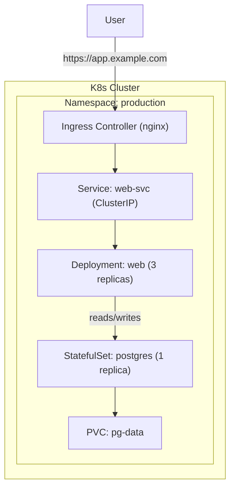

Chào chị. Đây là "Final Boss" — chúng ta sẽ dựng một kiến trúc hoàn chỉnh trên Kubernetes: Web App (Deployment) + Postgres (StatefulSet/PVC) + Service + Ingress (TLS optional) + autoscaling overview. Bài này là bài tổng hợp, làm cho người học thực sự 'chìm' vào việc triển khai.

---

## Ngày 10 - Buổi 2: Final Boss — Dựng full-stack trên Kubernetes

### 1. Kiến trúc mục tiêu (Mermaid)



### 2. Yêu cầu trước khi deploy

- Cluster có Ingress Controller (nginx/traefik) hoặc Minikube tunnel
- Storage provisioner (dynamic StorageClass) hoặc hostpath for lab
- Secrets cho DB credentials (không lưu trong repo)

### 3. Các manifest chính (tóm tắt)

- Secret: `db-secret` chứa POSTGRES_PASSWORD
- PVC: `pg-data` request 10Gi
- StatefulSet: postgres with volumeClaimTemplate (1 replica)
- Deployment: web app (3 replicas) with env vars from Secret
- Service: `postgres` (ClusterIP) và `web-svc` (ClusterIP)
- Ingress: host rule `app.example.com` → `web-svc`

(Chi tiết YAML có thể dài — ở bài lab chị sẽ nhận đầy đủ manifest mẫu để copy/paste.)

### 4. Triển khai (tốc hành)

```bash
kubectl create namespace production
kubectl apply -n production -f k8s/secret-db.yaml
kubectl apply -n production -f k8s/postgres-statefulset.yaml
kubectl apply -n production -f k8s/web-deployment.yaml
kubectl apply -n production -f k8s/web-service.yaml
kubectl apply -n production -f k8s/ingress.yaml
```

### 5. Kiểm thử & vận hành

- `kubectl get pods -n production` kiểm tra Pod
- `kubectl get pvc -n production` kiểm tra PVC bound
- `kubectl logs -n production deployment/web` xem log web
- `kubectl port-forward svc/postgres 5432:5432 -n production` để kết nối từ local (nếu cần)

### 6. Mở rộng: Horizontal Pod Autoscaler (HPA)

HPA tự động tăng/giảm replicas theo CPU/metrics:

```yaml
apiVersion: autoscaling/v2
kind: HorizontalPodAutoscaler
metadata:
  name: web-hpa
  namespace: production
spec:
  scaleTargetRef:
    apiVersion: apps/v1
    kind: Deployment
    name: web
  minReplicas: 3
  maxReplicas: 10
  metrics:
  - type: Resource
    resource:
      name: cpu
      target:
        type: Utilization
        averageUtilization: 70
```

Lưu ý: cần metrics-server chạy trong cluster để HPA có dữ liệu.

---

**Câu hỏi tư duy:** Sau deploy, chị muốn đảm bảo backup Postgres hàng ngày và có khả năng restore vào một cluster mới. Liệu copy PVC có đủ? Gợi ý: nghĩ tới logical backup (pg_dump) và physical backup (WAL shipping / pg_basebackup).