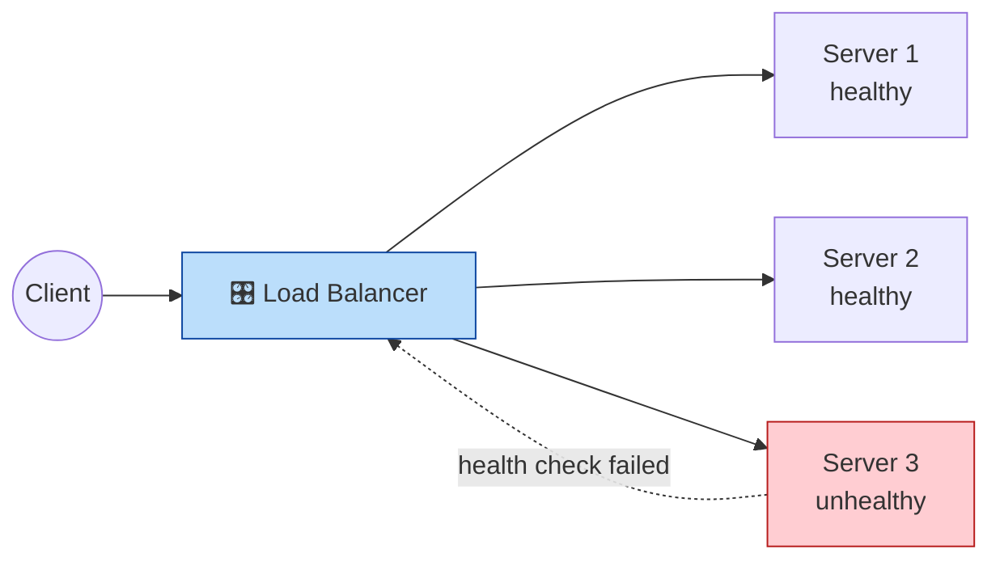

Chào chị. Hôm nay chúng ta sẽ nói về một nhân vật thầm lặng nhưng vô cùng quan trọng trong hệ thống: Load Balancer — người phân phát khách hàng đều cho các máy chủ để hệ thống luôn mượt mà.

---

## Ngày 3.1: Giải mã Load Balancer — Người phân phát công việc thông minh

Khi có nhiều request cùng tới một dịch vụ (ví dụ Web App hoặc API), nếu chị chỉ để một máy chủ đơn lẻ nhận hết thì sẽ nhanh chóng quá tải. Load Balancer (LB) giống như một lễ tân thông minh: đứng ở cửa, nhận từng request và chỉ vào đúng nhân viên đang rảnh.

### 1. L4 vs L7 — Hai kiểu "lễ tân" khác nhau

- Layer 4 (Transport, TCP/UDP) Load Balancer: Làm việc ở tầng TCP/UDP. Nó quyết định chuyển request theo IP:Port, rất nhanh và nhẹ.
  - Ví dụ: TCP load balancing, Network Load Balancer
  - Ưu điểm: hiệu năng cao, low-latency
  - Nhược điểm: không hiểu HTTP nội dung (không route theo URL)

- Layer 7 (Application, HTTP) Load Balancer: Làm việc ở tầng HTTP. Nó đọc Header, Path, Cookie, có thể route theo URL, set cookie "sticky session", hoặc trả lỗi 503 khi backend bận.
  - Ví dụ: Nginx, HAProxy, AWS ALB
  - Ưu điểm: thông minh, có thể làm routing theo đường dẫn, header, host
  - Nhược điểm: phức tạp hơn và chậm hơn L4 một chút

> **Mermaid — Sơ đồ đơn giản (Client → LB → Pool of servers)**



### 2. Các thuật toán phổ biến (Ai đi tiếp?)

- Round Robin: phân phát lần lượt 1,2,3,1,2,3. Phù hợp khi các server có cấu hình tương đương.
- Least Connections: gửi tới server có ít kết nối nhất — phù hợp khi request có thời gian xử lý khác nhau.
- IP Hash / Consistent Hashing: cùng 1 client (IP) luôn tới cùng 1 server — dùng cho cache/local-session.
- Sticky Sessions (Session Affinity): LB gán cookie để client luôn được route về cùng server (cần cho ứng dụng lưu session cục bộ).

### 3. Health Checks — Bác sĩ trực của cụm

LB thường kiểm tra backend bằng health check:
- L4: kiểm tra TCP port (có accept connection không)
- L7: gửi HTTP GET /healthz và chờ 200 OK

Nếu server trả lỗi, LB ngừng gửi traffic tới server đó cho đến khi nó lành lại.

### 4. Load Balancer cho Database? (Góc nhìn DBA)

- Read replicas: Với DB như PostgreSQL, LB thường dùng phía ứng dụng: write → primary, read → pool of replicas. Một "read LB" có thể phân phát SELECT tới replica theo round-robin hoặc least-connections.
- Sticky sessions cho DB thường không dùng (dễ gây mất cân bằng). Thay vào đó dùng proxy thông minh (pgbouncer, HAProxy) và replication-aware routing.

### 5. Công cụ thực tế & ví dụ nhanh

- Nginx (L7) — có thể làm reverse proxy + load balancing bằng `upstream`.
- HAProxy (L4/L7) — chuyên nghiệp cho cả hiệu năng và tính năng (stick-tables, healthchecks).
- Cloud LB: AWS ALB (L7), NLB (L4), GCP LB — quản lý sẵn.

Ví dụ Nginx (ngắn gọn):

```
upstream backend {
  server 10.0.0.2:80;
  server 10.0.0.3:80;
}
server {
  listen 80;
  location / {
    proxy_pass http://backend;
  }
}
```

### 6. Bẫy & best-practices

- Health check phải nhẹ và chính xác (ví dụ `/healthz` chỉ trả 200 khi tất cả thành phần sẵn sàng).
- Tránh sticky sessions nếu có thể — dùng session store (Redis) thay vì lưu session trên server.
- Theo dõi metrics: request rate, latency, error rate, active connections — LB phải cảnh báo khi backend bắt đầu chậm.
- Test failover: bật/ tắt server để kiểm chứng LB có rút traffic ngay.

---

**Câu hỏi tư duy:** Chị đang có một hệ thống web + 3 replica DB chỉ dùng để đọc. Chị muốn cân bằng truy vấn đọc. Chị sẽ dùng Round-Robin hay Least-Connections? Vì sao? (Gợi ý: xem độ dài phiên xử lý query và thời gian trả về)