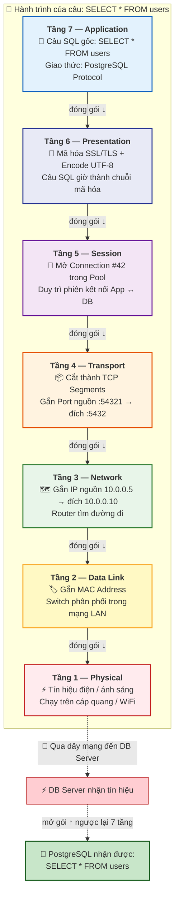
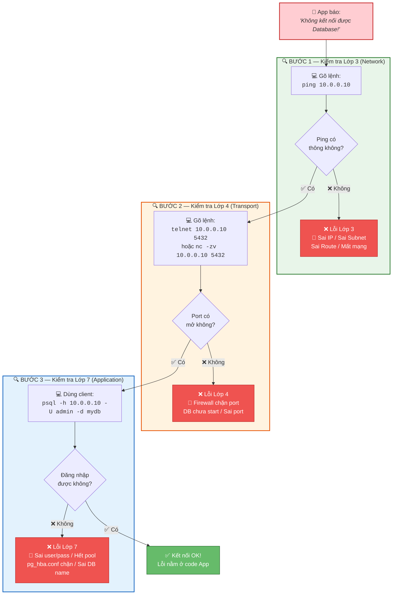
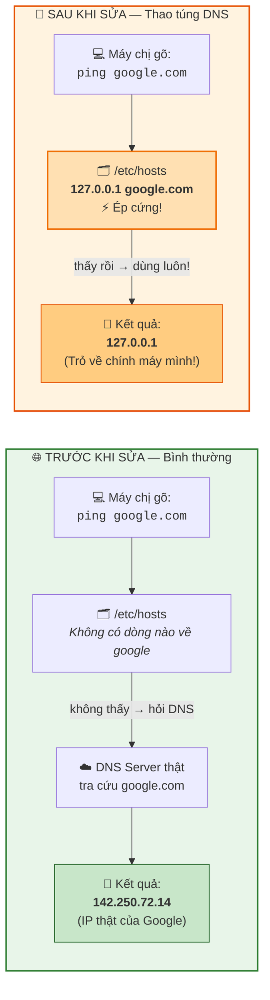
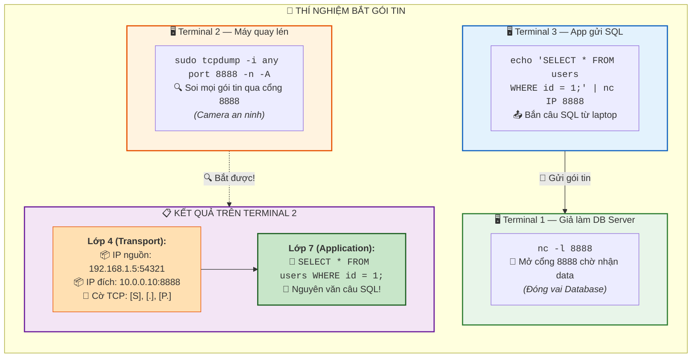

## Ngày 3.2: Giải phẫu Mạng chuyên sâu - Mô hình 7 tầng (OSI) qua lăng kính Database

Chào chị! Những ngày trước chúng ta mới chỉ lướt qua lớp bề mặt của mạng (IP và Port). Nhưng khi làm DevSecOps, nếu hệ thống sập mà chị chỉ biết ping IP thì sẽ rất bế tắc. Để thực sự bắt đúng bệnh, chị phải hiểu dữ liệu được bọc qua **7 tầng mạng (Mô hình OSI)** như thế nào.

Đừng lo, nó không phải lý thuyết suông. Hãy nhìn nó dưới góc độ của một người làm Database: Khi một con App gửi lệnh `SELECT * FROM users` xuống DB, câu lệnh đó phải đi qua 7 bước đóng gói trước khi chui vào đường dây mạng.

### 1. Bóc tách 7 Tầng Mạng (Từ đỉnh xuống đáy)

> **📊 Sơ đồ hành trình câu SQL đi qua 7 tầng mạng:**

> 💡 **Đọc sơ đồ:** App gửi câu SQL → bọc 7 lớp vỏ → chạy qua dây mạng → DB Server bóc 7 lớp vỏ ngược lại → nhận được câu SQL gốc!

| Tầng (Layer) | Tên gọi | Chức năng (Góc nhìn Database) | Lỗi thường gặp & Cách check |
| --- | --- | --- | --- |
| **7** | **Application (Ứng dụng)** | Dữ liệu thực tế. Chứa chính xác câu SQL của chị, sử dụng giao thức PostgreSQL/MySQL. | Sai cú pháp SQL, sai DB name. Check log của Database. |
| **6** | **Presentation (Trình diễn)** | Định dạng và mã hóa dữ liệu. Ép kiểu chuỗi (UTF-8) hoặc mã hóa kết nối bằng chứng chỉ SSL/TLS. | Lỗi "SSL connection has been closed". Check cấu hình chứng chỉ mạng. |
| **5** | **Session (Phiên)** | Duy trì kết nối. Quản lý việc App mở bao nhiêu connection xuống DB. Giống như Connection Pool (PgBouncer). | Lỗi "Too many connections" hoặc "Connection timeout". |
| **4** | **Transport (Giao vận)** | Quản lý truyền tải bằng cổng (Port 5432, 3306). Cắt câu SQL dài thành nhiều mảnh nhỏ và đánh số thứ tự (TCP) để không bị mất chữ. | Cổng đóng, chặn Firewall. Check bằng `telnet <IP> <Port>`. |
| **3** | **Network (Mạng)** | Gắn địa chỉ IP nguồn và đích. Tìm đường đi ngắn nhất qua các Router để App ở mạng này tìm được DB ở mạng kia. | Sai IP, không định tuyến được. Check bằng `ping` hoặc `ip route`. |
| **2** | **Data Link (Liên kết)** | Phân phối trong cùng một mạng LAN nội bộ. Gắn địa chỉ phần cứng MAC. | Lỗi do Switch hoặc trùng địa chỉ MAC (hiếm gặp trên Cloud). |
| **1** | **Physical (Vật lý)** | Dây cáp quang, tín hiệu điện, card mạng vật lý. | Đứt cáp quang biển, lỏng dây mạng, server mất điện. |

**Tư duy Debug hệ thống:**
Khi con App kêu gào *"Tao không gọi được Database"*, chị tuyệt đối không mò mẫm lung tung. Hãy test từ dưới lên trên (Bottom-Up):

> **📊 Sơ đồ quy trình debug mạng — Từ dưới lên trên:**

1. **Lớp 3:** Ping có thông IP không? (Nếu ping xịt -> Lỗi định tuyến/Subnet).
2. **Lớp 4:** Telnet/nc vào cái Port của DB có mở không? (Nếu port đóng -> Lỗi Firewall hoặc DB chưa chạy).
3. **Lớp 7:** Dùng app client (như DBeaver/psql) test kết nối bằng user/pass xem có vào được không? (Nếu báo sai mật khẩu/hết pool -> Lỗi cấu hình App/DB).

---

### 2. Thực hành: Thao túng Lớp 3 (Network) với DNS

Ở lớp 3, các máy móc gọi nhau bằng IP. Nhưng ứng dụng thì cấu hình bằng tên miền (ví dụ: `db.internal.local`). Hệ điều hành dùng một file cực kỳ quyền lực để ép tên miền thành IP, đó là file `/etc/hosts`.

> **📊 Sơ đồ: Trước và sau khi sửa /etc/hosts:**

> 💡 **Ứng dụng thực tế:** Trong K8s, nếu CoreDNS chết, DevSecOps có thể ép file `/etc/hosts` trong Pod trỏ thẳng IP Database để cứu hệ thống tạm thời!

Chị hãy mở Terminal chui vào con VM đang có, và làm thao tác thao túng DNS này:

1. Gõ `ping google.com` (Nó sẽ ra IP thật của Google). Ấn Ctrl+C dừng lại.
2. Dùng quyền root mở file cấu hình gốc:
> `sudo nano /etc/hosts`

3. Thêm dòng này vào cuối cùng (Ép Google trỏ về máy ảo nội bộ):
> `127.0.0.1 google.com`

4. Lưu lại (Ctrl+O -> Enter -> Ctrl+X).
5. Gõ lại `ping google.com`. Chị sẽ thấy nó ping thẳng vào `127.0.0.1`.

**Thực tế dự án:** Trong K8s, nếu hệ thống phân giải tên (CoreDNS) bị chết, các Pod không tìm thấy DB. DevSecOps có thể dùng trò này để ép cứng file `/etc/hosts` bên trong Pod trỏ thẳng về IP của Database để cứu hệ thống tạm thời! *(Nhớ vào xóa dòng vừa thêm kẻo máy mất mạng nhé).*

---

### 3. Thực hành: Soi rọi Lớp 4 và Lớp 7 bằng `tcpdump`

Khi Dev khăng khăng: *"Code em gửi đúng câu INSERT rồi mà DB chị không nhận!"*, chị không cần cãi nhau mồm. Chị lôi máy quét mã vạch của Linux ra: `tcpdump`. Nó bắt tận tay mọi gói tin ở Lớp 4 (Port) và hiển thị nội dung bên trong Lớp 7 (Application).

> **📊 Sơ đồ thí nghiệm tcpdump — 3 Terminal cùng lúc:**

> 💡 **Kết luận:** Thấy gói tin trên tcpdump → mạng OK, lỗi do DB. Không thấy gì → Firewall chặn, gói tin chưa đến được Server!

**Bước 1: Cài đặt công cụ** (Trên con VM)

> `sudo apt update && sudo apt install -y tcpdump`

**Bước 2: Giả lập một Database Server đang mở cổng**
Mở Tab Terminal số 1 (chui vào VM), dùng lệnh netcat mở cổng 8888:

> `nc -l 8888`
> *(Để im đó, nó đang đóng vai Database chờ request).*

**Bước 3: Đặt máy quay lén ở Card mạng**
Mở Tab Terminal số 2 (cũng chui vào VM), chạy tcpdump bằng quyền root:

> `sudo tcpdump -i any port 8888 -n -A`
> *(Lệnh này soi mọi thứ qua cổng 8888, in ra dưới dạng chữ đọc được `-A`).*

**Bước 4: Bắn truy vấn từ xa**
Mở Tab Terminal số 3 (Trên máy tính Laptop của chị, ở ngoài VM). Bắn một câu lệnh vào cái cổng 8888 đó:

> `echo "SELECT * FROM users WHERE id = 1;" | nc <IP_CUA_VM> 8888`

**Nghiệm thu bắt quả tang:**
Chị quay lại cái Tab số 2 đang chạy `tcpdump`. Màn hình sẽ nhảy một loạt thông tin Lớp 4 (Địa chỉ IP nguồn, IP đích, cờ TCP). Nếu kéo lên và nhìn kỹ, chị sẽ thấy nguyên văn câu `SELECT * FROM users WHERE id = 1;` chình ình ở đó (Dữ liệu Lớp 7).

Nếu chị thấy gói tin tới -> Mạng bình thường, lỗi do DB. Nếu chị không thấy bảng tcpdump nhảy số -> Lớp 3 hoặc Lớp 4 bị chặn (Firewall), gói tin chưa từng đến được Server.

*(Ấn Ctrl+C ở các tab để dọn dẹp).*

---

Làm chủ được mô hình 7 tầng này, chị sẽ có tư duy phân lập lỗi cực kỳ sắc bén. Gặp bug mạng nào cũng chia để trị, khoanh vùng chính xác lớp đang hỏng.

Chị chạy test thử cái `tcpdump` đi. Nếu ổn rồi, chúng ta sẽ kết thúc chuỗi kiến thức máy chủ trần trụi (Bare-metal) ở đây.