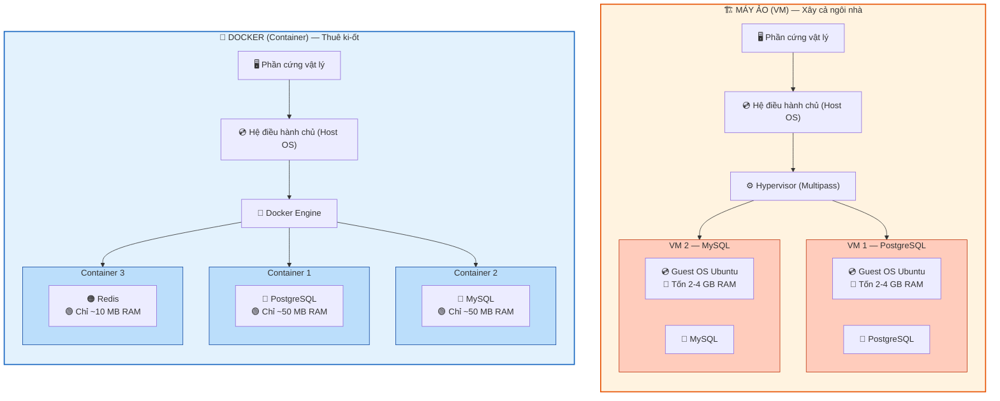
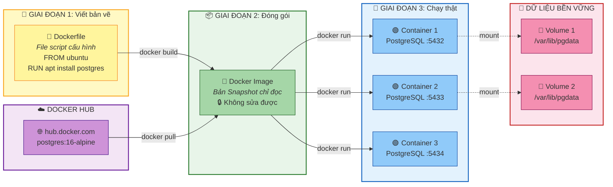
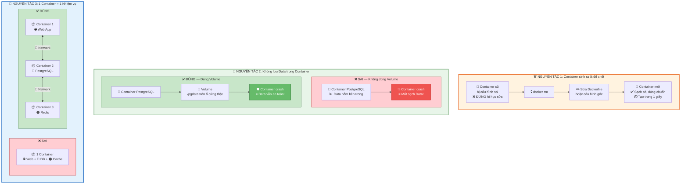

Chào chị. Mấy ngày qua chị đã quen với việc tự tay tạo Server ảo (VM) bằng Multipass và gõ lệnh cấu hình nó. Nhưng trong thực tế, nếu mỗi lần cần một cái Database mới mà chị lại phải đẻ ra cả một con Server, cài lại hệ điều hành, rồi hì hục chạy lệnh `apt install postgresql` thì quá chậm và lãng phí tài nguyên.

Chưa kể căn bệnh kinh điển của dân IT: *"Code/Database này chạy ngon trên máy tôi, nhưng sang máy chủ thì lỗi"*.

Hôm nay chúng ta bước sang Giai đoạn 2. Giải pháp cho mọi vấn đề trên: **Docker (Containerization)**. Chị hãy tạm quên những thứ khô khan của hệ điều hành đi, bài này chúng ta sẽ soi Docker hoàn toàn qua lăng kính của người làm Database.

---

## Ngày 4: Giải mã Docker - "Đóng gói" vạn vật

### 1. Bản chất của Docker là gì?

Chị đang dùng Multipass (Virtual Machine). Hãy tưởng tượng:

* **Máy ảo (VM):** Chị muốn mở một quán cafe (chạy Database). Chị đi mua hẳn một miếng đất, xây một cái móng mới, dựng tường, kéo điện nước (Hệ điều hành khách - Guest OS), rồi mới kê bàn ghế bán cafe. Rất cồng kềnh, tốn hàng chục GB ổ cứng và vài GB RAM chỉ để nuôi cái hệ điều hành.
* **Docker (Container):** Chị vào một trung tâm thương mại đã có sẵn điện nước, bảo vệ (Hệ điều hành chủ - Host OS). Chị chỉ việc thuê một cái Ki-ốt nhỏ, bê đúng cái máy pha cafe và bàn ghế vào là bán luôn. Nhanh, nhẹ, khởi động mất chưa tới 1 giây.

> **📊 Sơ đồ so sánh kiến trúc VM vs Docker:**

> 💡 **Nhìn là thấy:** VM mỗi con phải cõng 1 hệ điều hành riêng (nặng nề), Docker dùng chung kernel nên siêu nhẹ!

Docker nhốt ứng dụng (và cả Database) vào một cái hộp vô hình gọi là **Container**. Cái hộp này chứa mọi thứ ứng dụng cần để chạy, cách ly hoàn toàn với bên ngoài, nhưng lại dùng chung "điện nước" (Kernel) của máy chủ.

---

### 2. Từ điển Docker dành cho dân Database

Để dễ hiểu nhất, chị hãy xem bảng ánh xạ các khái niệm lõi của Docker sang các khái niệm quen thuộc trong Database:

| Khái niệm Docker | Góc nhìn Database | Giải thích thực tế |
| --- | --- | --- |
| **Dockerfile** | **File Script `.sql` (CREATE & INSERT)** | Đây là một file văn bản ghi lại các bước: Lấy hệ điều hành gì, cài gói nào, copy cấu hình nào vào. Giống hệt file script dùng để dựng cấu trúc DB. |
| **Docker Image** | **Database Dump / Backup File** | Nó là một bản Snapshot (chụp nhanh) chỉ đọc (Read-only). Nó chứa toàn bộ mã nguồn, thư viện, và môi trường. Chị không thể sửa trực tiếp Image, giống như không ai mở file `.bak` ra để sửa data cả. |
| **Docker Container** | **Database Instance đang chạy (Process)** | Khi chị lấy Image đem "Run", nó trở thành Container. Nó là thực thể sống, có IP riêng, có Port đang mở, đang tiêu thụ RAM/CPU. Chị có thể tạo 100 cái Container từ 1 cái Image (Giống đẻ 100 cái DB rỗng từ 1 file cấu trúc). |
| **Docker Volume** | **Thư mục Data vật lý (pgdata / ibdata1)** | Đây là thứ sống còn! Container là đồ dùng một lần, xóa là mất hết. Volume là ổ cứng gắn ngoài để lưu dữ liệu thật. Xóa Container đi, cắm Volume vào Container mới thì Data vẫn còn nguyên. |
| **Docker Hub** | **Marketplace / Thư viện dùng chung** | Nơi mọi người chia sẻ Image. Thay vì chị tự cài PostgreSQL, chị lên đây gõ `docker pull postgres` là kéo luôn một bản DB xịn xò đã cấu hình sẵn chuẩn bảo mật của nhà phát hành về máy. |

> **📊 Sơ đồ vòng đời Docker — Từ "bản vẽ" đến "ngôi nhà đang ở":**

> 💡 **Đọc sơ đồ:** Từ 1 Image có thể đẻ ra nhiều Container (giống 1 file backup restore ra nhiều DB). Volume là "ổ cứng ngoài" — xóa Container, data vẫn còn!

---

### 3. Nguyên tắc "Sinh tử" trong thế giới Container

> **📊 Sơ đồ 3 nguyên tắc sống còn khi dùng Docker:**

Khi làm việc với Docker, tư duy của chị phải thay đổi hoàn toàn so với lúc dùng máy chủ vật lý hay máy ảo:

* **Tính khả dụng (Disposable):** Container sinh ra là để chết đi. Chị cấu hình sai? Đừng hì hục sửa (Troubleshoot) như sửa Server cũ. Xóa thẳng tay lệnh `docker rm`, sửa lại file cấu hình gốc, và đẻ lại cái mới trong 1 giây.
* **Không lưu Data trong Container (Stateless):** Nếu chị chạy một con PostgreSQL trong Docker mà không cấu hình **Volume** (để map dữ liệu ra ổ cứng thật), thì khi Container đó bị tắt hoặc crash, toàn bộ bảng biểu, user, bản ghi của chị sẽ "bốc hơi" vĩnh viễn.
* **Một Container - Một Nhiệm vụ:** Không ai nhét cả Web App, Database PostgreSQL và Cache Redis vào chung một cái Container. Chị phải đẻ 3 Container riêng biệt và cho chúng nó nói chuyện với nhau qua Mạng (Networking hôm trước chị vừa học). Gãy thằng nào, đập đi xây lại đúng thằng đó.

---

Chị hãy đọc kỹ và ngấm cái bảng từ điển ở phần 2. Việc hiểu sự khác biệt giữa **Image** (Bản vẽ tĩnh) và **Container** (Ngôi nhà đang ở) sẽ quyết định việc chị cấu hình hệ thống có bị mất dữ liệu hay không.

Chị nắm rõ phần lý thuyết lõi này chưa? Nếu rồi, chúng ta sẽ bắt đầu thực hành: **Tự tay tải Image PostgreSQL từ mạng về và chạy lên thành một con Database Server hoàn chỉnh chỉ với 1 dòng lệnh duy nhất**. Chị sẵn sàng cài đặt Docker chưa?