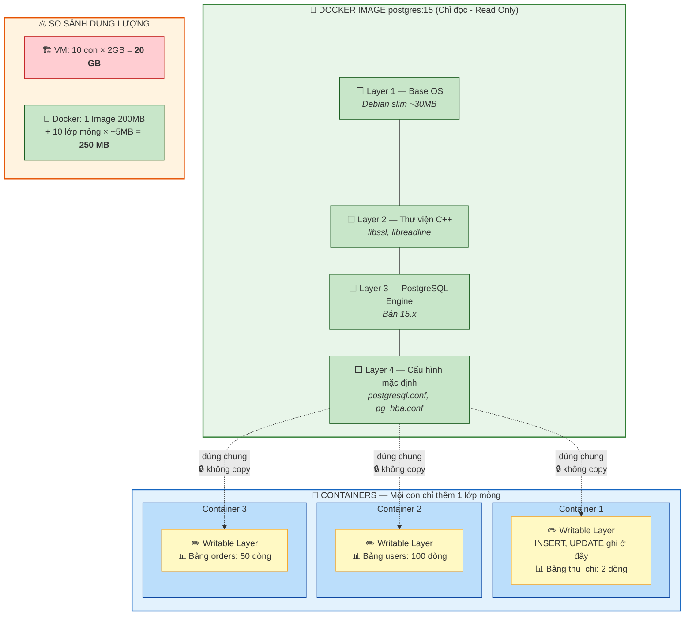
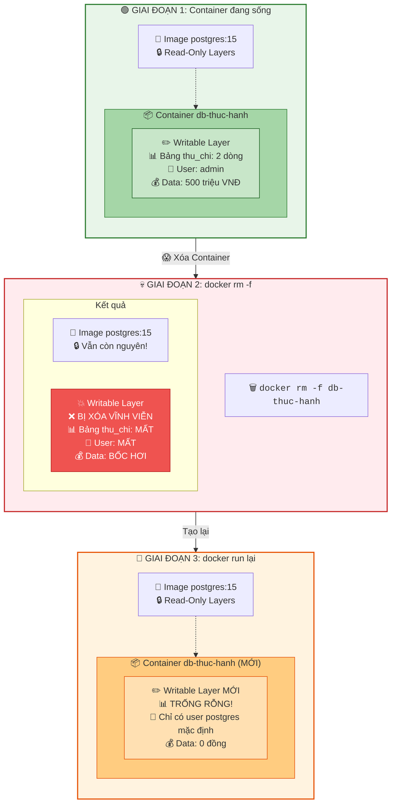

Chào chị. Hôm qua chúng ta đã nắm được "Tâm pháp" lý thuyết của Docker. Hôm nay, cất chuột đi, chúng ta sẽ mở Terminal lên để thấy phép thuật: Tự đẻ ra một con PostgreSQL Server hoàn chỉnh với đầy đủ user, password và cấu hình bảo mật chỉ bằng **đúng 1 dòng lệnh**.

Nhưng trước khi gõ lệnh, chị cần phải hiểu một khái niệm cực kỳ quan trọng làm nên sự vĩ đại của Docker: **Image Layers (Các lớp ảnh)**.

---

## Ngày 4 buổi 2: Thực chiến Docker - Kiến trúc Layer và Vòng đời Container

### 1. Bí mật của sự nhẹ nhàng: Kiến trúc Layer (Lớp)

Trong thế giới máy ảo (VM) Multipass hôm trước, mỗi lần chị tạo một con Server Ubuntu mới, nó tốn vài GB ổ cứng. Có 10 con VM là tốn hàng chục GB.

Nhưng Docker không ngu ngốc như vậy. Nó sử dụng kiến trúc xếp lớp (Layer).

Hãy tưởng tượng một Docker Image giống như một củ hành tây, hoặc gần gũi hơn với dân Database: Nó giống như một bản **Full Backup** kết hợp với các **Incremental Backup** (Backup tăng dần).

* **Base Layer (Lớp nền):** Một cái hệ điều hành Linux siêu nhỏ (chỉ vài chục MB).
* **Layer 2:** Lớp cài đặt môi trường (ví dụ: cài thư viện C++).
* **Layer 3:** Lớp cài đặt phần mềm lõi (PostgreSQL Engine).
* **Layer 4:** Lớp copy cấu hình mặc định (file `postgresql.conf`).

Khi chị tải một Image từ mạng về, Docker sẽ tải từng Layer này. Sự thần kỳ nằm ở chỗ: Nếu chị chạy 10 con Database từ cùng 1 Image, Docker **không** copy cái Image đó ra làm 10 bản. Cả 10 con Container đều **dùng chung** các lớp Image gốc ở chế độ *Chỉ đọc (Read-Only)*.

Mỗi Container khi sinh ra chỉ được cấp thêm một **Lớp trên cùng (Writable Layer - Lớp có thể ghi)**. Mọi thao tác `INSERT`, `UPDATE` của chị thực chất là ghi vào cái lớp mỏng dính trên cùng này. Nhờ vậy, chạy 10 con DB bằng Docker nhẹ y như chạy 1 con!

> **📊 Sơ đồ kiến trúc Layer — 10 Container dùng chung 1 Image:**

> 💡 **Bí mật tốc độ:** 10 Container dùng chung các Layer Image gốc (xanh), mỗi con chỉ thêm 1 lớp Writable mỏng (vàng). Tiết kiệm 80 lần dung lượng so với VM!

---

### 2. Thực hành: Triệu hồi PostgreSQL trong 1 nốt nhạc

*(Chị mở Terminal, chui vào con VM Linux hoặc dùng luôn máy Laptop nếu đã cài Docker).*

**Bước 1: Kéo Image từ chợ (Docker Hub) về máy**
Chị gõ lệnh sau để kéo bản vẽ của PostgreSQL bản 15 về:

> `docker pull postgres:15`

Chị hãy nhìn màn hình Terminal lúc nó tải. Chị sẽ thấy nó báo tải từng dòng `Pulling fs layer`. Đó chính là nó đang bóc từng lớp của củ hành tây mang về máy chị đấy.

Kiểm tra xem bản vẽ đã nằm trong máy chưa (Giống `\dt` xem danh sách bảng):

> `docker images`

**Bước 2: Phép thuật 1 dòng lệnh (Tạo và Chạy Container)**
Thay vì tải code, biên dịch, cấu hình file `pg_hba.conf`, chị chỉ cần gõ đúng lệnh này:

> `docker run --name db-thuc-hanh -e POSTGRES_PASSWORD=sieumat -d -p 5432:5432 postgres:15`

*Giải phẫu câu lệnh:*

* `docker run`: Lệnh đẻ Container từ Image.
* `--name db-thuc-hanh`: Đặt tên cho con DB này để dễ gọi, không nó sẽ random ra cái tên rất ngớ ngẩn.
* `-e POSTGRES_PASSWORD=sieumat`: Truyền Biến môi trường (Environment Variable). Docker sẽ tự động lấy cái pass này set cho user `postgres` (user mặc định).
* `-d`: Detached mode. Bảo con DB chạy ngầm đi, trả lại Terminal cho tôi gõ lệnh khác.
* `-p 5432:5432`: Chị còn nhớ bài Mạng (Networking) không? Đây là Port Mapping. Nó có nghĩa là: Bất cứ ai chọc vào Cổng 5432 của *máy tính thật*, hãy khoan thẳng cái lỗ đó vào Cổng 5432 của *con Container bên trong*.
* `postgres:15`: Tên bản vẽ (Image) dùng để đẻ.

Kiểm tra xem con DB đã sống chưa (Giống `SELECT * FROM pg_stat_activity;`):

> `docker ps`
> *(Chị sẽ thấy một dòng báo Container đang chạy, hiển thị cả Port đang mở).*

---

### 3. Thâm nhập vào Container (Lệnh Exec)

Bây giờ con DB đang chạy ngầm. Làm sao để chui vào trong nó gõ SQL?
Chị **không** dùng SSH như với máy ảo. Docker có lệnh riêng để xuyên thủng vào lớp Writable Layer:

> `docker exec -it db-thuc-hanh psql -U postgres`

*Giải thích: `exec -it` là lệnh thâm nhập tương tác trực tiếp. `psql -U postgres` là lệnh của Database bắt nó chạy ngay khi vừa chui vào.*

Bùm! Dấu nhắc lệnh của chị đã đổi thành `postgres=#`. Chị đang đứng ngay bên trong Database.
Gõ thử câu query kiểm tra:

> `SELECT version();`

Xong việc, gõ `\q` để thoát lệnh psql, trở về máy thật.

---

### 4. Bài học máu xương về sự "Vô thường" (Stateless)

Đây là phần quan trọng nhất ngày hôm nay, quyết định việc chị có làm mất Data của công ty hay không.

Lúc nãy chị đã hiểu mọi Data đều ghi vào lớp Writable Layer của Container. Giờ làm bài test sinh tử:

> **📊 Sơ đồ sinh tử — Tại sao xóa Container = Mất Data:**

> 💡 **Bài học đắt giá:** Image không bị ảnh hưởng, nhưng Writable Layer (chứa data thật) bị xóa cùng Container. Đây là lý do **bắt buộc phải dùng Volume** khi chạy Database!

**Bật / Tắt thông thường:**
Gõ: `docker stop db-thuc-hanh` (Tắt DB đi ngủ).
Gõ: `docker start db-thuc-hanh` (Bật lại).
=> Chị chui vào test, Data vẫn còn nguyên.

**Xóa bỏ Container (Mô phỏng sập hệ thống hoặc Update version mới):**
Chị hãy tự tay giết chết con Container này:

> `docker rm -f db-thuc-hanh`

Gõ `docker ps -a` kiểm tra. Nó đã bốc hơi hoàn toàn khỏi máy.

Bây giờ, chị chạy lại đúng cái lệnh sinh ra Container ở Bước 2:

> `docker run --name db-thuc-hanh -e POSTGRES_PASSWORD=sieumat -d -p 5432:5432 postgres:15`

Một con DB mới tinh lại sống dậy. Nhưng nếu chị chui vào trong, **toàn bộ dữ liệu cũ đã MẤT SẠCH!**

**Tại sao?** Vì khi gõ `docker rm`, cái lớp Writable Layer (nơi lưu data thật) đi kèm với cái Container đó đã bị quăng vào thùng rác. Container mới đẻ ra một lớp Writable hoàn toàn trống rỗng.

Trong DevSecOps, Container sinh ra là để chết. Sập là đập đi xây lại, cập nhật bản mới cũng đập đi đẻ lại. Vậy làm sao để Database vẫn giữ được Data khi Container bị xóa?

Chị hãy thực hành nhuần nhuyễn vòng lặp `run -> stop -> rm` ở trên đi.