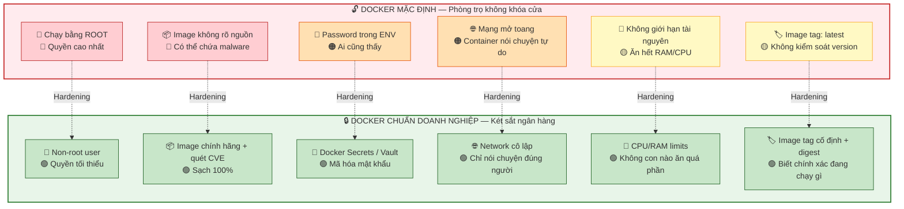
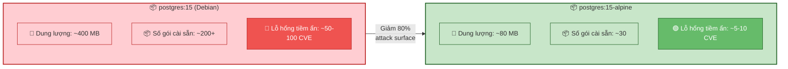
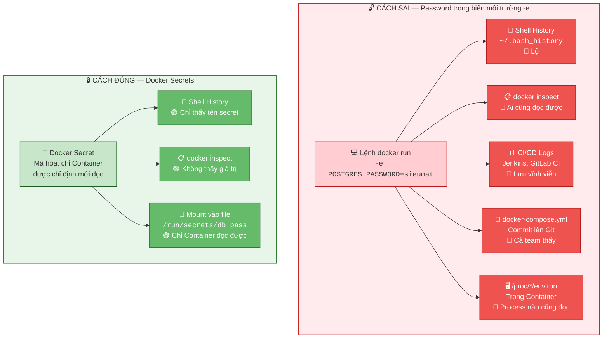
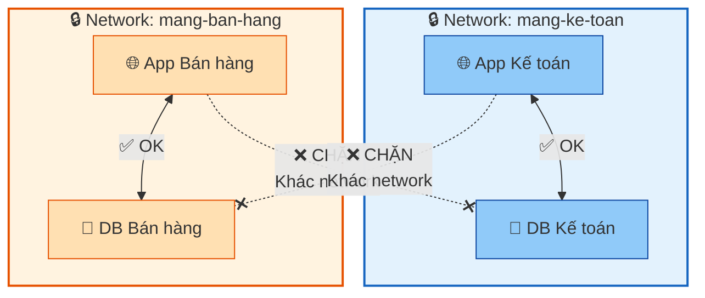
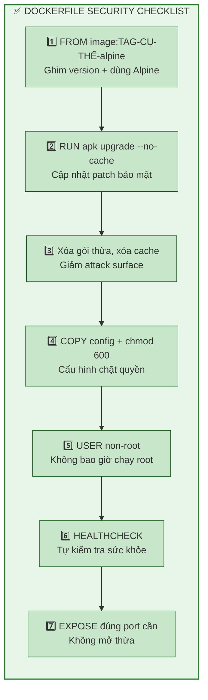
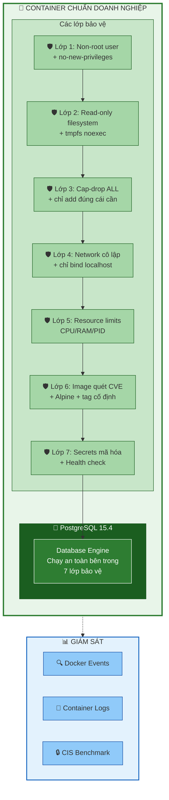

Chào chị. Hai buổi vừa rồi chị đã biết Docker là gì, biết cách đẻ Container, hiểu kiến trúc Layer và bài học "mất Data" khi không dùng Volume. Hôm nay chúng ta bước vào một chủ đề mà doanh nghiệp nào cũng **bắt buộc phải làm** trước khi đưa Docker lên Production: **Bảo mật Docker (Docker Security Hardening)**.

Chị hãy tưởng tượng: Docker Container giống như một căn phòng trọ trong chung cư. Nếu chị không khóa cửa, không che cửa sổ, để chìa khóa dưới thảm — thì dù chung cư có bảo vệ, trộm vẫn vào được phòng chị. Bài này sẽ dạy chị cách **khóa kín, gắn camera, và lắp két sắt** cho mỗi Container.

---

## Ngày 4 buổi 3: Bảo mật Docker — Xây dựng Container chuẩn Doanh nghiệp

### 1. Tại sao Docker mặc định CHƯA an toàn?

Khi chị gõ `docker run postgres:15` — nó chạy ngon lành. Nhưng thực tế, Docker mặc định có rất nhiều "cửa hở":

| Lỗ hổng mặc định | Hậu quả thực tế | Mức nghiêm trọng |
| --- | --- | --- |
| Container chạy bằng **root** | Hacker chiếm Container = chiếm luôn quyền root, có thể thoát ra máy chủ | 🔴 Nghiêm trọng |
| Image tải về không kiểm tra | Image chứa mã độc, backdoor, hoặc phần mềm lỗi thời đầy CVE | 🔴 Nghiêm trọng |
| Mật khẩu để trong `-e` (biến môi trường) | Gõ `docker inspect` là thấy password trần trụi | 🟠 Cao |
| Container truy cập mạng thoải mái | Container bị hack → Quét toàn bộ mạng nội bộ công ty | 🟠 Cao |
| Không giới hạn CPU/RAM | 1 Container chiếm hết tài nguyên, các Container khác chết theo | 🟡 Trung bình |
| Dùng tag `latest` | Không biết đang chạy version nào, một ngày đẹp trời Image thay đổi → hệ thống vỡ | 🟡 Trung bình |

> **📊 Sơ đồ tổng quan — Docker mặc định vs Docker chuẩn Doanh nghiệp:**



> 💡 **Mỗi mũi tên là một bước "Hardening" — gia cố bảo mật.** Bài này sẽ dạy chị từng bước một.

---

### 2. Nguyên tắc số 1: KHÔNG BAO GIỜ chạy Container bằng Root

Đây là lỗi **phổ biến nhất** và **nguy hiểm nhất**. Mặc định, process bên trong Container chạy bằng user `root`. Nếu hacker tìm được lỗ hổng trong ứng dụng (ví dụ SQL Injection), hắn chiếm được Container → đã có quyền root → có thể leo thang ra máy chủ bên ngoài (Container Escape).

Giống như chị thuê nhân viên kế toán nhưng lại đưa cho họ chìa khóa két sắt CEO. Họ chỉ cần nhập số liệu, không cần quyền đó.

**Cách kiểm tra Container đang chạy bằng user gì:**

> `docker exec db-thuc-hanh whoami`
> Nếu kết quả hiện `root` → **Nguy hiểm!**

**Cách sửa trong Dockerfile — Tạo user riêng và chuyển sang:**

```dockerfile
# ❌ SAI — Mặc định chạy bằng root
FROM postgres:15

# ✅ ĐÚNG — Tạo user riêng, chạy bằng user đó
FROM postgres:15

# Tạo group và user mới (không có quyền sudo)
RUN groupadd -r dbuser && useradd -r -g dbuser dbuser

# Chuyển sang user mới (từ dòng này trở đi, mọi lệnh chạy bằng dbuser)
USER dbuser
```

> 💡 **Tin vui:** Các Image chính hãng như `postgres:15` đã tự chuyển sang user `postgres` (non-root) khi chạy process chính. Nhưng chị vẫn phải kiểm tra, vì nhiều Image bên thứ ba không làm điều này!

**Bước kiểm tra nhanh với Image postgres:**

> `docker exec db-thuc-hanh cat /etc/passwd | grep postgres`

Chị sẽ thấy user `postgres` có UID khác 0 (root có UID=0). Đây là dấu hiệu tốt.

**Nâng cao — Chặn leo thang quyền root hoàn toàn:**

> `docker run --name db-bao-mat --security-opt=no-new-privileges -e POSTGRES_PASSWORD=sieumat -d postgres:15`

Flag `--security-opt=no-new-privileges` ngăn chặn mọi process bên trong Container tự nâng quyền lên root, kể cả dùng `setuid`. Giống như chị khóa luôn cửa phòng CEO, không ai mở được nữa.

---

### 3. Nguyên tắc số 2: Chọn Image như chọn thuốc — SAI một li, ĐI một đời

#### a) Chỉ dùng Image chính hãng (Official) hoặc Verified

Docker Hub có hàng triệu Image. Nhưng bất kỳ ai cũng có thể đẩy Image lên. Một Image tên `postgres-super-fast` nghe hấp dẫn nhưng bên trong có thể chứa crypto miner hoặc backdoor.

**Quy tắc vàng:**

| Loại Image | Ký hiệu trên Docker Hub | Có nên dùng? |
| --- | --- | --- |
| **Official Image** | 🏷️ `Docker Official Image` | ✅ Ưu tiên số 1 |
| **Verified Publisher** | ✔️ Dấu tích xanh | ✅ Tin tưởng được |
| **Community / Random** | Không có gì | ⚠️ Phải audit code trước |

**Cách kiểm tra trên Terminal:**

> `docker inspect postgres:15 | grep -i "author\|maintainer"`

#### b) Luôn dùng tag cụ thể, KHÔNG BAO GIỜ dùng `latest`

```bash
# ❌ SAI — "latest" hôm nay là v15, ngày mai có thể là v16, app chị vỡ
docker pull postgres:latest

# ✅ ĐÚNG — Ghim chết version
docker pull postgres:15.4-alpine

# ✅ ĐÚNG NHẤT — Dùng Digest (mã hash SHA256) để chắc chắn 100% Image không bị thay đổi
docker pull postgres@sha256:abc123def456...
```

Giống như chị đi mua thuốc, phải chỉ đích danh "Paracetamol 500mg hộp xanh", chứ không nói "cho tôi thuốc giảm đau gì cũng được".

#### c) Dùng Image Alpine — Nhỏ gọn, ít lỗ hổng

```bash
# Image thường — 400MB, chứa rất nhiều gói không cần thiết (nhiều attack surface)
docker pull postgres:15

# Image Alpine — chỉ 80MB, hệ điều hành siêu gọn, ít gói → ít lỗ hổng
docker pull postgres:15-alpine
```

> **📊 So sánh kích thước và số lỗ hổng:**



> 💡 **Quy tắc: Càng ít thứ cài trong Image, càng ít cửa cho hacker chui vào.** Alpine là lựa chọn hàng đầu cho Production.

#### d) Quét lỗ hổng bảo mật (Vulnerability Scanning)

Trước khi đưa Image lên Production, chị **bắt buộc** phải quét CVE (Common Vulnerabilities and Exposures):

```bash
# Dùng Docker Scout (tích hợp sẵn trong Docker Desktop)
docker scout cves postgres:15-alpine

# Hoặc dùng Trivy (công cụ miễn phí của Aqua Security, rất phổ biến)
# Cài Trivy:
brew install aquasecurity/trivy/trivy    # macOS
# Quét:
trivy image postgres:15-alpine
```

Kết quả sẽ hiện bảng liệt kê toàn bộ lỗ hổng theo mức: `CRITICAL`, `HIGH`, `MEDIUM`, `LOW`. **Không bao giờ đưa Image có lỗ CRITICAL lên Production.**

---

### 4. Nguyên tắc số 3: Mật khẩu KHÔNG được để trần

Ở bài 4.2, chị chạy lệnh:

> `docker run -e POSTGRES_PASSWORD=sieumat ...`

Password `sieumat` nằm chình ình trong lệnh. Bất kỳ ai gõ `docker inspect db-thuc-hanh` đều thấy nó. Trong lịch sử deploy, nó còn nằm trong log CI/CD, git history, shell history...

> **📊 Sơ đồ: Password lộ ở bao nhiêu chỗ nếu dùng `-e`:**



**Cách đúng — Dùng Docker Secrets (với Docker Swarm) hoặc file `.env` riêng:**

**Cách 1: Dùng file riêng (đơn giản nhất, phù hợp dev/staging)**

```bash
# Tạo file chứa password (KHÔNG commit file này lên Git!)
echo "sieumat" > db_password.txt

# Thêm vào .gitignore ngay lập tức
echo "db_password.txt" >> .gitignore

# Chạy Container, đọc password từ file
docker run --name db-bao-mat \
  -e POSTGRES_PASSWORD_FILE=/run/secrets/db_pass \
  -v $(pwd)/db_password.txt:/run/secrets/db_pass:ro \
  -d postgres:15-alpine
```

> `ro` nghĩa là Read-Only — Container chỉ được đọc file password, không được sửa.

**Cách 2: Docker Secrets (dùng trong Docker Swarm — chuẩn Production)**

```bash
# Khởi tạo Swarm (chỉ cần chạy 1 lần)
docker swarm init

# Tạo secret từ file
echo "sieumat" | docker secret create db_password -

# Tạo service dùng secret
docker service create \
  --name db-production \
  --secret db_password \
  -e POSTGRES_PASSWORD_FILE=/run/secrets/db_password \
  postgres:15-alpine
```

**Cách 3: Dùng HashiCorp Vault hoặc AWS Secrets Manager (chuẩn Enterprise)**

Đây là cấp độ cao nhất — mật khẩu được mã hóa, tự động xoay vòng (rotate), và có audit log ghi lại ai đã truy cập. Chị sẽ học thêm ở giai đoạn nâng cao.

---

### 5. Nguyên tắc số 4: Cô lập mạng — Container chỉ nói chuyện với đúng người cần nói

Mặc định, mọi Container trong cùng một Docker bridge network đều có thể ping nhau. Giống như tất cả nhân viên công ty đều có chìa khóa tất cả các phòng. Sai hoàn toàn!

**Quy tắc:** Tạo network riêng cho từng nhóm dịch vụ.

```bash
# Tạo network riêng cho hệ thống kế toán
docker network create --driver bridge mang-ke-toan

# Tạo network riêng cho hệ thống bán hàng
docker network create --driver bridge mang-ban-hang

# Container Database kế toán — chỉ nằm trong mạng kế toán
docker run --name db-ke-toan \
  --network mang-ke-toan \
  -e POSTGRES_PASSWORD_FILE=/run/secrets/db_pass \
  -v $(pwd)/db_password.txt:/run/secrets/db_pass:ro \
  -d postgres:15-alpine

# Container App bán hàng — nằm trong mạng bán hàng
# => KHÔNG thể truy cập db-ke-toan
docker run --name app-ban-hang \
  --network mang-ban-hang \
  -d my-sales-app:1.0
```

> **📊 Sơ đồ Network Isolation:**



> 💡 **Network riêng = Tường lửa ảo.** App bán hàng bị hack? Hacker cũng không thể nhảy sang DB kế toán vì khác mạng hoàn toàn.

---

### 6. Nguyên tắc số 5: Giới hạn tài nguyên — Không ai được ăn quá phần

Nếu không giới hạn, một Container bị DDoS hoặc query nặng có thể nuốt hết RAM/CPU của máy chủ, kéo sập tất cả Container khác. Giống như một nhân viên chiếm hết phòng họp cả ngày, không ai làm việc được.

```bash
docker run --name db-production \
  --memory="2g" \
  --memory-swap="2g" \
  --cpus="1.5" \
  --pids-limit=200 \
  --security-opt=no-new-privileges \
  --network mang-ke-toan \
  -e POSTGRES_PASSWORD_FILE=/run/secrets/db_pass \
  -v $(pwd)/db_password.txt:/run/secrets/db_pass:ro \
  -v pgdata:/var/lib/postgresql/data \
  -d postgres:15-alpine
```

*Giải phẫu các flag bảo mật:*

| Flag | Ý nghĩa | Tại sao cần? |
| --- | --- | --- |
| `--memory="2g"` | Container chỉ được dùng tối đa 2GB RAM | Chống 1 con ăn hết RAM máy chủ |
| `--memory-swap="2g"` | Không cho dùng swap (đặt bằng memory) | Chống chậm hệ thống do swap |
| `--cpus="1.5"` | Chỉ được dùng 1.5 cores CPU | Chống chiếm hết CPU |
| `--pids-limit=200` | Tối đa 200 process bên trong | Chống fork bomb (tấn công tạo vô hạn process) |
| `--security-opt=no-new-privileges` | Chặn leo thang quyền | Đã giải thích ở phần 2 |

---

### 7. Nguyên tắc số 6: Filesystem chỉ đọc — Khóa chết mọi thứ không cần ghi

Container chạy Production không cần phải ghi file lung tung. Chị có thể mount filesystem dạng Read-Only, chỉ mở đúng thư mục cần ghi (data và log):

```bash
docker run --name db-fortress \
  --read-only \
  --tmpfs /tmp \
  --tmpfs /run \
  -v pgdata:/var/lib/postgresql/data \
  -v pglogs:/var/log/postgresql \
  --memory="2g" \
  --cpus="1.5" \
  --security-opt=no-new-privileges \
  --network mang-ke-toan \
  -e POSTGRES_PASSWORD_FILE=/run/secrets/db_pass \
  -v $(pwd)/db_password.txt:/run/secrets/db_pass:ro \
  -d postgres:15-alpine
```

*Giải thích:*
* `--read-only`: Toàn bộ filesystem Container chuyển sang chỉ đọc. Hacker không thể tải thêm công cụ tấn công vào.
* `--tmpfs /tmp`: Cho phép ghi tạm vào `/tmp` (trên RAM, mất khi Container restart).
* Volume `pgdata` và `pglogs`: Chỉ 2 thư mục này được ghi — đúng nơi Database cần.

---

### 8. Nguyên tắc số 7: Viết Dockerfile chuẩn bảo mật

Dưới đây là một Dockerfile mẫu cho PostgreSQL chuẩn doanh nghiệp, áp dụng mọi nguyên tắc ở trên:

```dockerfile
# ✅ Ghim version cụ thể, dùng Alpine (nhẹ, ít CVE)
FROM postgres:15.4-alpine

# ✅ Gắn label để biết ai build, lúc nào
LABEL maintainer="devops-team@congty.com"
LABEL version="1.0"
LABEL description="PostgreSQL 15.4 — Hardened for Production"

# ✅ Cập nhật bảo mật + xóa cache để giảm kích thước Image
RUN apk update && apk upgrade --no-cache && rm -rf /var/cache/apk/*

# ✅ Xóa các gói không cần thiết (giảm attack surface)
# Alpine rất gọn rồi, nhưng nếu Image khác thì cần bước này:
# RUN apt-get remove --purge -y curl wget && apt-get autoremove -y

# ✅ Copy file cấu hình bảo mật tùy chỉnh
COPY postgresql.conf /etc/postgresql/postgresql.conf
COPY pg_hba.conf /etc/postgresql/pg_hba.conf

# ✅ Đặt quyền chặt cho file cấu hình (chỉ owner đọc được)
RUN chmod 600 /etc/postgresql/postgresql.conf /etc/postgresql/pg_hba.conf

# ✅ Chuyển sang non-root user (postgres user có sẵn trong Image gốc)
USER postgres

# ✅ Khai báo health check — Docker tự kiểm tra DB còn sống không
HEALTHCHECK --interval=30s --timeout=5s --start-period=10s --retries=3 \
  CMD pg_isready -U postgres || exit 1

# ✅ Chỉ expose đúng port cần thiết
EXPOSE 5432

# ✅ Entry point mặc định (kế thừa từ Image gốc)
```

> **📊 Checklist Dockerfile chuẩn bảo mật:**



---

### 9. Nguyên tắc số 8: Giám sát và Audit — Không có gì được giấu

Bảo mật không chỉ là phòng thủ, mà còn phải **biết** khi có ai đó đang cố phá. Giống như lắp camera trong ngân hàng.

**a) Docker Events — Xem mọi hành động với Container:**

```bash
# Theo dõi real-time mọi sự kiện Docker (ai tạo, xóa, start, stop Container)
docker events

# Lọc chỉ xem sự kiện của Container
docker events --filter type=container
```

**b) Logging — Đọc log Container:**

```bash
# Xem 100 dòng log cuối của DB
docker logs --tail 100 db-production

# Theo dõi log real-time (giống tail -f)
docker logs -f db-production
```

**c) Docker Bench Security — Kiểm tra bảo mật tự động:**

Đây là công cụ chính thức của Docker, kiểm tra cấu hình máy chủ và Container theo tiêu chuẩn **CIS Benchmark** (Center for Internet Security):

```bash
docker run --rm --net host --pid host --userns host --cap-add audit_control \
  -v /etc:/etc:ro \
  -v /var/lib:/var/lib:ro \
  -v /var/run/docker.sock:/var/run/docker.sock:ro \
  docker/docker-bench-security
```

Nó sẽ chạy hàng trăm bài test và báo kết quả `PASS`, `WARN`, `INFO`. Mục tiêu: **Không có WARN nào ở mức Critical.**

---

### 10. Tổng hợp — Lệnh chạy Docker chuẩn Doanh nghiệp hoàn chỉnh

Đây là lệnh "full giáp" khi chạy PostgreSQL trên Production, áp dụng tất cả các nguyên tắc ở trên:

```bash
# Tạo network riêng
docker network create --driver bridge mang-production

# Tạo volume cho data
docker volume create pgdata-prod

# Chạy Container chuẩn bảo mật
docker run --name db-production \
  --hostname db-production \
  --network mang-production \
  --read-only \
  --tmpfs /tmp:rw,noexec,nosuid,size=256m \
  --tmpfs /run:rw,noexec,nosuid,size=64m \
  --memory="4g" \
  --memory-swap="4g" \
  --cpus="2.0" \
  --pids-limit=256 \
  --security-opt=no-new-privileges \
  --cap-drop=ALL \
  --cap-add=CHOWN \
  --cap-add=DAC_OVERRIDE \
  --cap-add=FOWNER \
  --cap-add=SETGID \
  --cap-add=SETUID \
  -v pgdata-prod:/var/lib/postgresql/data \
  -v $(pwd)/db_password.txt:/run/secrets/db_pass:ro \
  -e POSTGRES_PASSWORD_FILE=/run/secrets/db_pass \
  -p 127.0.0.1:5432:5432 \
  --restart=unless-stopped \
  --health-cmd="pg_isready -U postgres" \
  --health-interval=30s \
  --health-timeout=5s \
  --health-retries=3 \
  -d postgres:15.4-alpine
```

*Giải phẫu những flag mới:*

| Flag | Ý nghĩa |
| --- | --- |
| `--cap-drop=ALL` | Xóa **tất cả** quyền đặc biệt của Linux (capabilities) |
| `--cap-add=CHOWN,FOWNER,...` | Chỉ thêm lại đúng quyền PostgreSQL cần để chạy |
| `-p 127.0.0.1:5432:5432` | Chỉ cho phép kết nối từ chính máy chủ (localhost), không cho mạng ngoài chọc vào |
| `--restart=unless-stopped` | Tự khởi động lại khi crash, trừ khi chị chủ động stop |
| `--tmpfs /tmp:noexec,nosuid` | `/tmp` trên RAM, **cấm chạy file thực thi** (chặn hacker drop malware vào /tmp rồi chạy) |

> **📊 Sơ đồ kiến trúc Container "Full giáp":**



> 💡 **7 lớp bảo vệ bọc quanh Database.** Hacker muốn chạm được vào data phải phá qua từng lớp — giống như đột nhập két sắt trong hầm ngân hàng.

---

### 11. Bảng tóm tắt — Docker Security Hardening Checklist

Chị in bảng này ra dán cạnh màn hình. Mỗi lần deploy Container lên Production, đánh dấu từng ô:

| # | Hạng mục | Lệnh / Cách làm | Đã làm? |
| --- | --- | --- | --- |
| 1 | Non-root user | `USER postgres` trong Dockerfile | ☐ |
| 2 | Chặn leo thang quyền | `--security-opt=no-new-privileges` | ☐ |
| 3 | Image chính hãng | Official Image + tag cố định | ☐ |
| 4 | Image nhỏ gọn | Dùng `-alpine` variant | ☐ |
| 5 | Quét CVE | `docker scout cves` hoặc `trivy image` | ☐ |
| 6 | Secrets an toàn | File mount `:ro` hoặc Docker Secrets | ☐ |
| 7 | Network cô lập | `--network` riêng cho từng nhóm | ☐ |
| 8 | Giới hạn tài nguyên | `--memory`, `--cpus`, `--pids-limit` | ☐ |
| 9 | Filesystem read-only | `--read-only` + `--tmpfs` | ☐ |
| 10 | Drop capabilities | `--cap-drop=ALL` + `--cap-add` đúng cái cần | ☐ |
| 11 | Bind localhost | `-p 127.0.0.1:PORT:PORT` | ☐ |
| 12 | Health check | `--health-cmd` hoặc `HEALTHCHECK` trong Dockerfile | ☐ |
| 13 | Audit & Monitoring | `docker events`, logs, CIS Benchmark | ☐ |
| 14 | Auto-restart | `--restart=unless-stopped` | ☐ |

---

### 12. Bài tập thực hành

**Bài 1 — Kiểm tra bảo mật Container hiện tại:**
Chị chạy lại con `db-thuc-hanh` từ bài 4.2, rồi kiểm tra:
```bash
# Container đang chạy user gì?
docker exec db-thuc-hanh whoami

# Password có bị lộ không?
docker inspect db-thuc-hanh | grep -i "POSTGRES_PASSWORD"

# Container có bị giới hạn tài nguyên không?
docker stats db-thuc-hanh --no-stream
```

**Bài 2 — Chạy Container "full giáp":**
Copy lệnh ở phần 10, chạy thử, rồi kiểm tra:
```bash
# Thử ghi file vào filesystem (phải bị từ chối vì read-only)
docker exec db-production touch /test.txt
# Kết quả mong đợi: "Read-only file system"

# Kiểm tra health check
docker inspect db-production --format='{{.State.Health.Status}}'
# Kết quả mong đợi: "healthy"
```

**Bài 3 — Quét lỗ hổng bảo mật:**
```bash
# Cài Trivy và quét Image
brew install aquasecurity/trivy/trivy
trivy image postgres:15.4-alpine
# Đọc kết quả, đếm xem có bao nhiêu CVE CRITICAL và HIGH
```

---

Chị nắm được tới đây, hệ thống Docker của chị đã ở **top 10% về bảo mật** so với phần lớn startup và SME tại Việt Nam. Nhiều công ty lớn còn chưa làm đủ checklist 14 điểm ở trên.

Bài tiếp theo, chúng ta sẽ học cách dùng **Docker Compose** để quản lý nhiều Container cùng lúc (Web + DB + Cache) bằng một file YAML duy nhất. Chị sẵn sàng chưa?
