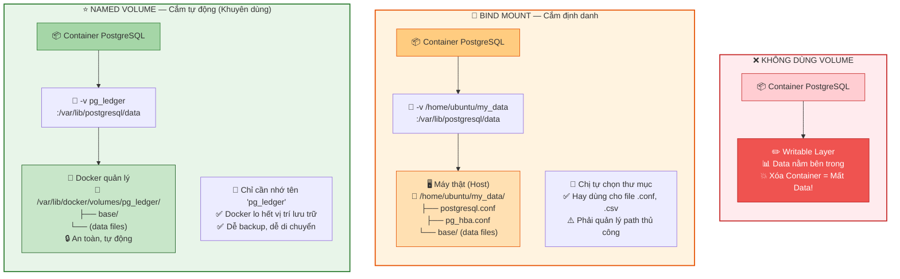
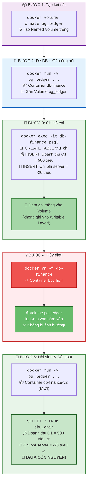

Chào chị. Bài trước chị đã tận mắt thấy sự "vô tình" của Docker: Container bị xóa là dữ liệu bốc hơi sạch sẽ. Khi xử lý các nghiệp vụ về dữ liệu hay đối soát sổ cái kế toán, tính toàn vẹn của dữ liệu là thứ sống còn. Hệ thống tính toán (Container) có thể sập, nhưng "Sổ cái" (Data) thì tuyệt đối không được mất một con số nào.

Hôm nay chúng ta học cách tách rời phần "Xác" (Môi trường chạy) và phần "Hồn" (Dữ liệu) bằng **Docker Volume**.

---

## Ngày 5 - Buổi 1: Docker Volume - "Sổ cái" bất tử của Database

### 1. Bản chất của Volume (Góc nhìn Dữ liệu)

Trong Database, dữ liệu vật lý luôn được lưu ở một thư mục cụ thể trên ổ cứng (ví dụ PostgreSQL mặc định lưu ở `/var/lib/postgresql/data`).

Nếu chị để thư mục này nằm **bên trong** Container, khi Container chết, thư mục chết theo.
**Giải pháp:** Chúng ta sẽ khoét một cái lỗ trên vỏ Container, sau đó cắm một cái ống (Volume) nối từ thư mục `/var/lib/postgresql/data` đó ra thẳng cái ổ cứng vật lý của máy tính thật (Host/VM).

Có 2 kiểu cắm ống chính:

1. **Bind Mount (Cắm định danh):** Chị ép Docker phải nối vào đúng thư mục `/home/ubuntu/my_data` trên máy thật. Kiểu này hay dùng để map các file cấu hình (`.conf`, `.csv` cần import).
2. **Named Volume (Cắm tự động - Khuyên dùng cho DB):** Chị chỉ cần đặt tên một cái Volume (ví dụ `db_ledger`). Docker sẽ tự động tìm chỗ an toàn nhất trên máy thật để cất giữ nó. Chị không cần quan tâm nó nằm ở ngóc ngách nào, chỉ cần nhớ tên là gọi lại được.

> **📊 Sơ đồ so sánh: Không Volume vs Bind Mount vs Named Volume:**



> 💡 **Quy tắc vàng:** Chạy Database → luôn dùng **Named Volume**. Map file cấu hình → dùng **Bind Mount**.

---

### 2. Thực hành: Bài Test "Vụ tai nạn máy chủ"

Hôm nay chị hãy đóng vai một DBA thực thụ. Chúng ta sẽ dựng Database, nhập dữ liệu tài chính quan trọng, cố tình đập nát cái Server đó, rồi dựng lại để xem dữ liệu có sống sót không.

> **📊 Sơ đồ toàn cảnh bài thực hành — 5 bước chứng minh Volume bất tử:**



> 💡 **Điểm mấu chốt:** Khi dùng `-v pg_ledger:/var/lib/postgresql/data`, data ghi thẳng vào Volume (ổ cứng thật), KHÔNG ghi vào Writable Layer. Nên xóa Container, data vẫn sống!

*(Mở Terminal lên và chỉ dùng lệnh Bash!)*

#### Bước 1: Khởi tạo "Két sắt" (Named Volume)

Trước khi đẻ DB, chị tạo một cái Volume độc lập để chứa data:

> `docker volume create pg_ledger`

Kiểm tra xem két sắt đã được tạo chưa:

> `docker volume ls`

#### Bước 2: Triệu hồi Database và gắn ống nối

Lệnh này giống lệnh hôm trước, nhưng chị chú ý thêm cờ `-v` (Volume):

> `docker run --name db-finance -e POSTGRES_PASSWORD=sieumat -d -v pg_ledger:/var/lib/postgresql/data -p 5432:5432 postgres:15`

*Giải thích cờ `-v pg_ledger:/var/lib/postgresql/data`: Lệnh này bảo Docker lấy cái két sắt `pg_ledger` ở ngoài máy thật, gắn chặt vào thư mục chứa data mặc định của Postgres ở bên trong.*

#### Bước 3: Thâm nhập và Ghi sổ cái

Chui vào bên trong con DB vừa tạo:

> `docker exec -it db-finance psql -U postgres`

Gõ vài lệnh SQL để tạo một bảng dữ liệu quan trọng:

```sql
CREATE TABLE thu_chi (id SERIAL PRIMARY KEY, hang_muc VARCHAR(50), so_tien INT);
INSERT INTO thu_chi (hang_muc, so_tien) VALUES ('Doanh thu Q1', 500000000);
INSERT INTO thu_chi (hang_muc, so_tien) VALUES ('Chi phi server', -20000000);
SELECT * FROM thu_chi;

```

*(Thấy dữ liệu hiện lên là OK. Gõ `\q` để thoát ra ngoài Terminal của máy thật).*

#### Bước 4: Hủy diệt hệ thống (Mô phỏng sự cố)

Bây giờ, giả sử con Server bị hacker tấn công hoặc sếp yêu cầu nâng cấp version DB. Chị thẳng tay xóa sạch con Container này:

> `docker rm -f db-finance`

Kiểm tra bằng `docker ps -a`, con `db-finance` đã bay màu. Nếu là hôm trước, bảng `thu_chi` của chị cũng đi tông. Nhưng hôm nay thì khác.

#### Bước 5: Hồi sinh và Đối soát

Chị đẻ ra một con DB hoàn toàn mới (thậm chí có thể đổi tên thành `db-finance-v2`), nhưng điều kiện tiên quyết là **phải gắn lại đúng cái ống volume cũ**:

> `docker run --name db-finance-v2 -e POSTGRES_PASSWORD=sieumat -d -v pg_ledger:/var/lib/postgresql/data -p 5432:5432 postgres:15`

Chui vào con DB mới tinh này:

> `docker exec -it db-finance-v2 psql -U postgres`

Và bây giờ, khoảnh khắc sự thật. Gõ:

> `SELECT * FROM thu_chi;`

**BÙM!** Các bản ghi doanh thu và chi phí vẫn nằm nguyên ở đó, không xê dịch một đồng.

*(Gõ `\q` để thoát).*

---

### 3. Dọn dẹp chiến trường (Nâng cao)

Volume sinh ra để bất tử, nên lệnh `docker rm` xóa Container sẽ **không bao giờ** chạm được vào Volume. Điều này giúp bảo vệ dữ liệu tuyệt đối.

Nhưng nếu chị làm bài Lab xong và muốn dọn rác cho nhẹ máy, chị phải tự tay gỡ két sắt:

1. Xóa con DB đang chiếm giữ Volume: `docker rm -f db-finance-v2`
2. Đập vỡ két sắt: `docker volume rm pg_ledger`

---

**Câu hỏi tư duy cuối buổi:**
Giả sử chị cần chuyển dữ liệu của con DB này từ máy Laptop hiện tại sang một con Server thật trên mạng. Theo chị, chúng ta sẽ copy cái Container, hay copy cái Volume?

Làm xong bài thực hành Volume này là chị đã nắm được 80% sức mạnh cốt lõi của Docker trong việc quản trị dữ liệu. Nghỉ ngơi chút, bài tiếp theo chúng ta sẽ học **Docker Compose** - Kỹ thuật điều binh khiển tướng, gọi một phát lên cả một cụm gồm Web App, Database và Cache chạy cùng lúc!