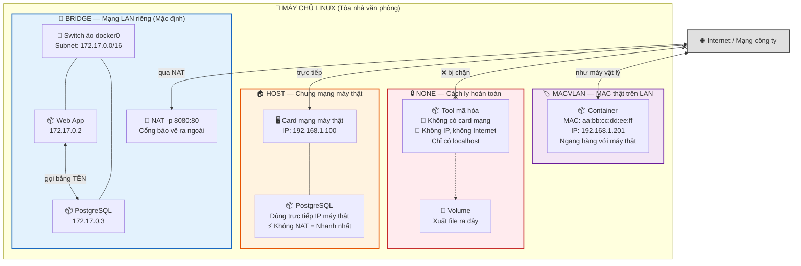
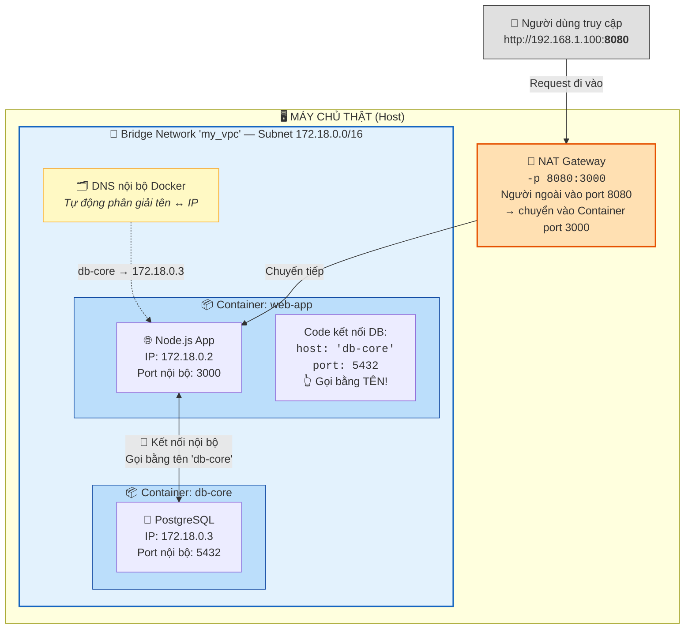
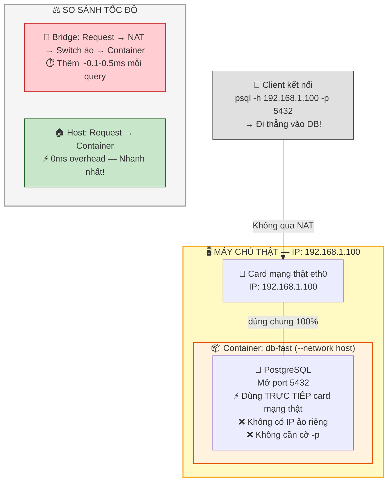
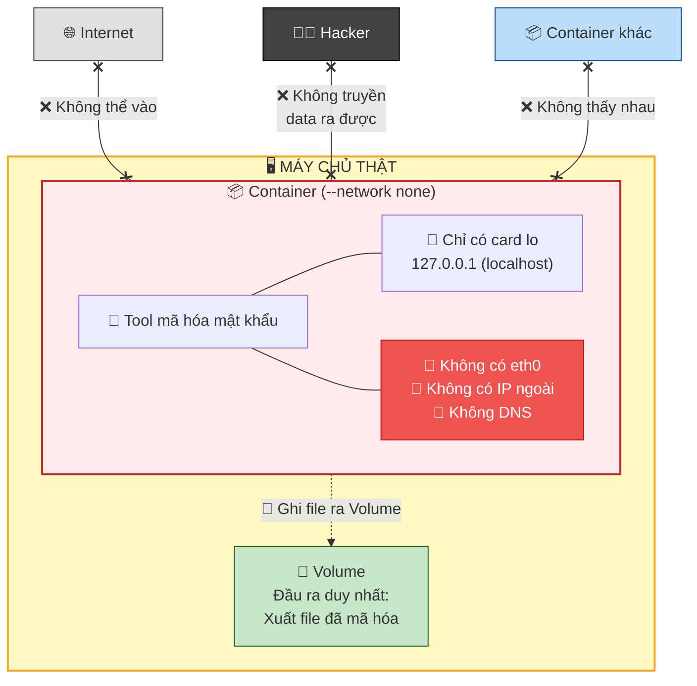
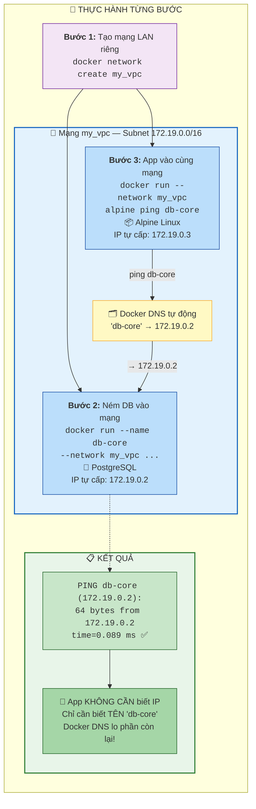

Chào chị. Hôm trước chúng ta đã thử kéo cáp mạng để một con App giả lập gọi được Database. Nhưng đó mới chỉ là bề nổi của tảng băng chìm.

Trong DevSecOps và thiết kế kiến trúc hệ thống, tùy vào yêu cầu về **Bảo mật (Security)** hoặc **Hiệu năng (Performance)**, chúng ta không chỉ dùng một loại mạng. Docker cung cấp nhiều loại "Card mạng" (Network Drivers) khác nhau để chị thiết kế các mô hình vùng kín (Air-gapped) hoặc tối ưu hóa tốc độ truy vấn Database.

Bài hôm nay sẽ lật mở toàn bộ các mô hình mạng của Docker.

---

## Ngày 5 - Buổi 2: Giải phẫu các kiến trúc mạng Docker

Hãy coi máy chủ Linux của chị như một tòa nhà văn phòng. Docker cho phép chị đi dây mạng cho các Container theo 4 mô hình chính sau:

> **📊 Sơ đồ tổng quan 4 mô hình mạng Docker:**

> 💡 **Nhìn 1 phát là hiểu:** Bridge = mạng LAN riêng có cổng bảo vệ | Host = bán vỉa hè, không rào chắn | None = két sắt bị rút dây mạng | Macvlan = giả làm máy thật

### 1. Bridge (Mạng Cầu Nối - VLAN ảo)

* **Bản chất:** Đây là loại mạng mặc định. Docker tạo ra một cái Switch ảo (docker0). Các Container cắm chung vào cái Switch này sẽ được cấp IP nội bộ (ví dụ `172.17.x.x`).
* **Góc nhìn thực tế:** Giống như lập một mạng LAN riêng cho phòng Kế toán. Các máy trong phòng tự gọi nhau bằng Tên (Hostname) thay vì IP. Người ngoài muốn vào phải xin phép qua cổng bảo vệ (NAT Port-mapping bằng cờ `-p`).
* **Sử dụng:** 90% ứng dụng thông thường (Web App gọi xuống Database).

> **📊 Sơ đồ chi tiết Bridge Network — Phòng Kế toán có cổng bảo vệ:**

> 💡 **Điểm quan trọng:** Trong Bridge, App gọi DB bằng **tên Container** (không cần nhớ IP). Người ngoài chỉ vào được qua cổng NAT `-p`.

### 2. Host (Mạng Chung Chạ - Tối đa Hiệu năng)

* **Bản chất:** Container đập bỏ hoàn toàn vách ngăn mạng ảo. Nó sử dụng trực tiếp Card mạng và dải IP của chính máy chủ thật (Host).
* **Góc nhìn thực tế:** Thay vì thuê ki-ốt trong trung tâm thương mại, chị mang bàn ra vỉa hè bày bán luôn. Khách (Request) đi thẳng vào không qua cửa từ hay thang máy nào cả. Không có độ trễ do NAT.
* **Sử dụng:** Rất hay dùng cho Database chịu tải cực cao. Chị không muốn độ trễ mạng ảo làm chậm đi vài mili-giây của các câu lệnh Query phức tạp.

> **📊 Sơ đồ chi tiết Host Network — Bán hàng vỉa hè, không qua trung gian:**

> 💡 **Khi nào dùng Host?** Database chịu tải cao, cần mỗi mili-giây. Nhưng đánh đổi: mất cách ly mạng, 2 Container không thể cùng dùng 1 port.

### 3. None (Mạng Cách Ly - Két sắt tuyệt mật)

* **Bản chất:** Container sinh ra không có card mạng (ngoài cái `localhost` của chính nó). Hoàn toàn mù tịt với Internet và các Container khác.
* **Góc nhìn thực tế:** Giống như một cái máy tính bị rút hẳn dây mạng, dùng để xử lý dữ liệu tuyệt mật. Hacker dù có khai thác được lỗ hổng của ứng dụng chui vào trong, cũng không thể truyền dữ liệu (Data Exfiltration) ra ngoài.
* **Sử dụng:** Các Job xử lý dữ liệu nhạy cảm (ví dụ: Tool mã hóa mật khẩu, đọc file sao kê ngân hàng nội bộ). Xử lý xong xuất ra file Volume rồi tự hủy.

> **📊 Sơ đồ chi tiết None Network — Két sắt bị rút dây mạng:**

> 💡 **Ứng dụng DevSecOps:** Xử lý sao kê ngân hàng, mã hóa password, sinh chứng chỉ SSL → nhét vào Container `none`, xuất file qua Volume. Hacker chui vào cũng không gửi data ra ngoài được!

### 4. Macvlan (Mạng Vật Lý ảo - Cao cấp)

* **Bản chất:** Cấp cho Container một địa chỉ MAC vật lý. Container xuất hiện trên mạng cty (mạng cục bộ của router thật) như một cái máy tính vật lý bình thường, ngang hàng với chính máy chủ Host.
* **Sử dụng:** Dành cho các hệ thống Legacy (đồ cổ) yêu cầu thiết bị phải có địa chỉ MAC thật. Ít dùng trong DevSecOps hiện đại.

---

### 2. Thực hành: Trải nghiệm 3 trạng thái Mạng

Chị hãy mở Terminal lên. Chúng ta sẽ làm bài Lab so sánh để thấy sự khác biệt về mặt cấu trúc lệnh.

**Test 1: Mạng Không Khí (Air-gapped) với `none**`
Chị đẻ một môi trường Linux siêu nhỏ gọn (alpine) để test, ép nó vào mạng `none` và chui thẳng vào trong:

> `docker run -it --rm --network none alpine sh`

Bên trong Container, chị kiểm tra các card mạng hiện có:

> `ip addr`
> *(Chị sẽ chỉ thấy card `lo` - 127.0.0.1. Không có IP nào khác).*

Thử gõ lệnh gọi ra Internet:

> `ping google.com`
> *(Kết quả: `ping: bad address`. Hệ thống hoàn toàn cách ly). Gõ `exit` để thoát và tự hủy Container.*

**Test 2: Mạng Hiệu năng cao với `host**`
Bây giờ, chị đẻ ra một con PostgreSQL, nhưng yêu cầu nó hòa mạng chung với máy chủ thật:

> `docker run --name db-fast --network host -e POSTGRES_PASSWORD=sieumat -d postgres:15`

*Lưu ý:* Ở lệnh này, chị sẽ thấy hoàn toàn **không có cờ `-p 5432:5432**`. Vì nó dùng chung mạng máy thật, khi Database mở cổng 5432 bên trong, thì tự động máy tính thật của chị cũng mở cổng 5432.

Chị dùng lệnh soi cổng máy thật (đã học Ngày 1) để kiểm chứng:

> `ss -tulpn | grep 5432`
> *(Chị sẽ thấy tiến trình đang giữ cổng này, trực diện và không qua ảo hóa).*
> Xóa con DB đi cho gọn máy: `docker rm -f db-fast`

**Test 3: Mạng Bridge Tùy chỉnh (VPC thu nhỏ)**
Đây là cách làm chuẩn mực nhất để App và DB nhận mặt nhau.

> **📊 Sơ đồ thực hành — Tạo VPC thu nhỏ cho App gọi DB bằng tên:**

> 💡 **Đây là nền tảng cho Docker Compose:** Sau này trong file `docker-compose.yml`, tất cả service sẽ tự động được ném vào chung 1 Bridge Network và gọi nhau bằng tên!

Tạo một mạng LAN riêng biệt:

> `docker network create my_vpc`

Ném Database vào cái LAN đó:

> `docker run --name db-core --network my_vpc -e POSTGRES_PASSWORD=sieumat -d postgres:15`

Đóng vai trò một con App, chui vào cùng mạng LAN và ping thử vào cái tên `db-core`:

> `docker run -it --rm --network my_vpc alpine ping db-core`
> *(Nó sẽ phân giải tên `db-core` thành IP ảo dạng 172.x.x.x và ping thành công. Ấn `Ctrl+C` dừng lại và gõ `exit` để thoát).*
> Xóa DB đi cho sạch: `docker rm -f db-core`

---

Việc nắm rõ khi nào dùng Bridge, khi nào ép bằng Host, và khi nào cách ly bằng None chính là tư duy kiến trúc của Kỹ sư Hệ thống.

Đến đây, chị đã phải tự tay gõ quá nhiều tham số: `-e`, `-v`, `-p`, `--network`, `--name`... Rất dễ gõ sai chính tả. Chị đã sẵn sàng để "từ bỏ" việc gõ từng dòng lệnh dài ngoằng này, và chuyển sang nhét toàn bộ thông số hạ tầng vào một file văn bản rõ ràng, cấu trúc đẹp đẽ với **Docker Compose** chưa?