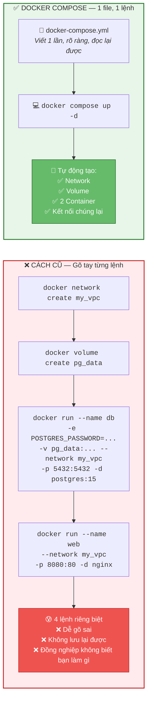
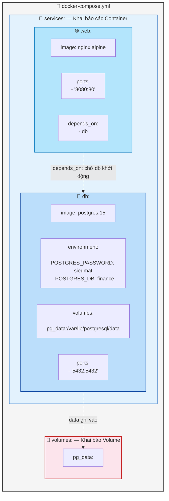
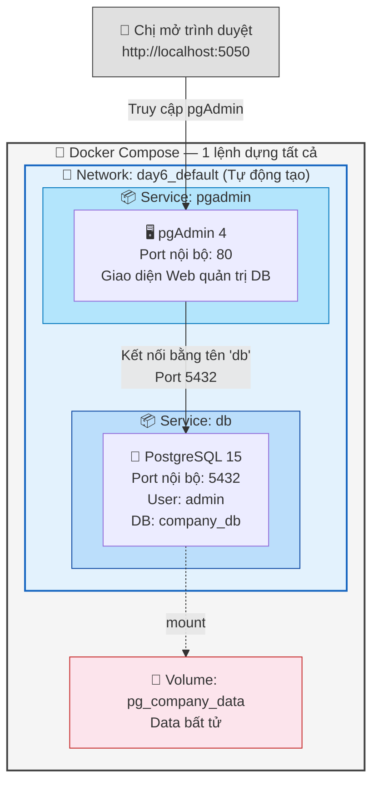
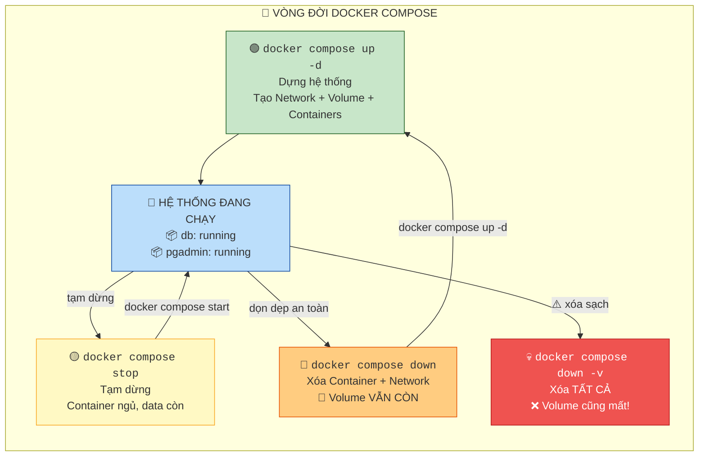

Chào chị. Mấy bài trước chị đã phải gõ những dòng lệnh `docker run` dài ngoằng, nhét đủ thứ cờ `-e`, `-v`, `-p`, `--network`, `--name`... vào một dòng duy nhất. Sai một chữ là phải xóa đi gõ lại. Và quan trọng nhất: nếu hệ thống cần 3 con Container (Web App + Database + Cache) chạy cùng lúc, chị phải gõ 3 lệnh riêng biệt, tự tay tạo Network, tự tay gắn Volume... Cực kỳ dễ sai sót và không ai có thể "đọc lại" được chị đã cấu hình hệ thống như thế nào.

Giải pháp: Nhét tất cả vào **một file văn bản duy nhất**, viết rõ ràng từng dòng, và chỉ cần **1 lệnh** để cả hệ thống đứng dậy. Đó chính là **Docker Compose**.

---

## Ngày 6 - Buổi 1: Docker Compose — "Bản thiết kế" toàn bộ hệ thống

### 1. Bản chất Docker Compose (Góc nhìn Database)

Nếu những bài trước chị gõ từng lệnh `docker run` giống như gõ từng câu `CREATE TABLE`, `INSERT`, `GRANT` một cách thủ công trên Terminal... thì Docker Compose giống như chị viết một **file Migration Script `.sql`** hoàn chỉnh — chứa toàn bộ cấu trúc bảng, dữ liệu mẫu, phân quyền — rồi chỉ cần chạy `psql -f migration.sql` là xong.

> **📊 Sơ đồ so sánh: Gõ lệnh thủ công vs Docker Compose:**



> 💡 **Quy tắc vàng:** Nếu hệ thống cần từ 2 Container trở lên, **luôn dùng Docker Compose**. Không bao giờ gõ tay từng lệnh `docker run` nữa.

---

### 2. Giải mã cấu trúc file `docker-compose.yml`

File `docker-compose.yml` viết bằng ngôn ngữ **YAML** (Yet Another Markup Language). Quy tắc duy nhất chị cần nhớ: **Thụt đầu dòng bằng DẤU CÁCH (Space), tuyệt đối không dùng Tab**. Sai 1 dấu cách là file hỏng.

Chị hãy xem bản đồ ánh xạ từ các cờ `docker run` sang cấu trúc YAML:

| Lệnh `docker run` cũ | Tương đương trong `docker-compose.yml` | Ý nghĩa |
| --- | --- | --- |
| `--name db-finance` | `services: db-finance:` | Đặt tên service (Container) |
| `-e POSTGRES_PASSWORD=sieumat` | `environment: POSTGRES_PASSWORD: sieumat` | Biến môi trường |
| `-v pg_ledger:/var/lib/postgresql/data` | `volumes: - pg_ledger:/var/lib/...` | Gắn Volume |
| `-p 5432:5432` | `ports: - "5432:5432"` | Mở cổng |
| `--network my_vpc` | *(Tự động! Compose tạo Network riêng)* | Mạng nội bộ |
| `postgres:15` | `image: postgres:15` | Image sử dụng |

> **📊 Sơ đồ cấu trúc file docker-compose.yml:**



**Từ khóa quan trọng nhất:**
- **`services:`** — Khai báo danh sách các Container (giống `CREATE TABLE` khai báo các bảng).
- **`volumes:`** — Khai báo các Volume ở cuối file (giống `CREATE TABLESPACE`).
- **`depends_on:`** — Bảo Container nào phải chờ Container nào khởi động trước (giống khóa ngoại `FOREIGN KEY` — bảng con phải chờ bảng cha tồn tại).
- **`networks:`** — Compose **tự động tạo** một Bridge Network riêng cho tất cả service trong file. Các service gọi nhau bằng **tên** (giống bài 5.2 chị vừa học).

---

### 3. Thực hành: Dựng hệ thống Database + Quản trị viên (pgAdmin)

Bài thực hành hôm nay mô phỏng kịch bản thực tế: Chị cần một con PostgreSQL và một giao diện quản trị web (pgAdmin) để quản lý DB bằng trình duyệt, thay vì gõ `psql` trên Terminal.

> **📊 Sơ đồ kiến trúc hệ thống sẽ dựng:**



#### Bước 1: Tạo thư mục dự án

> `mkdir ~/lab-compose && cd ~/lab-compose`

#### Bước 2: Viết file `docker-compose.yml`

Chị tạo file bằng lệnh `nano docker-compose.yml` rồi copy nội dung sau vào:

```yaml
services:
  # === DATABASE SERVER ===
  db:
    image: postgres:15
    container_name: pg-server
    restart: unless-stopped
    environment:
      POSTGRES_USER: admin
      POSTGRES_PASSWORD: sieumat123
      POSTGRES_DB: company_db
    volumes:
      - pg_company_data:/var/lib/postgresql/data
    ports:
      - "5432:5432"

  # === GIAO DIỆN QUẢN TRỊ DATABASE ===
  pgadmin:
    image: dpage/pgadmin4:latest
    container_name: pg-admin-web
    restart: unless-stopped
    environment:
      PGADMIN_DEFAULT_EMAIL: chi@company.com
      PGADMIN_DEFAULT_PASSWORD: admin123
    ports:
      - "5050:80"
    depends_on:
      - db

# === KHAI BÁO VOLUME ===
volumes:
  pg_company_data:
```

*Giải phẫu từng dòng:*
- **`restart: unless-stopped`** — Nếu Container sập, Docker tự động đẻ lại. Chỉ dừng khi chị ra lệnh `docker compose stop` bằng tay (giống cơ chế Auto-Restart của PostgreSQL Service).
- **`depends_on: - db`** — pgAdmin sẽ chờ con DB khởi động trước rồi mới bật. Đảm bảo khi pgAdmin sống, đã có DB để kết nối.
- **`POSTGRES_USER: admin`** — Tạo sẵn user `admin` thay vì dùng user `postgres` mặc định. Đây là thói quen bảo mật tốt.

#### Bước 3: Phép thuật 1 dòng lệnh

Đứng trong thư mục `lab-compose`, chị gõ:

> `docker compose up -d`

Ngồi chờ Docker kéo Image về (lần đầu hơi lâu). Khi thấy dòng `Started` là xong.

Kiểm tra xem cả 2 con Container đã sống chưa:

> `docker compose ps`

Chị sẽ thấy 2 dòng: `pg-server` (running) và `pg-admin-web` (running).

#### Bước 4: Trải nghiệm pgAdmin (GUI quản trị DB)

Mở trình duyệt, truy cập: **http://localhost:5050**

Đăng nhập bằng:
- Email: `chi@company.com`
- Password: `admin123`

Sau khi vào, chị cần thêm Server mới (Add New Server):
- **Tab General:** Name = `My Company DB` (Tên tùy thích)
- **Tab Connection:**
  - Host: `db` ← *(Đây là TÊN service trong file compose, không phải IP!)*
  - Port: `5432`
  - Username: `admin`
  - Password: `sieumat123`

Bấm Save. Bùm! Chị đã kết nối được vào Database qua giao diện đồ họa đẹp mắt.

#### Bước 5: Test tạo dữ liệu

Trong pgAdmin, bấm vào `company_db` → Tools → Query Tool. Gõ:

```sql
CREATE TABLE nhan_vien (id SERIAL PRIMARY KEY, ho_ten VARCHAR(50), phong_ban VARCHAR(30));
INSERT INTO nhan_vien (ho_ten, phong_ban) VALUES ('Nguyễn Văn A', 'Kế toán');
INSERT INTO nhan_vien (ho_ten, phong_ban) VALUES ('Trần Thị B', 'IT');
SELECT * FROM nhan_vien;
```

Thấy dữ liệu hiện ra là thành công.

---

### 4. Các lệnh điều khiển Compose (Bảng tra cứu)

Tất cả lệnh dưới đây phải chạy trong thư mục chứa file `docker-compose.yml`:

| Lệnh | Ý nghĩa (Góc nhìn Database) | Giải thích |
| --- | --- | --- |
| `docker compose up -d` | `START DATABASE` | Dựng và chạy toàn bộ hệ thống ở chế độ ngầm |
| `docker compose down` | `SHUTDOWN DATABASE` | Tắt và xóa tất cả Container + Network. **Volume vẫn còn!** |
| `docker compose down -v` | `DROP DATABASE` | Tắt và xóa tất cả, **kể cả Volume** (mất Data!) |
| `docker compose ps` | `SELECT * FROM pg_stat_activity` | Xem trạng thái các Container đang chạy |
| `docker compose logs db` | `pg_log` | Xem nhật ký (log) của service `db` |
| `docker compose logs -f` | `tail -f pg_log` | Xem log realtime (theo dõi liên tục) |
| `docker compose restart db` | `pg_ctl restart` | Khởi động lại 1 service cụ thể |
| `docker compose exec db psql -U admin company_db` | `psql -U admin company_db` | Chui vào DB gõ SQL |

> **📊 Sơ đồ vòng đời Docker Compose:**



> 💡 **Nhớ kỹ:** `docker compose down` = an toàn (giữ data). `docker compose down -v` = nguy hiểm (mất data). Giống `DELETE` vs `DROP TABLE` vậy!

---

### 5. Dọn dẹp bài Lab

Khi chị làm xong muốn dọn sạch, chạy:

> `docker compose down`
> *(Xóa Container + Network, giữ Volume data)*

Nếu muốn xóa luôn Volume (mất dữ liệu):

> `docker compose down -v`

---

**Câu hỏi tư duy cuối buổi:**
Hiện tại mật khẩu Database đang nằm trình trình trong file `docker-compose.yml`. Nếu chị đẩy file này lên GitHub, cả thế giới sẽ biết password DB của công ty. Theo chị, làm sao để giấu mật khẩu mà vẫn dùng được Docker Compose?

Buổi sau chúng ta sẽ giải quyết vấn đề này và học thêm các kỹ thuật nâng cao: **Biến môi trường (.env), Health Check, và chiến thuật khởi động lại tự động** — những thứ biến hệ thống Docker từ "chạy được" thành "chạy chuyên nghiệp cấp doanh nghiệp".
