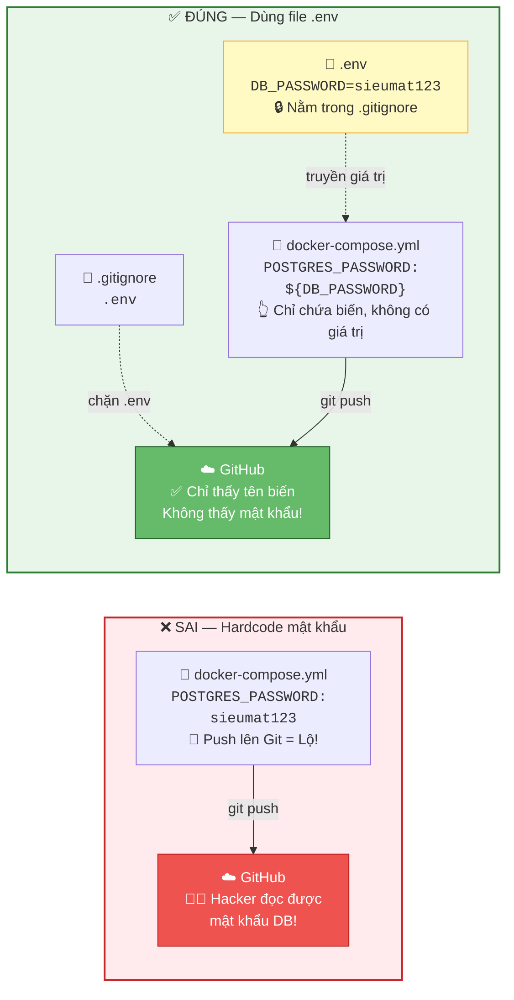
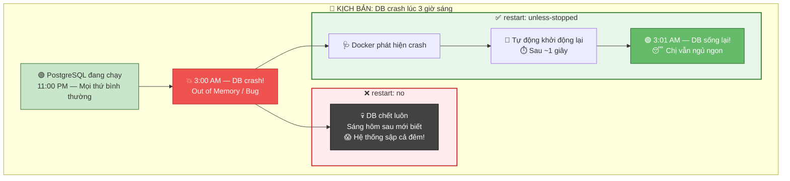
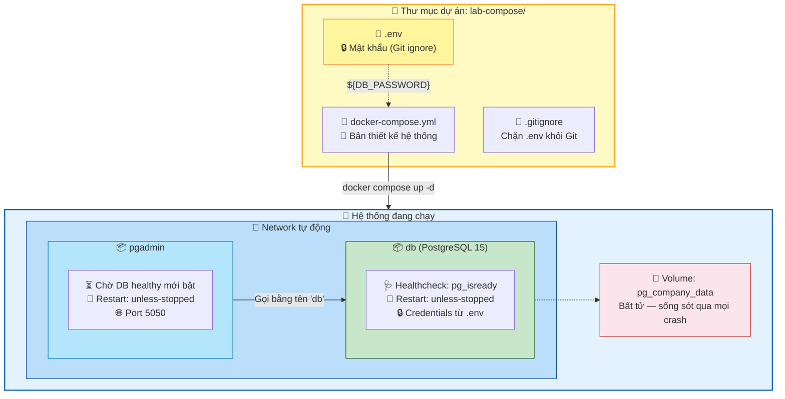

Chào chị. Buổi trước chị đã dựng được cả một hệ thống PostgreSQL + pgAdmin chỉ bằng 1 file YAML và 1 dòng lệnh. Nhưng nếu quan sát kỹ, chị sẽ thấy hệ thống đó còn nhiều lỗ hổng nghiêm trọng:

1. **Mật khẩu nằm lộ liễu** trong file `docker-compose.yml`. Đẩy lên Git là lộ sạch.
2. **`depends_on` chỉ chờ Container khởi động**, nhưng không chờ Database thực sự sẵn sàng nhận kết nối. pgAdmin có thể bật lên khi PostgreSQL vẫn đang "hâm nóng" → lỗi kết nối.
3. **Nếu DB crash lúc 3 giờ sáng**, không ai ở đó gõ `docker compose up` lại.

Bài hôm nay sẽ biến hệ thống từ "chạy được" thành "chạy cấp doanh nghiệp".

---

## Ngày 6 - Buổi 2: Docker Compose nâng cao — Bảo mật, Tự hồi phục & Giám sát

### 1. Giấu mật khẩu bằng file `.env` (Environment File)

Trong Database, chị không bao giờ hardcode password vào câu lệnh SQL rồi lưu trên Git. Docker Compose cũng vậy. Chị sẽ tách mật khẩu ra một file riêng tên `.env` và cho Git bỏ qua nó.

> **📊 Sơ đồ: Tách mật khẩu khỏi file Compose:**



**Thực hành:**

Quay lại thư mục `lab-compose` hôm trước. Tạo file `.env`:

> `nano .env`

Nội dung:

```env
# === CREDENTIALS (Không được đẩy lên Git) ===
DB_USER=admin
DB_PASSWORD=sieumat123
DB_NAME=company_db

PGADMIN_EMAIL=chi@company.com
PGADMIN_PASSWORD=admin123
```

Tạo file `.gitignore` để Git bỏ qua:

> `echo ".env" > .gitignore`

Giờ sửa lại file `docker-compose.yml`, thay toàn bộ giá trị mật khẩu bằng biến:

```yaml
services:
  db:
    image: postgres:15
    container_name: pg-server
    restart: unless-stopped
    environment:
      POSTGRES_USER: ${DB_USER}
      POSTGRES_PASSWORD: ${DB_PASSWORD}
      POSTGRES_DB: ${DB_NAME}
    volumes:
      - pg_company_data:/var/lib/postgresql/data
    ports:
      - "5432:5432"
    healthcheck:
      test: ["CMD-SHELL", "pg_isready -U ${DB_USER} -d ${DB_NAME}"]
      interval: 10s
      timeout: 5s
      retries: 5
      start_period: 30s

  pgadmin:
    image: dpage/pgadmin4:latest
    container_name: pg-admin-web
    restart: unless-stopped
    environment:
      PGADMIN_DEFAULT_EMAIL: ${PGADMIN_EMAIL}
      PGADMIN_DEFAULT_PASSWORD: ${PGADMIN_PASSWORD}
    ports:
      - "5050:80"
    depends_on:
      db:
        condition: service_healthy

volumes:
  pg_company_data:
```

Chị thấy 2 thứ mới xuất hiện: `healthcheck` và `condition: service_healthy`. Đó là nội dung phần tiếp theo.

---

### 2. Health Check — "Bác sĩ trực" cho Database

`depends_on: - db` của bài trước chỉ chờ Container **khởi động** (process chạy). Nhưng PostgreSQL sau khi bật tiến trình vẫn cần vài giây để nạp WAL log, kiểm tra data integrity, mở cổng kết nối... Trong thời gian đó, pgAdmin nhào vào kết nối sẽ bị từ chối.

**Health Check** giống như một "bác sĩ trực" cứ mỗi 10 giây lại vào phòng Database hỏi: *"Ê, mày đã sẵn sàng nhận bệnh nhân chưa?"*

> **📊 Sơ đồ so sánh depends_on thường vs depends_on + healthcheck:**

```mermaid
flowchart TB
    subgraph no_health["❌ depends_on thường — Chỉ chờ khởi động"]
        direction LR
        DB1_START["🐘 DB Container<br/>Process bật lên"]
        DB1_INIT["⏳ DB đang nạp WAL...<br/>Chưa mở cổng 5432"]
        PGADMIN1["🖥️ pgAdmin bật luôn<br/>→ Kết nối DB"]
        ERR["❌ Connection refused!<br/>DB chưa sẵn sàng!"]
        DB1_START --> DB1_INIT
        DB1_INIT --> PGADMIN1
        PGADMIN1 --> ERR
    end

    subgraph with_health["✅ depends_on + condition: service_healthy"]
        direction LR
        DB2_START["🐘 DB Container<br/>Process bật lên"]
        DB2_INIT["⏳ DB đang nạp WAL...<br/>🩺 Healthcheck: CHƯA OK"]
        DB2_READY["✅ DB sẵn sàng!<br/>🩺 Healthcheck: OK<br/>pg_isready = success"]
        PGADMIN2["🖥️ pgAdmin BÂY GIỜ<br/>mới được phép bật"]
        OK["✅ Kết nối thành công!"]
        DB2_START --> DB2_INIT --> DB2_READY --> PGADMIN2 --> OK
    end

    style no_health fill:#FFEBEE,stroke:#C62828,stroke-width:2px
    style with_health fill:#E8F5E9,stroke:#2E7D32,stroke-width:2px
    style ERR fill:#EF5350,stroke:#B71C1C,color:#fff
    style OK fill:#66BB6A,stroke:#1B5E20,color:#fff
    style DB2_READY fill:#A5D6A7,stroke:#2E7D32
```



**Giải phẫu cấu hình Health Check:**

```yaml
healthcheck:
  test: ["CMD-SHELL", "pg_isready -U ${DB_USER} -d ${DB_NAME}"]
  interval: 10s      # Cứ 10 giây kiểm tra 1 lần
  timeout: 5s        # Nếu sau 5 giây không trả lời → coi như fail
  retries: 5         # Fail 5 lần liên tiếp → đánh dấu "unhealthy"
  start_period: 30s  # Cho DB 30 giây hâm nóng, trong thời gian này fail không tính
```

- **`pg_isready`** — Công cụ có sẵn trong Image PostgreSQL, kiểm tra cổng 5432 có đang nhận kết nối không.
- **`condition: service_healthy`** — pgAdmin chỉ được bật khi Health Check của DB trả về "healthy".

Kiểm tra trạng thái Health Check:

> `docker compose ps`
> *(Cột STATUS sẽ hiện `healthy` thay vì chỉ `running`).*

---

### 3. Restart Policy — Tự hồi phục lúc 3 giờ sáng

Chị để ý dòng `restart: unless-stopped` trong file compose. Đây là chính sách khởi động lại tự động khi Container sập.

| Restart Policy | Ý nghĩa | Khi nào dùng |
| --- | --- | --- |
| `no` | Không tự khởi động lại (mặc định) | Chạy Job 1 lần rồi thôi |
| `always` | Luôn luôn tự bật lại, kể cả khi reboot máy | Service quan trọng trên Production |
| `unless-stopped` | Tự bật lại, TRỪ KHI chị tự tay `docker compose stop` | Phù hợp cho Lab và Dev |
| `on-failure` | Chỉ bật lại khi Container crash (exit code ≠ 0) | Batch Job, Script xử lý data |

> **📊 Sơ đồ Restart Policy hoạt động:**



**Test thử Restart Policy:**

Chị hãy cố tình giết con DB:

> `docker kill pg-server`

Chờ 2-3 giây, rồi kiểm tra:

> `docker compose ps`

Chị sẽ thấy con `pg-server` tự động sống lại với trạng thái `healthy`. Docker đã làm bảo vệ cho chị lúc 3 giờ sáng.

---

### 4. Xem Log — "Hộp đen" của hệ thống

Khi hệ thống có vấn đề, log là thứ đầu tiên chị phải soi. Docker Compose tập trung log của tất cả service vào một chỗ:

**Xem log toàn bộ hệ thống (realtime):**

> `docker compose logs -f`
> *(Nhấn Ctrl+C để dừng. `-f` = follow, giống `tail -f`).*

**Xem log chỉ của Database:**

> `docker compose logs db`

**Xem 50 dòng log cuối cùng:**

> `docker compose logs --tail 50 db`

**Lọc log tìm lỗi (kết hợp grep — bài Linux hôm trước):**

> `docker compose logs db | grep -i "error\|fatal\|panic"`

> 💡 **Tư duy DBA:** Cái lệnh `docker compose logs db | grep -i error` chính xác là phiên bản DevOps của việc chị mở file `pg_log` tìm `ERROR` hoặc `FATAL` trong PostgreSQL.

---

### 5. Tổng kết kiến trúc hoàn chỉnh

Sau 2 buổi, chị đã có một hệ thống Docker Compose cấp doanh nghiệp:

> **📊 Sơ đồ tổng kết — Hệ thống hoàn chỉnh sau bài 6:**



---

### Checklist kiến thức Docker Compose

Trước khi sang chủ đề tiếp theo, chị hãy tự kiểm tra:

- [ ] Hiểu cấu trúc file `docker-compose.yml` (services, volumes, ports, environment)
- [ ] Biết dùng file `.env` để tách mật khẩu khỏi source code
- [ ] Hiểu `depends_on` + `condition: service_healthy` khác gì `depends_on` thường
- [ ] Cấu hình được Health Check cho PostgreSQL (`pg_isready`)
- [ ] Hiểu 4 loại Restart Policy và khi nào dùng loại nào
- [ ] Thành thạo `docker compose up/down/ps/logs/exec`

---

**Câu hỏi tư duy cuối buổi:**
Hiện tại chị có 1 file `docker-compose.yml` đang chạy ngon. Nhưng trên Production thì cấu hình khác (port khác, password khác, resource limit khác). Chị có nên tạo 2 file compose riêng cho Dev và Prod không? Hay có cách nào thông minh hơn?

Chúng ta đã chinh phục xong Docker. Bài tiếp theo, chị sẽ bước sang một thế giới hoàn toàn mới: **Kubernetes (K8s)** — Nơi hệ thống không chỉ có 2-3 Container trên 1 máy, mà là hàng trăm Container phân tán trên nhiều máy chủ. Docker Compose là chỉ huy 1 tiểu đội, Kubernetes là Tổng Tư lệnh cả quân đoàn!
