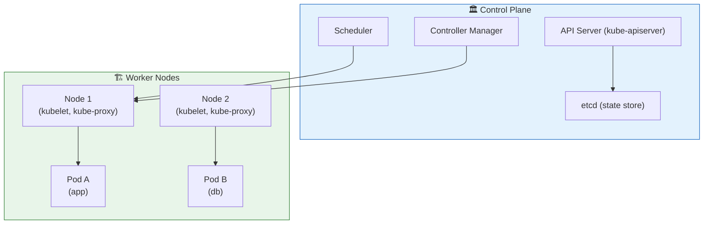

Chào chị. Kubernetes (K8s) là bước nhảy vọt tiếp theo: khi Docker Compose là chỉ huy cho 1 tiểu đội, K8s là Tổng Tư Lệnh của cả quân đoàn — điều phối hàng trăm, thậm chí hàng ngàn Container trên nhiều máy.

---

## Ngày 7 - Buổi 1: Kubernetes — Tổ chức một đế chế Container (Cốt lõi dễ hiểu)

### 1. Vấn đề K8s giải quyết

Khi hệ thống lớn lên, chị sẽ cần:
- Chạy nhiều bản sao của service trên nhiều máy
- Tự động khởi tạo lại khi có failure (self-healing)
- Cân bằng tải, phân phối traffic, và nâng cấp không downtime
- Quản lý storage cho stateful apps như DB

Kubernetes sinh ra để giải quyết những thứ đó ở quy mô lớn.

### 2. Những khái niệm cơ bản (từ nhỏ đến lớn)

- Pod: Đơn vị nhỏ nhất K8s quản lý — 1 hoặc nhiều container chạy chung network/volume.
- Node: Máy chủ vật lý/VM (k8s worker) chạy Pod.
- Cluster: Tập hợp nhiều Node do Control Plane quản lý.
- Control Plane: Gồm API Server, Scheduler, Controller Manager, etcd (store trạng thái).

### 3. Kiến trúc ngắn gọn (Mermaid)

### 4. Tư duy quản trị (so sánh với DB)

- Pod ~ một transaction scope nhỏ: ephemeral và có thể bị tạo/xóa.
- Deployment ~ quy trình sao lưu/restore: đảm bảo có N bản sao luôn chạy (ReplicaSet).
- etcd ~ ``system catalog`` (như hệ thống metadata DB). Không được tắt.

### 5. Kỹ năng chị cần chuẩn bị

- Thao tác `kubectl` (tương tự `psql` cho DB)
- Viết manifest YAML cho Pod/Deployment/Service
- Hiểu networking K8s (Service/Ingress)

---

**Câu hỏi tư duy:** Nếu chị muốn một service luôn có 5 bản sao chạy, và tự động nâng cấp không downtime, chị sẽ dùng resource nào trong K8s? (Gợi ý: ReplicaSet + Deployment)
