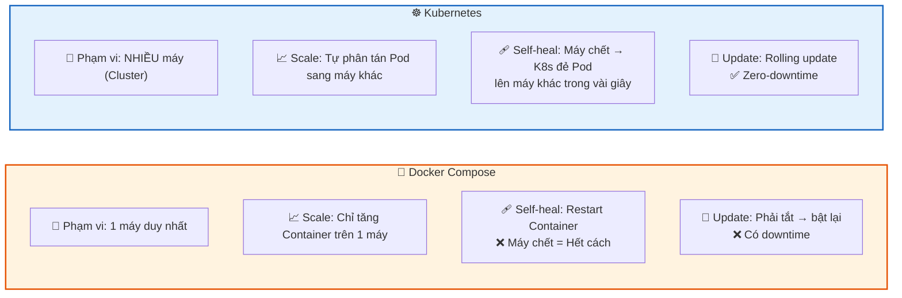
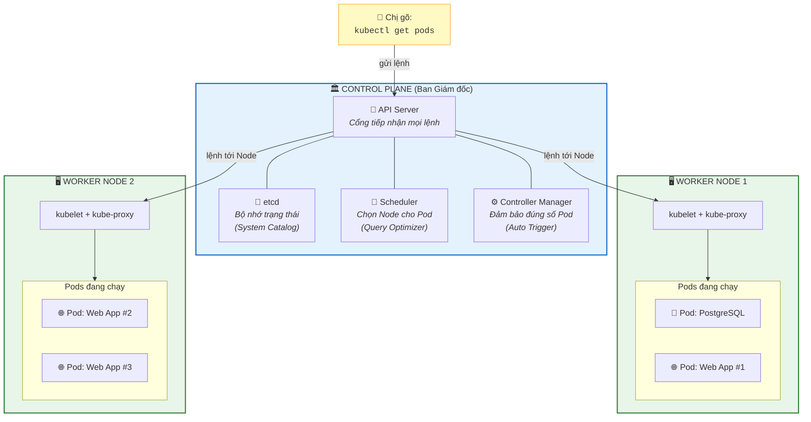
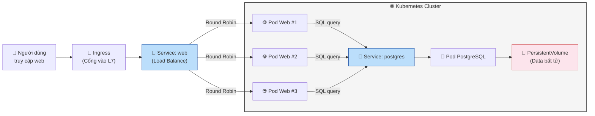

Chào chị. Docker Compose chỉ huy được một tiểu đội Container trên **1 máy**. Nhưng trong thực tế doanh nghiệp, hệ thống cần chạy trên **nhiều máy chủ**, cần tự động phục hồi khi Server sập, cần nâng cấp phần mềm mà người dùng không hề biết. Docker Compose không làm được những điều đó.

Giải pháp: **Kubernetes (K8s)** — Tổng Tư Lệnh điều phối Container trên quy mô lớn. Hãy tưởng tượng Docker Compose là quản lý 1 nhà hàng, thì K8s là quản lý cả chuỗi 100 nhà hàng trên toàn quốc.

---

## Ngày 7 - Buổi 1: Giải mã Kubernetes — Từ "1 máy" lên "cả đế chế"

### 1. Tại sao cần K8s? (Câu chuyện thực tế)

Chị tưởng tượng hệ thống công ty đang chạy trên Docker Compose:

- **Thứ Hai:** Mọi thứ chạy ngon trên 1 Server.
- **Thứ Ba:** Lượng khách tăng gấp 10 lần. 1 Server không chịu nổi. Chị muốn chạy thêm 5 bản sao Web App trên 5 máy khác nhau → Docker Compose **không biết cách** phân tán Container sang máy khác.
- **Thứ Tư:** Server chứa DB bị hỏng ổ cứng lúc 3 giờ sáng. Docker có `restart: always` nhưng nếu **cả máy chết** thì ai đẻ lại Container trên máy khác? → Docker Compose **bó tay**.
- **Thứ Năm:** Sếp yêu cầu nâng cấp Web App lên version mới mà người dùng không được bị gián đoạn → Docker Compose **không hỗ trợ** rolling update tự động.

Kubernetes giải quyết **tất cả** những vấn đề trên.

> **📊 Sơ đồ so sánh Docker Compose vs Kubernetes:**

> 💡 **Một câu ghi nhớ:** Docker Compose = Quản lý 1 quán cafe. Kubernetes = Quản lý chuỗi 100 quán cafe toàn quốc, tự mở quán mới khi quán nào bị cháy.

---

### 2. Kiến trúc Kubernetes (Giải thích từng thành phần)

Một cụm K8s (Cluster) gồm 2 loại máy:

**🏛️ Control Plane (Ban Giám đốc)** — Bộ não ra quyết định, không chạy ứng dụng:

| Thành phần | Vai trò (Góc nhìn Database) | Giải thích |
| --- | --- | --- |
| **API Server** | **Cổng tiếp nhận lệnh** (giống cổng `psql`) | Mọi lệnh `kubectl` đều gửi tới đây. Là cửa duy nhất vào hệ thống. |
| **etcd** | **System Catalog / WAL Log** | Cơ sở dữ liệu key-value lưu TOÀN BỘ trạng thái cluster. Mất etcd = mất cluster. |
| **Scheduler** | **Query Optimizer** | Quyết định Pod chạy trên Node nào (giống Optimizer chọn execution plan). |
| **Controller Manager** | **Trigger / Stored Procedure tự động** | Liên tục kiểm tra: "Đang có 2 Pod, cần 3 → đẻ thêm 1". Hoạt động như trigger tự động. |

**🏗️ Worker Node (Nhân viên)** — Máy chủ chạy ứng dụng thật:

| Thành phần | Vai trò (Góc nhìn Database) | Giải thích |
| --- | --- | --- |
| **kubelet** | **Agent giám sát** | Chạy trên mỗi Node, nhận lệnh từ API Server và đảm bảo Container chạy đúng. |
| **kube-proxy** | **Connection Pooler (PgBouncer)** | Quản lý luật mạng, điều phối traffic từ Service tới đúng Pod. |
| **Container Runtime** | **Database Engine** | Phần mềm chạy Container (containerd). Giống PostgreSQL Engine thực thi query. |

> **📊 Sơ đồ kiến trúc Kubernetes Cluster:**

---

### 3. Từ điển K8s dành cho dân Database

| Khái niệm K8s | Tương đương Docker | Góc nhìn Database | Giải thích |
| --- | --- | --- | --- |
| **Pod** | Container | **1 Process DB đang chạy** | Đơn vị nhỏ nhất. 1 Pod thường = 1 Container. |
| **Deployment** | *(không có)* | **Quy trình Backup-Restore tự động** | Đảm bảo luôn có N bản sao Pod. Tự đẻ lại khi chết. |
| **Service** | Port `-p` | **DNS + PgBouncer** | Endpoint ổn định để gọi Pod. Pod chết IP đổi, Service giữ nguyên. |
| **Namespace** | *(không có)* | **Schema** | Phân vùng: production, staging, team-a. |
| **PersistentVolume** | Volume `-v` | **Tablespace** | Dữ liệu bền vững, Pod chết data vẫn còn. |
| **ConfigMap** | Environment vars | **postgresql.conf** | Cấu hình không bí mật. |
| **Secret** | `.env` file | **Mật khẩu pg_hba.conf** | Mật khẩu, token. Mã hóa trên etcd. |
| **Ingress** | *(không có)* | **Reverse Proxy** | Điều hướng HTTP từ ngoài vào Service. |

---

### 4. Vòng đời một Request trong K8s

> **📊 Sơ đồ hành trình request từ người dùng đến Database:**

---

### 5. `kubectl` — "psql" của Kubernetes

| Lệnh kubectl | Tương đương DB | Ý nghĩa |
| --- | --- | --- |
| `kubectl get pods` | `SELECT * FROM pg_stat_activity` | Xem Pod đang chạy |
| `kubectl get nodes` | Xem danh sách Server | Xem các máy trong cluster |
| `kubectl describe pod <tên>` | `EXPLAIN ANALYZE` | Chi tiết trạng thái + events |
| `kubectl logs <tên>` | Xem `pg_log` | Đọc nhật ký Pod |
| `kubectl exec -it <tên> -- bash` | `psql` | Chui vào bên trong Pod |
| `kubectl apply -f file.yaml` | `psql -f migration.sql` | Áp dụng cấu hình từ file |
| `kubectl delete pod <tên>` | `pg_terminate_backend()` | Giết 1 Pod |

---

**Câu hỏi tư duy cuối buổi:**
Docker Compose cũng có `restart: always` để tự khởi động lại Container. Vậy tại sao K8s vẫn cần thiết? (Gợi ý: `restart` chỉ hoạt động khi **máy còn sống**. Nếu **cả máy chết** thì sao?)

Buổi sau chúng ta sẽ **tự tay dựng Cluster K8s** trên máy chị và triệu hồi Pod đầu tiên!
