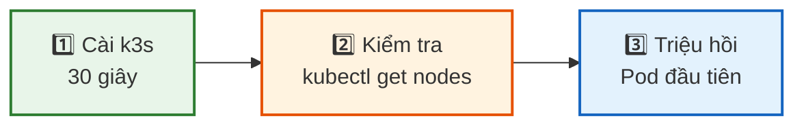
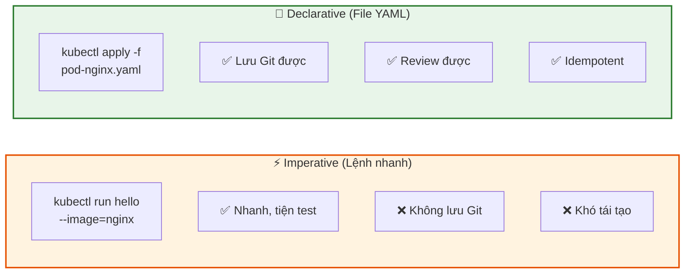
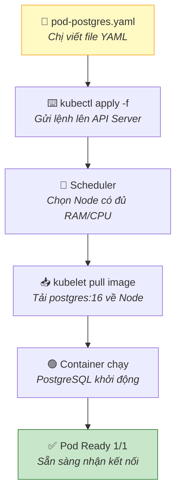
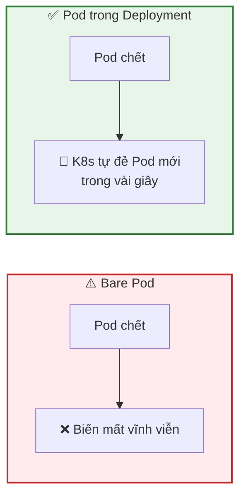

## Ngày 7 - Buổi 2: Tự tay dựng K8s trên máy & triệu hồi Pod đầu tiên

Buổi trước chị đã hiểu K8s là gì và tại sao cần nó. Giờ là lúc **bắt tay vào làm**. Cuối buổi này chị sẽ:
- Có 1 Cluster K8s chạy trên chính máy mình.
- Tạo Pod đầu tiên bằng YAML.
- Dùng `kubectl` thành thạo như dùng `psql`.

---

### 1. Chọn K8s cho môi trường học (có 3 lựa chọn)

| Công cụ | Ưu điểm | Nhược điểm | Khi nào dùng |
| --- | --- | --- | --- |
| **k3s** | Nhẹ (<100MB), cài 30 giây, đầy đủ K8s | Không phải K8s chính hãng 100% | ✅ Tốt nhất để học |
| **minikube** | Google phát triển, phổ biến | Cần VM hoặc Docker | Phổ biến trong tutorial |
| **Docker Desktop K8s** | Bật 1 click nếu đã có Docker Desktop | Ngốn RAM (~4GB) | Đã cài Docker Desktop |

Chúng ta sẽ dùng **k3s** vì nó nhẹ nhất và giống production nhất.

> **📊 Sơ đồ 3 bước cài Cluster:**



---

### 2. Cài đặt k3s (1 lệnh duy nhất)

#### Bước 1: Cài k3s

```bash
# Trên Ubuntu/Debian (hoặc WSL2 trên Windows)
curl -sfL https://get.k3s.io | sh -
```

Lệnh này sẽ:
- Tải và cài k3s (~100MB).
- Tự tạo Cluster 1 Node (vừa Control Plane vừa Worker).
- Cài sẵn `kubectl`.
- Khởi động ngay lập tức.

#### Bước 2: Cấu hình quyền

```bash
# Cho phép user hiện tại dùng kubectl mà không cần sudo
sudo chmod 644 /etc/rancher/k3s/k3s.yaml
export KUBECONFIG=/etc/rancher/k3s/k3s.yaml
echo 'export KUBECONFIG=/etc/rancher/k3s/k3s.yaml' >> ~/.bashrc
```

> 💡 **KUBECONFIG** giống file `.pgpass` — chứa thông tin kết nối đến cluster. Không có biến này, `kubectl` không biết gửi lệnh đi đâu.

#### Bước 3: Kiểm tra cluster

```bash
kubectl get nodes
```

Kết quả mong đợi:
```
NAME          STATUS   ROLES                  AGE   VERSION
my-machine    Ready    control-plane,master   30s   v1.28.x+k3s1
```

- **Ready** = Node đã sẵn sàng nhận Pod.
- **control-plane,master** = Node này vừa là giám đốc vừa là nhân viên (Cluster 1 Node).

```bash
# Xem chi tiết hơn
kubectl get nodes -o wide
```

#### Thay thế: Dùng Docker Desktop (macOS/Windows)

Nếu chị dùng macOS hoặc Windows có Docker Desktop:
1. Mở Docker Desktop → Settings → Kubernetes.
2. Check ✅ **Enable Kubernetes** → Apply & Restart.
3. Đợi 2-3 phút, icon K8s chuyển sang xanh.
4. Kiểm tra: `kubectl get nodes`

---

### 3. Khám phá Cluster trước khi tạo Pod

Giống như khi mới kết nối PostgreSQL, chị chạy `\l` để xem database, `\dt` để xem bảng — K8s cũng vậy:

```bash
# Xem tất cả namespace (giống \dn trong psql)
kubectl get namespaces
```

```
NAME              STATUS   AGE
default           Active   5m
kube-system       Active   5m
kube-public       Active   5m
```

- **default**: Nơi Pod của chị sẽ chạy (nếu không chỉ định namespace).
- **kube-system**: Nội bộ K8s. Không đụng vào.

```bash
# Xem Pod hệ thống đang chạy (K8s cũng chạy bằng Pod!)
kubectl get pods -n kube-system
```

Chị sẽ thấy CoreDNS, traefik (Ingress), metrics-server... — K8s tự quản lý chính mình bằng Pod.

> 💡 **Fun fact:** Bản thân Kubernetes cũng chạy bằng Container. Giống PostgreSQL cũng lưu catalog trong chính database của mình (`pg_catalog`).

---

### 4. Tạo Pod đầu tiên — bằng 2 cách

#### Cách 1: Lệnh nhanh (Imperative)

```bash
kubectl run hello --image=nginx --port=80
```

Kiểm tra:
```bash
kubectl get pods
```

```
NAME    READY   STATUS    RESTARTS   AGE
hello   1/1     Running   0          10s
```

- **1/1** = 1 Container trong Pod, 1 đang chạy.
- **Running** = Đang sống.

> 🧐 Giống lệnh `CREATE TABLE hello ...` trực tiếp trong psql. Nhanh nhưng không lưu lại "công thức".

#### Cách 2: File YAML (Declarative) — CÁCH ĐÚNG

Tạo file `pod-nginx.yaml`:

```yaml
apiVersion: v1          # Phiên bản API (giống SQL version)
kind: Pod               # Loại tài nguyên (giống CREATE TABLE / CREATE VIEW)
metadata:
  name: web-app         # Tên Pod (giống tên bảng)
  labels:               # Nhãn để phân loại (giống COMMENT ON TABLE)
    app: web
    env: dev
spec:                   # Mô tả chi tiết
  containers:           # Danh sách Container trong Pod
    - name: nginx       # Tên container
      image: nginx:1.25 # Image:tag (giống pg version)
      ports:
        - containerPort: 80  # Port container lắng nghe
```

Áp dụng:
```bash
kubectl apply -f pod-nginx.yaml
```

```
pod/web-app created
```

> 💡 **`kubectl apply -f`** giống `psql -f migration.sql` — Chị viết mọi thứ thành file, K8s thực thi. Đây là cách chuẩn vì:
> - Lưu vào Git được (Infrastructure as Code).
> - Review được trước khi chạy.
> - Chạy lại bao nhiêu lần cũng cho kết quả giống nhau (Idempotent).

> **📊 So sánh 2 cách tạo Pod:**



---

### 5. Thực hành `kubectl` — 10 lệnh quan trọng nhất

#### 5.1 Xem danh sách Pod

```bash
kubectl get pods
kubectl get pods -o wide    # Thêm cột IP, Node
kubectl get pods -w          # Watch liên tục (Ctrl+C để thoát)
```

#### 5.2 Xem chi tiết Pod (siêu quan trọng khi debug)

```bash
kubectl describe pod web-app
```

Output quan trọng:
```
Events:
  Type    Reason     Age   From               Message
  ----    ------     ---   ----               -------
  Normal  Scheduled  30s   default-scheduler  Successfully assigned default/web-app to my-machine
  Normal  Pulling    29s   kubelet            Pulling image "nginx:1.25"
  Normal  Pulled     25s   kubelet            Successfully pulled image
  Normal  Created    25s   kubelet            Created container nginx
  Normal  Started    24s   kubelet            Started container nginx
```

> 💡 Phần **Events** giống `pg_stat_activity` — cho chị biết chuyện gì đang xảy ra bên trong. Khi Pod lỗi, **luôn đọc Events đầu tiên**.

#### 5.3 Xem log của Pod

```bash
kubectl logs web-app
kubectl logs web-app -f      # Follow log liên tục (như tail -f)
```

#### 5.4 Chui vào bên trong Pod

```bash
kubectl exec -it web-app -- bash
```

Bên trong:
```bash
cat /usr/share/nginx/html/index.html
curl localhost:80
exit
```

> 🧐 Giống `docker exec` — nhưng Pod có thể đang chạy trên **bất kỳ Node nào** trong cluster. `kubectl exec` tự tìm đúng Node cho chị.

#### 5.5 Port-forward để truy cập từ trình duyệt

Pod mặc định **không expose ra ngoài**. Để test nhanh:

```bash
kubectl port-forward pod/web-app 8080:80
```

Mở trình duyệt: `http://localhost:8080` → Thấy trang "Welcome to nginx!"

> 💡 Port-forward giống tạo SSH tunnel đến database — chỉ dùng khi dev/debug. Production sẽ dùng Service + Ingress (bài sau).

#### 5.6 Xóa Pod

```bash
kubectl delete pod web-app
kubectl delete pod hello
```

---

### 6. Lab thực hành: Pod PostgreSQL

Tạo file `pod-postgres.yaml`:

```yaml
apiVersion: v1
kind: Pod
metadata:
  name: my-postgres
  labels:
    app: database
    engine: postgresql
spec:
  containers:
    - name: postgres
      image: postgres:16
      ports:
        - containerPort: 5432
      env:
        - name: POSTGRES_PASSWORD
          value: "mypassword123"
        - name: POSTGRES_DB
          value: "devops_lab"
```

```bash
# Tạo Pod
kubectl apply -f pod-postgres.yaml

# Đợi Pod chạy
kubectl get pods -w
# Đợi đến khi STATUS = Running rồi Ctrl+C

# Xem log PostgreSQL khởi động
kubectl logs my-postgres

# Chui vào Pod, kết nối psql
kubectl exec -it my-postgres -- psql -U postgres -d devops_lab
```

Bên trong psql:
```sql
CREATE TABLE k8s_test (id serial PRIMARY KEY, message text);
INSERT INTO k8s_test (message) VALUES ('Hello from Kubernetes!');
SELECT * FROM k8s_test;
\q
```

> **📊 Vòng đời Pod PostgreSQL:**



---

### 7. Thí nghiệm Self-Healing (Pod đơn lẻ KHÔNG có)

```bash
# Xóa Pod postgres
kubectl delete pod my-postgres

# Kiểm tra
kubectl get pods
```

**Kết quả:** Pod **biến mất luôn**, KHÔNG tự đẻ lại.

> ⚠️ **Bài học quan trọng:** Pod đơn lẻ (bare Pod) giống chạy `postgres` trực tiếp trên máy — nó chết thì chết luôn. Để có **self-healing** (tự phục hồi), chị cần bọc Pod trong **Deployment** — đó là nội dung **buổi sau**.



---

### 8. Dọn dẹp

```bash
kubectl delete pod --all
kubectl get pods   # Phải thấy trống
```

---

### ✅ Checklist cuối buổi

| Kỹ năng | Lệnh | ✅ |
| --- | --- | --- |
| Cài K8s cluster | `curl -sfL https://get.k3s.io \| sh -` | ☐ |
| Xem Node | `kubectl get nodes` | ☐ |
| Tạo Pod bằng YAML | `kubectl apply -f pod.yaml` | ☐ |
| Xem Pod | `kubectl get pods -o wide` | ☐ |
| Xem chi tiết | `kubectl describe pod <tên>` | ☐ |
| Xem log | `kubectl logs <tên> -f` | ☐ |
| Chui vào Pod | `kubectl exec -it <tên> -- bash` | ☐ |
| Port-forward | `kubectl port-forward pod/<tên> 8080:80` | ☐ |
| Xóa Pod | `kubectl delete pod <tên>` | ☐ |

---

**Câu hỏi tư duy cuối buổi:**
Chị vừa thấy Pod đơn lẻ chết thì không tự phục hồi. Vậy trong production, **ai sẽ giám sát và tự đẻ lại Pod khi nó chết?** Deployment hoạt động như thế nào bên trong? (Gợi ý: Controller Manager + Desired State vs Current State)

Buổi sau: **Deployment & ReplicaSet** — Vũ khí quan trọng nhất để đảm bảo ứng dụng **không bao giờ chết**.
