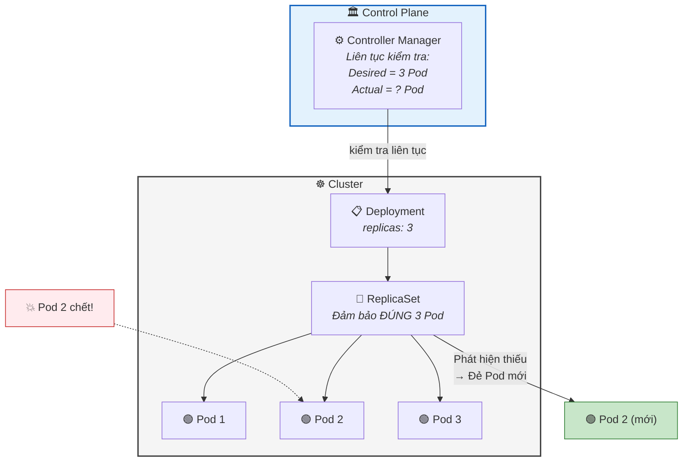
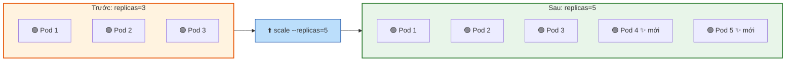
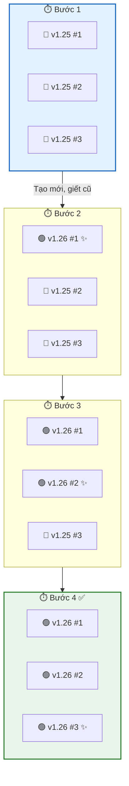
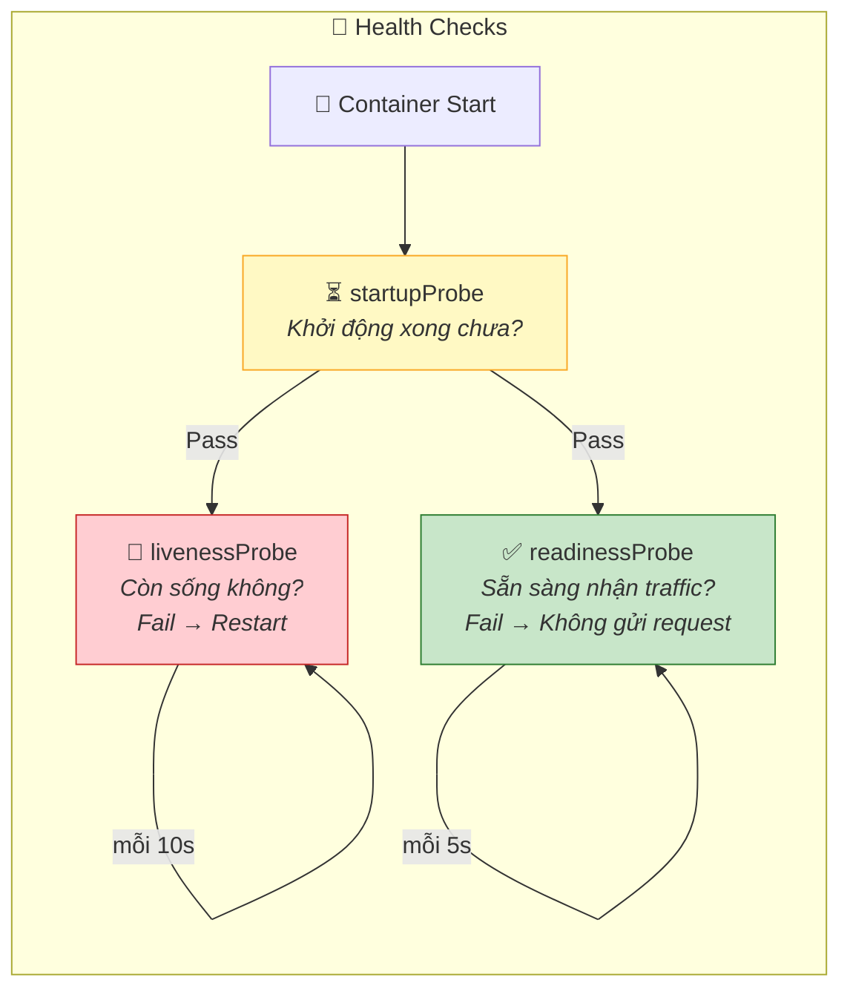

## Ngày 8 - Buổi 1: Deployment & ReplicaSet — Vũ khí "Bất tử" cho ứng dụng

Buổi trước chị tạo Pod đơn lẻ, xóa nó thì nó **chết luôn**. Trong production, điều đó không chấp nhận được. Hôm nay chị sẽ học **Deployment** — thứ biến ứng dụng thành **bất tử**: chết tự đẻ lại, nâng cấp không downtime, rollback chỉ 1 lệnh.

---

### 1. Vấn đề: Pod đơn lẻ = Single Point of Failure

| Tình huống | Pod đơn lẻ | Deployment |
| --- | --- | --- |
| Pod crash | ❌ Chết vĩnh viễn | ✅ K8s đẻ Pod mới trong 5 giây |
| Cần 5 bản sao | ❌ Phải tạo 5 file YAML riêng | ✅ `replicas: 5` — 1 dòng duy nhất |
| Nâng cấp version | ❌ Xóa cũ → tạo mới (downtime) | ✅ Rolling update, zero-downtime |
| Lỡ deploy lỗi | ❌ Không cách nào quay lại | ✅ `kubectl rollout undo` — 1 lệnh rollback |

> 💡 **Góc nhìn Database:** Pod đơn lẻ giống chạy PostgreSQL không có replication — master chết là mất hết. Deployment giống cấu hình **streaming replication** với auto-failover: primary chết, standby tự lên thay.

---

### 2. Deployment hoạt động như thế nào?



**Chuỗi điều khiển:**
1. **Deployment** → Quản lý **ReplicaSet**.
2. **ReplicaSet** → Đảm bảo đúng **N Pod** đang chạy.
3. **Controller Manager** → Liên tục so sánh **Desired State** (muốn 3 Pod) vs **Current State** (đang có mấy Pod). Nếu thiếu → đẻ thêm. Nếu thừa → giết bớt.

> 💡 **Góc nhìn Database:** Controller Manager giống **pg_cron** + **health check** chạy mỗi giây: "Tôi muốn 3 standby. Đang có 2? → Tạo thêm 1."

---

### 3. Tạo Deployment đầu tiên

Tạo file `deployment-web.yaml`:

```yaml
apiVersion: apps/v1         # API group cho Deployment
kind: Deployment
metadata:
  name: web-app              # Tên Deployment
spec:
  replicas: 3                # Muốn 3 bản sao Pod
  selector:                  # Cách Deployment tìm Pod của mình
    matchLabels:
      app: web               # "Tôi quản lý Pod nào có label app=web"
  template:                  # Template để đẻ Pod
    metadata:
      labels:
        app: web             # Label phải KHỚP với selector ở trên
    spec:
      containers:
        - name: nginx
          image: nginx:1.25
          ports:
            - containerPort: 80
```

**Giải thích từng phần:**

| Trường | Ý nghĩa | Góc nhìn Database |
| --- | --- | --- |
| `replicas: 3` | Luôn duy trì 3 Pod | Giống `synchronous_standby_names = 3` |
| `selector.matchLabels` | Deployment quản lý Pod nào | Giống `WHERE app = 'web'` |
| `template` | Khuôn mẫu để tạo Pod | Giống `CREATE TABLE ... AS SELECT` |
| `template.metadata.labels` | Gắn label cho Pod mới sinh | Phải khớp selector |

```bash
# Áp dụng
kubectl apply -f deployment-web.yaml

# Xem Deployment
kubectl get deployments
```

```
NAME      READY   UP-TO-DATE   AVAILABLE   AGE
web-app   3/3     3            3           15s
```

```bash
# Xem ReplicaSet (K8s tự tạo)
kubectl get replicasets
```

```
NAME                 DESIRED   CURRENT   READY   AGE
web-app-7d9f8b6c5    3         3         3       20s
```

```bash
# Xem 3 Pod
kubectl get pods
```

```
NAME                       READY   STATUS    RESTARTS   AGE
web-app-7d9f8b6c5-abc12   1/1     Running   0          25s
web-app-7d9f8b6c5-def34   1/1     Running   0          25s
web-app-7d9f8b6c5-ghi56   1/1     Running   0          25s
```

> 🧐 Tên Pod = `<deployment>-<replicaset-hash>-<pod-hash>`. K8s tự đặt tên random để tránh trùng.

---

### 4. Thí nghiệm Self-Healing (Tự phục hồi)

#### Thí nghiệm 1: Giết 1 Pod

```bash
# Mở terminal 2, watch liên tục
kubectl get pods -w
```

```bash
# Terminal 1: Giết 1 Pod
kubectl delete pod web-app-7d9f8b6c5-abc12
```

**Quan sát terminal 2:**
```
web-app-7d9f8b6c5-abc12   1/1     Terminating   0          2m
web-app-7d9f8b6c5-xyz99   0/1     Pending       0          0s
web-app-7d9f8b6c5-xyz99   0/1     ContainerCreating   0    1s
web-app-7d9f8b6c5-xyz99   1/1     Running       0          3s
```

**Pod cũ chết → Pod mới sinh ra trong 3 giây!** Luôn giữ đúng 3 Pod.

#### Thí nghiệm 2: Giết tất cả Pod cùng lúc

```bash
kubectl delete pods --all
kubectl get pods -w
```

**K8s tức thì đẻ lại 3 Pod mới.** Đây chính là sức mạnh của Deployment.

> 💡 **Góc nhìn Database:** Giống Patroni quản lý PostgreSQL HA cluster — primary chết, Patroni tự promote standby. K8s làm điều tương tự cho mọi ứng dụng.

---

### 5. Scale — Tăng/giảm số Pod

```bash
# Scale lên 5 Pod
kubectl scale deployment web-app --replicas=5

kubectl get pods
# → 5 Pod đang chạy

# Scale xuống 2 Pod
kubectl scale deployment web-app --replicas=2

kubectl get pods
# → Chỉ còn 2 Pod (3 cái bị K8s giết)
```

Hoặc sửa file YAML: `replicas: 5` → `kubectl apply -f deployment-web.yaml`

> **📊 Sơ đồ Scale up/down:**



---

### 6. Rolling Update — Nâng cấp không downtime

Đây là tính năng **killer** của Deployment. Chị nâng cấp nginx từ 1.25 lên 1.26 mà người dùng không hề biết.

#### Bước 1: Cập nhật image

```bash
kubectl set image deployment/web-app nginx=nginx:1.26
```

Hoặc sửa file YAML: `image: nginx:1.26` → `kubectl apply -f deployment-web.yaml`

#### Bước 2: Quan sát Rolling Update

```bash
kubectl rollout status deployment/web-app
```

```
Waiting for deployment "web-app" rollout to finish: 1 out of 3 new replicas have been updated...
Waiting for deployment "web-app" rollout to finish: 2 out of 3 new replicas have been updated...
deployment "web-app" successfully rolled out
```

```bash
kubectl get pods -w
```

**Quan sát quá trình:**
```
web-app-NEW-aaa11   0/1     ContainerCreating   # Pod mới version 1.26 đang tạo
web-app-NEW-aaa11   1/1     Running             # Pod mới sẵn sàng
web-app-OLD-abc12   1/1     Terminating         # Pod cũ version 1.25 bị giết
web-app-NEW-bbb22   0/1     ContainerCreating   # Pod mới thứ 2
...
```

K8s tạo Pod mới → đợi nó Ready → mới giết Pod cũ. **Luôn có Pod sẵn sàng phục vụ.**

> **📊 Sơ đồ Rolling Update:**



---

### 7. Rollback — Quay về version cũ (1 lệnh)

Lỡ deploy version lỗi? Không sao:

```bash
# Xem lịch sử deploy
kubectl rollout history deployment/web-app
```

```
REVISION  CHANGE-CAUSE
1         <none>         # nginx:1.25
2         <none>         # nginx:1.26
```

```bash
# Rollback về revision trước
kubectl rollout undo deployment/web-app

# Kiểm tra
kubectl get pods -o jsonpath='{.items[*].spec.containers[*].image}'
# → nginx:1.25 (đã quay lại!)
```

> 💡 **Góc nhìn Database:** Rollback giống `pg_basebackup` + PITR (Point-in-Time Recovery). Nhưng K8s làm trong **vài giây** thay vì vài phút.

---

### 8. Health Check — Probes (Kiểm tra sức khỏe Pod)

K8s cần biết Pod có **thực sự hoạt động** không, không chỉ "đang chạy". Có 3 loại probe:

| Probe | Câu hỏi K8s đặt ra | Nếu thất bại |
| --- | --- | --- |
| **livenessProbe** | "Mày còn sống không?" | K8s **restart** Container |
| **readinessProbe** | "Mày sẵn sàng nhận traffic chưa?" | K8s **ngừng gửi traffic** đến Pod |
| **startupProbe** | "Mày đã khởi động xong chưa?" | K8s **đợi thêm**, chưa kiểm tra liveness |

Ví dụ Deployment với probes:

```yaml
apiVersion: apps/v1
kind: Deployment
metadata:
  name: web-healthy
spec:
  replicas: 3
  selector:
    matchLabels:
      app: web-healthy
  template:
    metadata:
      labels:
        app: web-healthy
    spec:
      containers:
        - name: nginx
          image: nginx:1.25
          ports:
            - containerPort: 80
          livenessProbe:             # Kiểm tra sống/chết
            httpGet:
              path: /
              port: 80
            initialDelaySeconds: 5   # Đợi 5s sau khi start mới bắt đầu check
            periodSeconds: 10        # Check mỗi 10s
          readinessProbe:            # Kiểm tra sẵn sàng
            httpGet:
              path: /
              port: 80
            initialDelaySeconds: 3
            periodSeconds: 5
```

```bash
kubectl apply -f deployment-healthy.yaml
kubectl describe pod <tên-pod>
# Xem Events → sẽ thấy Liveness/Readiness probe passed
```

> **📊 Sơ đồ 3 loại Probe:**



---

### 9. Dọn dẹp

```bash
kubectl delete deployment web-app web-healthy
kubectl get pods   # Deployment bị xóa → Pod cũng bị xóa
```

---

### ✅ Checklist cuối buổi

| Kỹ năng | Lệnh | ✅ |
| --- | --- | --- |
| Tạo Deployment | `kubectl apply -f deployment.yaml` | ☐ |
| Xem Deployment | `kubectl get deployments` | ☐ |
| Self-healing | Xóa Pod → Pod mới tự đẻ lại | ☐ |
| Scale | `kubectl scale deployment <tên> --replicas=5` | ☐ |
| Rolling Update | `kubectl set image deployment/<tên> <ctn>=` | ☐ |
| Xem quá trình | `kubectl rollout status deployment/<tên>` | ☐ |
| Rollback | `kubectl rollout undo deployment/<tên>` | ☐ |
| Lịch sử deploy | `kubectl rollout history deployment/<tên>` | ☐ |

---

**Câu hỏi tư duy cuối buổi:**
Chị có 3 Pod Web App chạy bình thường. Người dùng truy cập `http://yourapp.com`. Nhưng hiện tại **không có cách nào traffic từ bên ngoài đi vào đúng Pod** — vì Pod có IP private, thay đổi mỗi khi restart. Vậy cần thêm thứ gì để kết nối người dùng với Pod? (Gợi ý: **Service**)

Buổi sau: **Service & Ingress** — Cánh cửa kết nối thế giới bên ngoài với Pod bên trong.
