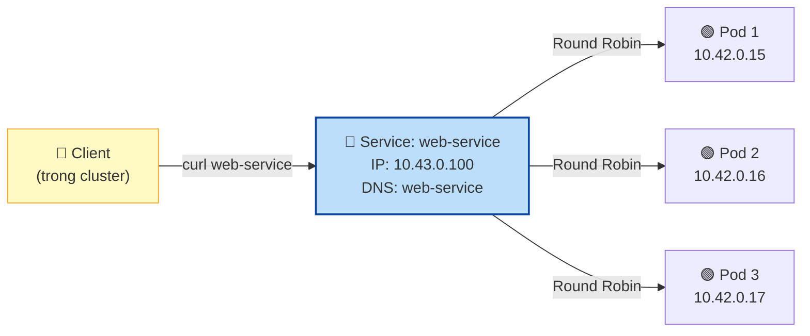
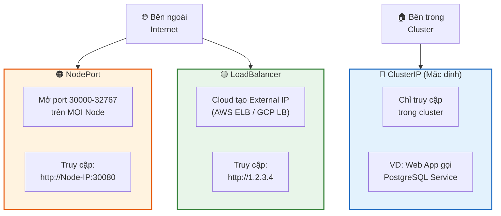
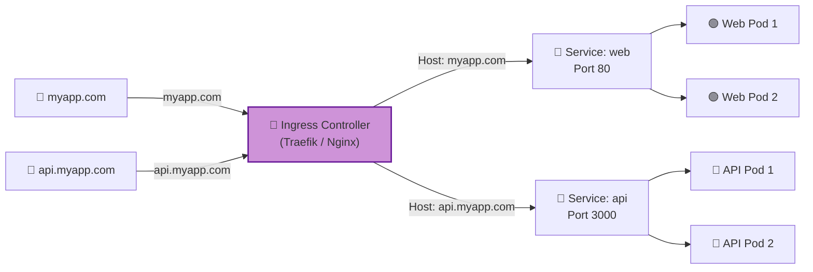
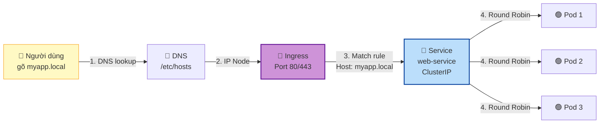

## Ngày 8 - Buổi 2: Service & Ingress — Mở cửa cho thế giới bên ngoài

Buổi trước chị tạo 3 Pod Web App bằng Deployment. Nhưng Pod có IP **private, thay đổi** mỗi khi restart. Người dùng không thể truy cập trực tiếp. Hôm nay chị sẽ học **Service** (cánh cửa ổn định vào Pod) và **Ingress** (bộ định tuyến HTTP thông minh).

---

### 1. Vấn đề: Pod IP không đáng tin

```bash
# Tạo Deployment 3 Pod
kubectl apply -f deployment-web.yaml  # File từ buổi trước

# Xem IP của từng Pod
kubectl get pods -o wide
```

```
NAME                       READY   IP            NODE
web-app-7d9f8b6c5-aaa11   1/1     10.42.0.15    node1
web-app-7d9f8b6c5-bbb22   1/1     10.42.0.16    node1
web-app-7d9f8b6c5-ccc33   1/1     10.42.0.17    node1
```

- IP `10.42.x.x` là **internal IP** — chỉ truy cập được từ bên trong cluster.
- Nếu Pod restart, IP **đổi hoàn toàn**.
- Người dùng không thể nhớ 3 IP thay đổi liên tục.

> 💡 **Góc nhìn Database:** Giống như PostgreSQL standby thay đổi IP khi failover. Giải pháp của DBA: dùng **PgBouncer / HAProxy** ở giữa. K8s Service chính là PgBouncer cho Container.

---

### 2. Service là gì?

**Service = Endpoint ổn định + Load Balancer nội bộ.** Nó có:
- **1 IP cố định** (ClusterIP) — không thay đổi dù Pod chết đẻ.
- **1 DNS name** — VD: `web-service.default.svc.cluster.local`
- **Tự động phân phối traffic** đến các Pod khỏe mạnh.



---

### 3. Bốn loại Service

| Type | Phạm vi | Use case | Góc nhìn Database |
| --- | --- | --- | --- |
| **ClusterIP** | Chỉ trong cluster | Backend nói chuyện với DB | PgBouncer nội bộ |
| **NodePort** | Mở port trên mọi Node | Dev/test, truy cập nhanh | Mở port PostgreSQL ra ngoài |
| **LoadBalancer** | Tạo External IP (Cloud) | Production trên AWS/GCP | Elastic IP + HAProxy |
| **ExternalName** | DNS alias | Trỏ đến service ngoài | DNS CNAME |

> **📊 Sơ đồ 3 loại Service chính:**



---

### 4. Thực hành: Tạo ClusterIP Service

Đảm bảo Deployment đang chạy:
```bash
kubectl apply -f deployment-web.yaml
kubectl get pods   # Phải có 3 Pod Running
```

Tạo file `service-clusterip.yaml`:

```yaml
apiVersion: v1
kind: Service
metadata:
  name: web-service       # Tên Service (dùng làm DNS name)
spec:
  type: ClusterIP          # Loại Service (mặc định)
  selector:
    app: web               # Chọn Pod có label app=web
  ports:
    - port: 80             # Port Service lắng nghe
      targetPort: 80       # Port Container bên trong Pod
      protocol: TCP
```

```bash
kubectl apply -f service-clusterip.yaml
kubectl get services
```

```
NAME          TYPE        CLUSTER-IP     EXTERNAL-IP   PORT(S)   AGE
web-service   ClusterIP   10.43.0.100    <none>        80/TCP    5s
```

**Test từ bên trong cluster:**

```bash
# Tạo 1 Pod tạm để curl
kubectl run test-curl --image=curlimages/curl --rm -it -- sh
```

Bên trong Pod test:
```bash
# Gọi bằng tên Service (DNS tự phân giải!)
curl web-service
# → Welcome to nginx!

# Gọi nhiều lần, Service tự phân phối đến Pod khác nhau
curl web-service
curl web-service

# Gọi bằng FQDN
curl web-service.default.svc.cluster.local

exit
```

> 💡 **K8s tự có DNS server** (CoreDNS). Khi chị tạo Service tên `web-service`, CoreDNS tự đăng ký DNS record. Mọi Pod trong cluster gọi `curl web-service` sẽ được phân giải đến ClusterIP.

---

### 5. Thực hành: Tạo NodePort Service

```yaml
# service-nodeport.yaml
apiVersion: v1
kind: Service
metadata:
  name: web-nodeport
spec:
  type: NodePort
  selector:
    app: web
  ports:
    - port: 80              # Port Service
      targetPort: 80        # Port Container
      nodePort: 30080       # Port mở trên Node (30000-32767)
```

```bash
kubectl apply -f service-nodeport.yaml
kubectl get services
```

```
NAME           TYPE        CLUSTER-IP     EXTERNAL-IP   PORT(S)        AGE
web-nodeport   NodePort    10.43.0.101    <none>        80:30080/TCP   5s
```

**Test từ máy chị:**

```bash
# Truy cập bằng IP của Node + nodePort
curl http://localhost:30080
# → Welcome to nginx!

# Hoặc mở trình duyệt: http://localhost:30080
```

> 🧐 NodePort mở port trên **TẤT CẢ** Node trong cluster. Dù Pod chỉ chạy trên Node 1, chị vẫn có thể truy cập qua Node 2:30080 — K8s tự chuyển tiếp.

---

### 6. Service cho PostgreSQL (Lab thực tế)

Tạo hệ thống Web + Database:

```yaml
# postgres-deployment.yaml
apiVersion: apps/v1
kind: Deployment
metadata:
  name: postgres
spec:
  replicas: 1
  selector:
    matchLabels:
      app: postgres
  template:
    metadata:
      labels:
        app: postgres
    spec:
      containers:
        - name: postgres
          image: postgres:16
          ports:
            - containerPort: 5432
          env:
            - name: POSTGRES_PASSWORD
              value: "secret123"
            - name: POSTGRES_DB
              value: "myapp"
---
apiVersion: v1
kind: Service
metadata:
  name: postgres-service     # Web App sẽ gọi tên này
spec:
  type: ClusterIP            # DB chỉ cần truy cập nội bộ
  selector:
    app: postgres
  ports:
    - port: 5432
      targetPort: 5432
```

```bash
kubectl apply -f postgres-deployment.yaml

# Kiểm tra
kubectl get pods
kubectl get services
```

Test kết nối từ Pod khác:
```bash
kubectl run test-psql --image=postgres:16 --rm -it -- \
  psql -h postgres-service -U postgres -d myapp
```

```sql
-- Bên trong psql
SELECT version();
\q
```

> 💡 Lưu ý chị dùng `-h postgres-service` — tên Service. Không cần biết IP Pod PostgreSQL. Dù Pod Postgres restart đổi IP, Service name **giữ nguyên**.

---

### 7. Ingress — Bộ định tuyến HTTP thông minh

Service NodePort mở port **số lẻ** (30080, 30081...) rất xấu. Người dùng muốn truy cập `http://myapp.com`, không phải `http://1.2.3.4:30080`.

**Ingress** giải quyết vấn đề này:
- Nhận traffic HTTP/HTTPS từ bên ngoài.
- Phân phối đến đúng Service dựa trên **domain name** hoặc **URL path**.
- Hỗ trợ SSL/TLS.



#### Thực hành Ingress

k3s đã cài sẵn Traefik Ingress Controller. Tạo file `ingress.yaml`:

```yaml
apiVersion: networking.k8s.io/v1
kind: Ingress
metadata:
  name: web-ingress
spec:
  rules:
    - host: myapp.local          # Domain name
      http:
        paths:
          - path: /
            pathType: Prefix
            backend:
              service:
                name: web-service    # Service ClusterIP đã tạo
                port:
                  number: 80
```

```bash
kubectl apply -f ingress.yaml
kubectl get ingress
```

```
NAME          CLASS     HOSTS         ADDRESS        PORTS   AGE
web-ingress   traefik   myapp.local   192.168.1.10   80      5s
```

Test (thêm domain vào /etc/hosts):
```bash
# Thêm dòng này vào /etc/hosts
echo "127.0.0.1 myapp.local" | sudo tee -a /etc/hosts

# Test
curl http://myapp.local
# → Welcome to nginx!
```

#### Ingress dựa trên Path (1 domain, nhiều service):

```yaml
apiVersion: networking.k8s.io/v1
kind: Ingress
metadata:
  name: multi-path-ingress
spec:
  rules:
    - host: myapp.local
      http:
        paths:
          - path: /               # myapp.local/ → web
            pathType: Prefix
            backend:
              service:
                name: web-service
                port:
                  number: 80
          - path: /api            # myapp.local/api → api
            pathType: Prefix
            backend:
              service:
                name: api-service
                port:
                  number: 3000
```

---

### 8. Tổng hợp: Hành trình Request từ Internet đến Pod



---

### 9. Dọn dẹp

```bash
kubectl delete deployment web-app postgres
kubectl delete service web-service web-nodeport postgres-service
kubectl delete ingress web-ingress multi-path-ingress 2>/dev/null
kubectl get all   # Kiểm tra
```

---

### ✅ Checklist cuối buổi

| Kỹ năng | Lệnh/File | ✅ |
| --- | --- | --- |
| Hiểu 3 loại Service | ClusterIP, NodePort, LoadBalancer | ☐ |
| Tạo ClusterIP Service | `kubectl apply -f service-clusterip.yaml` | ☐ |
| Test DNS nội bộ | `curl <service-name>` từ Pod khác | ☐ |
| Tạo NodePort Service | `nodePort: 30080` | ☐ |
| Truy cập từ bên ngoài | `curl localhost:30080` | ☐ |
| Tạo Ingress | `kubectl apply -f ingress.yaml` | ☐ |
| Service cho PostgreSQL | `-h postgres-service` | ☐ |

---

**Câu hỏi tư duy cuối buổi:**
Chị đã biết Pod có thể chết bất cứ lúc nào. Deployment tự đẻ Pod mới. Nhưng nếu Pod PostgreSQL chết và được đẻ lại — **dữ liệu INSERT trước đó có còn không?** (Gợi ý: Container là stateless, data nằm trong Container sẽ mất. Cần **PersistentVolume**.)

Buổi sau: **PersistentVolume & StatefulSet** — Cho PostgreSQL "sống" trên K8s đúng cách, dữ liệu không bao giờ mất.
