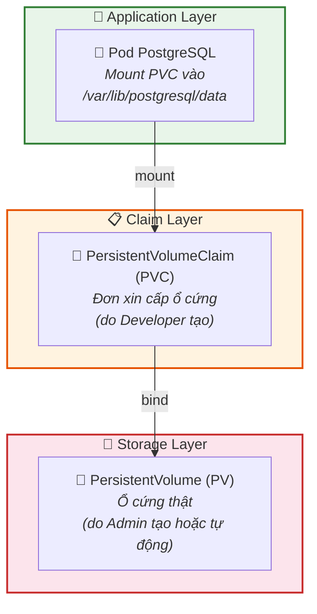
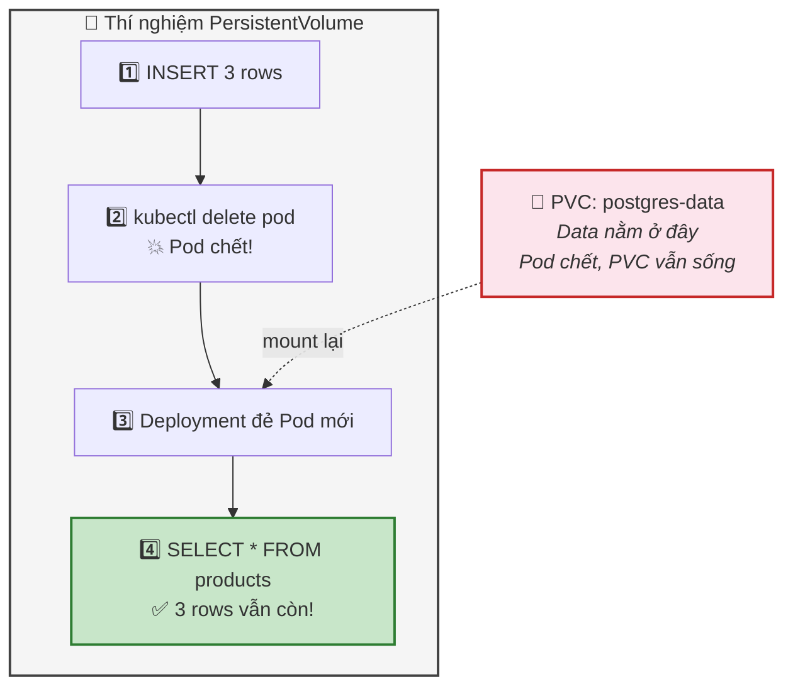
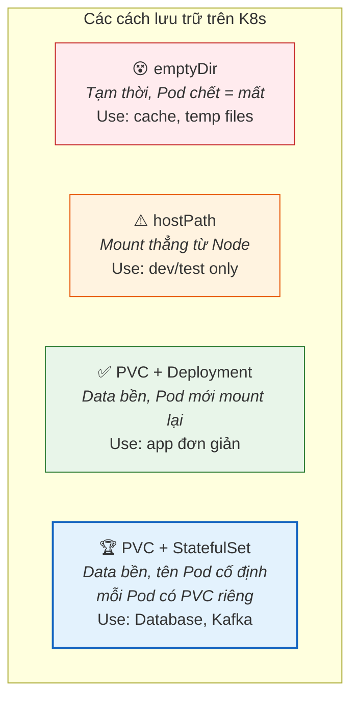

## Ngày 9 - Buổi 1: PersistentVolume & StatefulSet — Cho Database "sống" trên K8s

Buổi trước chị đã kết nối người dùng đến Pod qua Service. Nhưng có một vấn đề chí mạng: nếu Pod PostgreSQL chết và Deployment tạo Pod mới — **toàn bộ dữ liệu INSERT trước đó biến mất**. Vì Container là stateless, data nằm trong Container mất khi Container chết.

Hôm nay chị sẽ học cách giữ dữ liệu **bất tử** trên K8s.

---

### 1. Vấn đề: Data trong Pod chỉ là "ảo ảnh"

```bash
# Tạo Pod PostgreSQL
kubectl run test-pg --image=postgres:16 \
  --env="POSTGRES_PASSWORD=secret" \
  --env="POSTGRES_DB=testdb"

# Đợi Pod chạy
kubectl get pods -w

# INSERT dữ liệu
kubectl exec -it test-pg -- psql -U postgres -d testdb -c "
  CREATE TABLE users (id serial, name text);
  INSERT INTO users (name) VALUES ('Alice'), ('Bob'), ('Charlie');
  SELECT * FROM users;
"

# Kết quả: 3 rows ✅
```

Bây giờ giả lập Pod crash:
```bash
kubectl delete pod test-pg
kubectl run test-pg --image=postgres:16 \
  --env="POSTGRES_PASSWORD=secret" \
  --env="POSTGRES_DB=testdb"

kubectl get pods -w  # Đợi Running

kubectl exec -it test-pg -- psql -U postgres -d testdb -c "SELECT * FROM users;"
```

**Kết quả: ERROR — bảng `users` không tồn tại.** Data mất sạch.

> 💡 **Góc nhìn Database:** Giống chạy PostgreSQL với `data_directory` trên RAM disk. Server restart = mất data. Giải pháp: mount data directory ra **ổ cứng vật lý bền vững**.

---

### 2. Giải pháp: PersistentVolume (PV) + PersistentVolumeClaim (PVC)



| Khái niệm | Ai tạo | Góc nhìn Database | Ví dụ |
| --- | --- | --- | --- |
| **PersistentVolume (PV)** | Admin / StorageClass tự động | **Ổ cứng / Partition** | 10GB SSD trên Server |
| **PersistentVolumeClaim (PVC)** | Developer | **Lệnh `CREATE TABLESPACE`** | "Tôi cần 5GB để lưu data" |
| **StorageClass** | Admin | **Loại storage** | SSD nhanh, HDD rẻ, NFS chia sẻ |

> 💡 **Quy trình:** Developer tạo PVC ("Tôi cần 5GB") → K8s tìm PV phù hợp → Bind PVC với PV → Pod mount PVC → Data bền vững.

---

### 3. Thực hành: PostgreSQL với PersistentVolume

#### Bước 1: Tạo PVC

```yaml
# postgres-pvc.yaml
apiVersion: v1
kind: PersistentVolumeClaim
metadata:
  name: postgres-data
spec:
  accessModes:
    - ReadWriteOnce       # 1 Pod đọc-ghi tại 1 thời điểm
  resources:
    requests:
      storage: 1Gi        # Xin 1GB
```

> 💡 **Access Modes:**
> - **ReadWriteOnce (RWO):** 1 Node mount (phù hợp Database)
> - **ReadOnlyMany (ROX):** Nhiều Node đọc (phù hợp static files)
> - **ReadWriteMany (RWX):** Nhiều Node đọc-ghi (cần NFS)

```bash
kubectl apply -f postgres-pvc.yaml
kubectl get pvc
```

```
NAME            STATUS   VOLUME                                     CAPACITY   ACCESS MODES
postgres-data   Bound    pvc-abc123-def456                          1Gi        RWO
```

**STATUS = Bound** → K8s đã cấp ổ cứng thành công.

> 🧐 k3s dùng StorageClass mặc định là `local-path` — tạo PV trên đĩa local của Node. Trong production (AWS/GCP), StorageClass sẽ tạo EBS Volume hoặc Persistent Disk tự động.

#### Bước 2: Tạo Deployment PostgreSQL với PVC

```yaml
# postgres-with-pv.yaml
apiVersion: apps/v1
kind: Deployment
metadata:
  name: postgres
spec:
  replicas: 1
  selector:
    matchLabels:
      app: postgres
  template:
    metadata:
      labels:
        app: postgres
    spec:
      containers:
        - name: postgres
          image: postgres:16
          ports:
            - containerPort: 5432
          env:
            - name: POSTGRES_PASSWORD
              value: "secret123"
            - name: POSTGRES_DB
              value: "myapp"
            - name: PGDATA
              value: "/var/lib/postgresql/data/pgdata"
          volumeMounts:                    # Mount volume VÀO container
            - name: pg-storage
              mountPath: /var/lib/postgresql/data  # Thư mục data của PG
      volumes:                              # Khai báo volume
        - name: pg-storage
          persistentVolumeClaim:
            claimName: postgres-data        # Tên PVC đã tạo
---
apiVersion: v1
kind: Service
metadata:
  name: postgres-service
spec:
  type: ClusterIP
  selector:
    app: postgres
  ports:
    - port: 5432
      targetPort: 5432
```

```bash
kubectl apply -f postgres-with-pv.yaml
kubectl get pods -w   # Đợi Running
```

#### Bước 3: INSERT dữ liệu

```bash
kubectl exec -it deploy/postgres -- psql -U postgres -d myapp -c "
  CREATE TABLE products (id serial PRIMARY KEY, name text, price int);
  INSERT INTO products (name, price) VALUES 
    ('Laptop', 1000), ('Phone', 500), ('Tablet', 300);
  SELECT * FROM products;
"
```

```
 id |  name  | price
----+--------+-------
  1 | Laptop |  1000
  2 | Phone  |   500
  3 | Tablet |   300
```

#### Bước 4: Giết Pod — Data vẫn sống!

```bash
# Giết Pod
kubectl delete pod -l app=postgres

# Deployment tự đẻ Pod mới (đợi Running)
kubectl get pods -w

# Kiểm tra data
kubectl exec -it deploy/postgres -- psql -U postgres -d myapp -c "SELECT * FROM products;"
```

**Kết quả: 3 rows vẫn còn!** 🎉

> **📊 Sơ đồ thí nghiệm bền vững:**



---

### 4. StatefulSet — Chuyên gia cho Database

Deployment hoạt động tốt cho **stateless app** (Web, API). Nhưng cho **Database**, K8s có thứ tốt hơn: **StatefulSet**.

| Tính năng | Deployment | StatefulSet |
| --- | --- | --- |
| Tên Pod | Random (`web-abc12`) | Cố định (`postgres-0`, `postgres-1`) |
| Thứ tự khởi động | Ngẫu nhiên | Tuần tự (0 → 1 → 2) |
| Thứ tự tắt | Ngẫu nhiên | Ngược lại (2 → 1 → 0) |
| Volume | Chia sẻ 1 PVC | Mỗi Pod có PVC riêng |
| DNS | Chỉ có Service DNS | Mỗi Pod có DNS riêng |
| Use case | Web, API, Worker | **Database, Kafka, Elasticsearch** |

> 💡 **Góc nhìn Database:** StatefulSet giống **PostgreSQL HA cluster** với Patroni:
> - `postgres-0` = Primary (luôn khởi động trước)
> - `postgres-1`, `postgres-2` = Standby
> - Mỗi node có **data directory riêng**
> - Tắt theo thứ tự standby trước, primary sau

#### Tạo StatefulSet PostgreSQL:

```yaml
# postgres-statefulset.yaml
apiVersion: apps/v1
kind: StatefulSet
metadata:
  name: postgres
spec:
  serviceName: postgres-headless   # REQUIRED: Service headless
  replicas: 1
  selector:
    matchLabels:
      app: postgres
  template:
    metadata:
      labels:
        app: postgres
    spec:
      containers:
        - name: postgres
          image: postgres:16
          ports:
            - containerPort: 5432
          env:
            - name: POSTGRES_PASSWORD
              value: "secret123"
            - name: POSTGRES_DB
              value: "myapp"
            - name: PGDATA
              value: "/var/lib/postgresql/data/pgdata"
          volumeMounts:
            - name: pg-data
              mountPath: /var/lib/postgresql/data
  volumeClaimTemplates:          # Tự tạo PVC cho MỖI Pod
    - metadata:
        name: pg-data
      spec:
        accessModes: ["ReadWriteOnce"]
        resources:
          requests:
            storage: 1Gi
---
# Headless Service (clusterIP: None)
apiVersion: v1
kind: Service
metadata:
  name: postgres-headless
spec:
  clusterIP: None               # Headless = không có ClusterIP
  selector:
    app: postgres
  ports:
    - port: 5432
      targetPort: 5432
```

```bash
# Xóa Deployment cũ trước
kubectl delete deployment postgres
kubectl delete service postgres-service
kubectl delete pvc postgres-data

# Tạo StatefulSet
kubectl apply -f postgres-statefulset.yaml
kubectl get pods -w
```

```
NAME         READY   STATUS    RESTARTS   AGE
postgres-0   1/1     Running   0          30s
```

Tên Pod là `postgres-0` (cố định, không random!).

```bash
# Mỗi Pod có PVC riêng
kubectl get pvc
```

```
NAME                   STATUS   VOLUME         CAPACITY
pg-data-postgres-0     Bound    pvc-xxx123     1Gi
```

**Headless Service cho DNS riêng cho từng Pod:**

```bash
# Trong cluster, gọi được:
# postgres-0.postgres-headless.default.svc.cluster.local
```

> 💡 Nếu sau này chị scale lên 3 replicas (HA PostgreSQL), mỗi Pod sẽ có DNS riêng: `postgres-0`, `postgres-1`, `postgres-2` — giống cấu hình replication với hostname cố định.

---

### 5. So sánh tổng hợp: Mọi cách lưu data trên K8s



---

### 6. Dọn dẹp

```bash
kubectl delete statefulset postgres
kubectl delete service postgres-headless
kubectl delete pvc --all      # ⚠️ Xóa PVC = xóa data
kubectl get all
```

---

### ✅ Checklist cuối buổi

| Kỹ năng | Lệnh/File | ✅ |
| --- | --- | --- |
| Tạo PVC | `kubectl apply -f pvc.yaml` | ☐ |
| Xem PVC | `kubectl get pvc` | ☐ |
| Mount PVC vào Pod | `volumeMounts` + `volumes` trong YAML | ☐ |
| Thí nghiệm data bền | Delete Pod → data vẫn còn | ☐ |
| Hiểu StatefulSet | Tên cố định, PVC riêng, thứ tự | ☐ |
| Tạo StatefulSet | `volumeClaimTemplates` | ☐ |
| Headless Service | `clusterIP: None` | ☐ |

---

**Câu hỏi tư duy cuối buổi:**
Chị đang hardcode mật khẩu PostgreSQL (`POSTGRES_PASSWORD: secret123`) trực tiếp trong file YAML. File YAML push lên Git → **ai cũng thấy mật khẩu**. Làm thế nào để tách mật khẩu ra khỏi file YAML? (Gợi ý: **ConfigMap** cho cấu hình thường, **Secret** cho mật khẩu)

Buổi sau: **ConfigMap & Secret** — Quản lý cấu hình và bí mật như chuyên gia.
