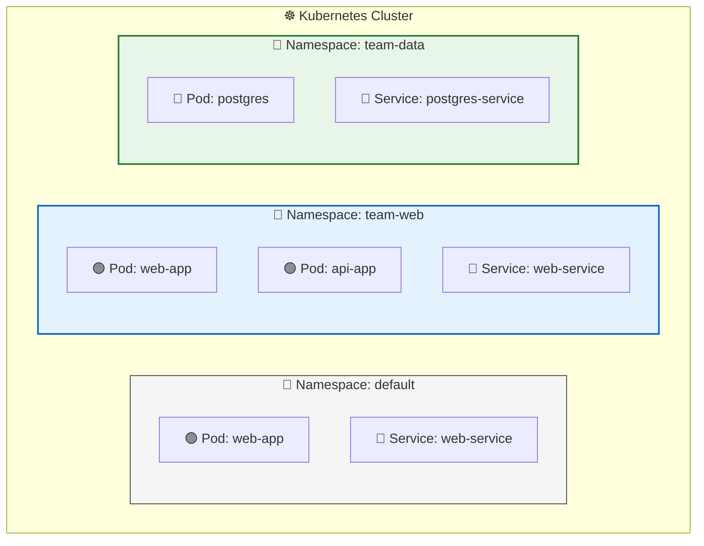
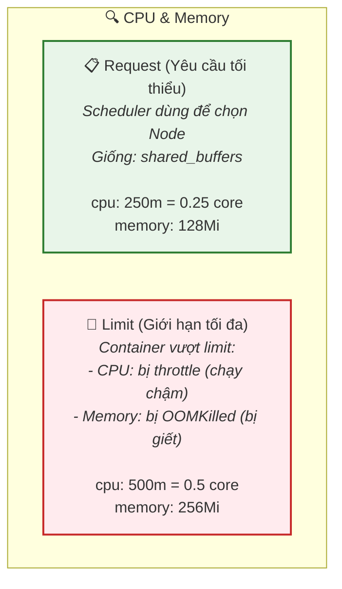
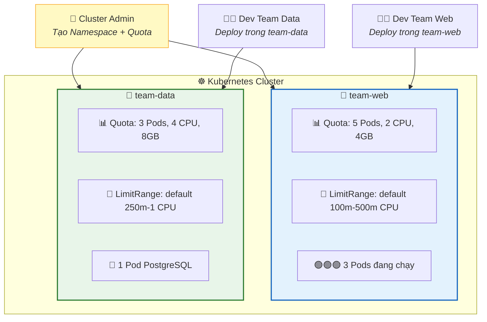

## Ngày 10 - Buổi 1: Namespace & Resource Management — Phân vùng Cluster

Khi cluster chỉ có 1 team dùng thì mọi thứ đơn giản. Nhưng thực tế doanh nghiệp, **nhiều team** cùng chia sẻ 1 cluster. Hôm nay chị sẽ học cách **phân vùng** cluster để mỗi team có "phòng" riêng, không đụng hàng, và không ai "ăn hết" tài nguyên.

---

### 1. Namespace — Schema của K8s

> 💡 **Góc nhìn Database:** Namespace giống **Schema** trong PostgreSQL. Chị có thể tạo bảng `users` trong schema `team_web` và bảng `users` khác trong schema `team_data` — không xung đột. K8s Namespace hoạt động y hệt.



Lưu ý: Pod `web-app` tồn tại ở cả namespace `default` và `team-web` — **không xung đột** vì khác namespace.

---

### 2. Thực hành Namespace

#### Tạo Namespace

```bash
# Cách 1: Lệnh nhanh
kubectl create namespace team-web
kubectl create namespace team-data

# Cách 2: YAML
cat <<EOF | kubectl apply -f -
apiVersion: v1
kind: Namespace
metadata:
  name: team-staging
  labels:
    env: staging
EOF
```

```bash
kubectl get namespaces
```

```
NAME            STATUS   AGE
default         Active   7d
kube-system     Active   7d
team-web        Active   5s
team-data       Active   5s
team-staging    Active   3s
```

#### Deploy vào Namespace cụ thể

```bash
# Tạo Deployment trong namespace team-web
kubectl apply -f deployment-web.yaml -n team-web

# Xem Pod trong namespace team-web
kubectl get pods -n team-web

# Xem Pod TOÀN BỘ cluster
kubectl get pods --all-namespaces
# hoặc
kubectl get pods -A
```

#### Đổi Namespace mặc định

```bash
# Mệt mỏi khi phải gõ -n team-web mỗi lệnh?
kubectl config set-context --current --namespace=team-web

# Giờ mọi lệnh kubectl tự dùng namespace team-web
kubectl get pods   # = kubectl get pods -n team-web

# Quay về default
kubectl config set-context --current --namespace=default
```

#### DNS giữa Namespace

Pod trong namespace `team-web` muốn gọi PostgreSQL ở namespace `team-data`:

```bash
# Trong cùng namespace: gọi tên Service
curl postgres-service

# Khác namespace: thêm .namespace
curl postgres-service.team-data
# Hoặc FQDN đầy đủ:
curl postgres-service.team-data.svc.cluster.local
```

> 💡 **Góc nhìn Database:** Giống `SELECT * FROM team_data.users` — truy vấn bảng ở schema khác bằng cách thêm tên schema phía trước.

---

### 3. ResourceQuota — Giới hạn tài nguyên cho Namespace

Không có giới hạn → 1 team deploy 100 Pod → Node hết RAM → **toàn bộ cluster bị ảnh hưởng**. ResourceQuota đặt **trần** cho mỗi Namespace.

```yaml
# quota-team-web.yaml
apiVersion: v1
kind: ResourceQuota
metadata:
  name: team-web-quota
  namespace: team-web
spec:
  hard:
    pods: "10"                    # Tối đa 10 Pod
    requests.cpu: "4"             # Tổng CPU request ≤ 4 cores
    requests.memory: "8Gi"        # Tổng RAM request ≤ 8GB
    limits.cpu: "8"               # Tổng CPU limit ≤ 8 cores
    limits.memory: "16Gi"         # Tổng RAM limit ≤ 16GB
    persistentvolumeclaims: "5"   # Tối đa 5 PVC
    services: "5"                 # Tối đa 5 Service
```

```bash
kubectl apply -f quota-team-web.yaml
kubectl describe quota team-web-quota -n team-web
```

```
Name:                   team-web-quota
Namespace:              team-web
Resource                Used    Hard
--------                ----    ----
pods                    0       10
requests.cpu            0       4
requests.memory         0       8Gi
limits.cpu              0       8
limits.memory           0       16Gi
persistentvolumeclaims  0       5
services                0       5
```

Khi đã có ResourceQuota, **mọi Pod phải khai báo `resources.requests` và `resources.limits`**, nếu không sẽ bị từ chối:

```yaml
# deployment-with-resources.yaml
apiVersion: apps/v1
kind: Deployment
metadata:
  name: web-app
  namespace: team-web
spec:
  replicas: 3
  selector:
    matchLabels:
      app: web
  template:
    metadata:
      labels:
        app: web
    spec:
      containers:
        - name: nginx
          image: nginx:1.25
          resources:
            requests:              # Tài nguyên TỐI THIỂU (Scheduler dùng để chọn Node)
              cpu: "250m"          # 0.25 core
              memory: "128Mi"      # 128MB RAM
            limits:                # Tài nguyên TỐI ĐA (vượt = bị giết)
              cpu: "500m"          # 0.5 core
              memory: "256Mi"      # 256MB RAM
          ports:
            - containerPort: 80
```

```bash
kubectl apply -f deployment-with-resources.yaml
kubectl describe quota team-web-quota -n team-web
```

```
Resource           Used     Hard
--------           ----     ----
pods               3        10       # 3/10 Pod đã dùng
requests.cpu       750m     4        # 3 x 250m = 750m
requests.memory    384Mi    8Gi      # 3 x 128Mi = 384Mi
```

> **📊 Sơ đồ Request vs Limit:**



---

### 4. LimitRange — Giá trị mặc định cho Container

Khi developer quên khai báo `resources` → Pod bị từ chối. LimitRange đặt **giá trị mặc định** để tránh lỗi.

```yaml
# limitrange-team-web.yaml
apiVersion: v1
kind: LimitRange
metadata:
  name: team-web-limits
  namespace: team-web
spec:
  limits:
    - type: Container
      default:               # Limit mặc định nếu không khai báo
        cpu: "500m"
        memory: "256Mi"
      defaultRequest:        # Request mặc định
        cpu: "100m"
        memory: "64Mi"
      max:                   # Limit tối đa cho 1 Container
        cpu: "2"
        memory: "2Gi"
      min:                   # Limit tối thiểu cho 1 Container
        cpu: "50m"
        memory: "32Mi"
```

```bash
kubectl apply -f limitrange-team-web.yaml
kubectl describe limitrange team-web-limits -n team-web
```

Giờ nếu developer tạo Pod **không có `resources`**, K8s tự gán: `requests.cpu=100m, limits.cpu=500m`.

---

### 5. Lab thực hành: Multi-Team Cluster

```bash
# === Team Web ===
kubectl create namespace team-web

# Quota cho team-web
cat <<EOF | kubectl apply -f -
apiVersion: v1
kind: ResourceQuota
metadata:
  name: quota
  namespace: team-web
spec:
  hard:
    pods: "5"
    requests.cpu: "2"
    requests.memory: "4Gi"
EOF

# Deploy web app trong team-web
kubectl apply -f deployment-with-resources.yaml   # 3 Pod nginx

# === Team Data ===
kubectl create namespace team-data

# Quota cho team-data
cat <<EOF | kubectl apply -f -
apiVersion: v1
kind: ResourceQuota
metadata:
  name: quota
  namespace: team-data
spec:
  hard:
    pods: "3"
    requests.cpu: "4"
    requests.memory: "8Gi"
EOF

# Deploy postgres trong team-data
cat <<EOF | kubectl apply -f -
apiVersion: apps/v1
kind: Deployment
metadata:
  name: postgres
  namespace: team-data
spec:
  replicas: 1
  selector:
    matchLabels:
      app: postgres
  template:
    metadata:
      labels:
        app: postgres
    spec:
      containers:
        - name: postgres
          image: postgres:16
          resources:
            requests:
              cpu: "500m"
              memory: "512Mi"
            limits:
              cpu: "1"
              memory: "1Gi"
          env:
            - name: POSTGRES_PASSWORD
              value: "demo123"
          ports:
            - containerPort: 5432
---
apiVersion: v1
kind: Service
metadata:
  name: postgres-service
  namespace: team-data
spec:
  selector:
    app: postgres
  ports:
    - port: 5432
EOF
```

```bash
# Xem tổng quan
kubectl get pods -A
kubectl describe quota -n team-web
kubectl describe quota -n team-data
```

**Thí nghiệm vượt quota:**
```bash
# Scale team-web lên 6 Pod (quota chỉ cho 5)
kubectl scale deployment web-app --replicas=6 -n team-web

kubectl get pods -n team-web
# → Chỉ có 5 Pod. Pod thứ 6 bị từ chối.

kubectl describe replicaset -n team-web
# Events: Error creating: pods "web-app-xxx" is forbidden: 
#         exceeded quota: quota, requested: pods=1, used: pods=5, limited: pods=5
```

> 💡 **Góc nhìn Database:** ResourceQuota giống `ALTER USER team_web SET statement_timeout = '5s'; ALTER USER team_web CONNECTION LIMIT 10;` — giới hạn tài nguyên mỗi user.

---

### 6. Tổng hợp: Namespace + Quota + LimitRange



---

### 7. Dọn dẹp

```bash
kubectl delete namespace team-web team-data team-staging
# Xóa namespace = xóa TOÀN BỘ resource bên trong (Pod, Service, ConfigMap...)
```

---

### ✅ Checklist cuối buổi

| Kỹ năng | Lệnh | ✅ |
| --- | --- | --- |
| Tạo Namespace | `kubectl create namespace <tên>` | ☐ |
| Deploy vào Namespace | `kubectl apply -f file.yaml -n <ns>` | ☐ |
| Đổi NS mặc định | `kubectl config set-context --current --namespace=<ns>` | ☐ |
| Xem tất cả NS | `kubectl get pods -A` | ☐ |
| DNS giữa NS | `service-name.namespace` | ☐ |
| Tạo ResourceQuota | `kubectl apply -f quota.yaml` | ☐ |
| Khai báo resources | `requests` + `limits` trong Pod spec | ☐ |
| Tạo LimitRange | Giá trị mặc định cho Container | ☐ |

---

**Câu hỏi tư duy cuối buổi:**
Chị đã biết tất cả thành phần cốt lõi của K8s: Pod, Deployment, Service, Ingress, PV/PVC, ConfigMap, Secret, Namespace, ResourceQuota. Giờ hãy tưởng tượng chị phải deploy **hệ thống hoàn chỉnh** gồm Web App + API + PostgreSQL + Redis lên K8s. Chị sẽ cần những resource nào? Viết theo thứ tự nào?

Buổi sau (Final Boss): **Deploy full-stack application lên K8s** — Gom tất cả kiến thức 4 ngày thành 1 hệ thống hoàn chỉnh!
