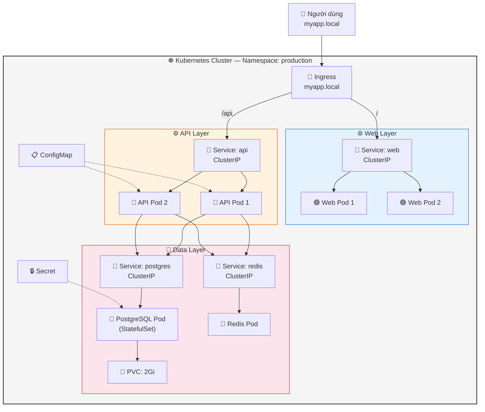
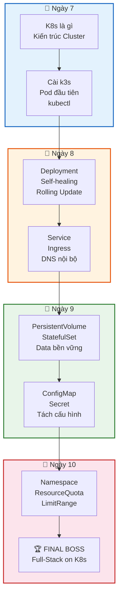

## Ngày 10 - Buổi 2 (Final Boss): Deploy Full-Stack lên Kubernetes

Đây là buổi cuối cùng. Chị sẽ gom **tất cả** kiến thức từ 4 ngày K8s vào **1 hệ thống hoàn chỉnh**: Web Frontend + API Backend + PostgreSQL + Redis, chạy trên K8s đúng chuẩn production.

---

### 1. Kiến trúc hệ thống



---

### 2. Thứ tự triển khai (RẤT QUAN TRỌNG)

| Bước | Resource | Tại sao phải theo thứ tự |
| --- | --- | --- |
| 1 | Namespace | Tạo "phòng" trước, deploy sau |
| 2 | Secret | PostgreSQL cần mật khẩu khi khởi động |
| 3 | ConfigMap | API cần biết DB_HOST, REDIS_HOST |
| 4 | PVC | PostgreSQL cần ổ cứng sẵn |
| 5 | PostgreSQL (StatefulSet + Service) | API phụ thuộc DB |
| 6 | Redis (Deployment + Service) | API phụ thuộc Cache |
| 7 | API (Deployment + Service) | Web phụ thuộc API |
| 8 | Web (Deployment + Service) | Frontend |
| 9 | Ingress | Mở cửa ra bên ngoài |

> 💡 **Góc nhìn Database:** Giống thứ tự khi cài hệ thống mới: tạo database → tạo user + quyền → tạo schema → tạo bảng → tạo index → mở kết nối cho app.

---

### 3. Bắt tay vào làm

#### Bước 1: Namespace

```bash
kubectl create namespace production
```

#### Bước 2: Secret

```bash
kubectl create secret generic db-credentials \
  --namespace=production \
  --from-literal=POSTGRES_USER=appuser \
  --from-literal=POSTGRES_PASSWORD='Pr0duction_S3cret!' \
  --from-literal=POSTGRES_DB=myapp
```

#### Bước 3: ConfigMap

```yaml
# 01-configmap.yaml
apiVersion: v1
kind: ConfigMap
metadata:
  name: app-config
  namespace: production
data:
  DB_HOST: "postgres"
  DB_PORT: "5432"
  DB_NAME: "myapp"
  REDIS_HOST: "redis"
  REDIS_PORT: "6379"
  APP_ENV: "production"
  LOG_LEVEL: "warn"
```

```bash
kubectl apply -f 01-configmap.yaml
```

#### Bước 4: PostgreSQL (StatefulSet + Service + PVC)

```yaml
# 02-postgres.yaml
apiVersion: v1
kind: Service
metadata:
  name: postgres
  namespace: production
spec:
  clusterIP: None             # Headless Service cho StatefulSet
  selector:
    app: postgres
  ports:
    - port: 5432
      targetPort: 5432
---
apiVersion: apps/v1
kind: StatefulSet
metadata:
  name: postgres
  namespace: production
spec:
  serviceName: postgres
  replicas: 1
  selector:
    matchLabels:
      app: postgres
  template:
    metadata:
      labels:
        app: postgres
    spec:
      containers:
        - name: postgres
          image: postgres:16
          ports:
            - containerPort: 5432
          env:
            - name: POSTGRES_USER
              valueFrom:
                secretKeyRef:
                  name: db-credentials
                  key: POSTGRES_USER
            - name: POSTGRES_PASSWORD
              valueFrom:
                secretKeyRef:
                  name: db-credentials
                  key: POSTGRES_PASSWORD
            - name: POSTGRES_DB
              valueFrom:
                secretKeyRef:
                  name: db-credentials
                  key: POSTGRES_DB
            - name: PGDATA
              value: "/var/lib/postgresql/data/pgdata"
          resources:
            requests:
              cpu: "250m"
              memory: "256Mi"
            limits:
              cpu: "1"
              memory: "512Mi"
          livenessProbe:
            exec:
              command: ["pg_isready", "-U", "appuser", "-d", "myapp"]
            initialDelaySeconds: 30
            periodSeconds: 10
          readinessProbe:
            exec:
              command: ["pg_isready", "-U", "appuser", "-d", "myapp"]
            initialDelaySeconds: 5
            periodSeconds: 5
          volumeMounts:
            - name: pg-data
              mountPath: /var/lib/postgresql/data
  volumeClaimTemplates:
    - metadata:
        name: pg-data
      spec:
        accessModes: ["ReadWriteOnce"]
        resources:
          requests:
            storage: 2Gi
```

```bash
kubectl apply -f 02-postgres.yaml
kubectl get pods -n production -w
# Đợi postgres-0 Running 1/1
```

> 💡 Lưu ý chị dùng `pg_isready` cho liveness/readiness probe — đây là cách chuẩn kiểm tra PostgreSQL có sẵn sàng không.

#### Bước 5: Redis

```yaml
# 03-redis.yaml
apiVersion: apps/v1
kind: Deployment
metadata:
  name: redis
  namespace: production
spec:
  replicas: 1
  selector:
    matchLabels:
      app: redis
  template:
    metadata:
      labels:
        app: redis
    spec:
      containers:
        - name: redis
          image: redis:7-alpine
          ports:
            - containerPort: 6379
          resources:
            requests:
              cpu: "100m"
              memory: "64Mi"
            limits:
              cpu: "250m"
              memory: "128Mi"
          livenessProbe:
            exec:
              command: ["redis-cli", "ping"]
            initialDelaySeconds: 5
            periodSeconds: 10
---
apiVersion: v1
kind: Service
metadata:
  name: redis
  namespace: production
spec:
  selector:
    app: redis
  ports:
    - port: 6379
      targetPort: 6379
```

```bash
kubectl apply -f 03-redis.yaml
kubectl get pods -n production
```

#### Bước 6: API Backend

```yaml
# 04-api.yaml
apiVersion: apps/v1
kind: Deployment
metadata:
  name: api
  namespace: production
spec:
  replicas: 2
  selector:
    matchLabels:
      app: api
  template:
    metadata:
      labels:
        app: api
    spec:
      containers:
        - name: api
          image: nginx:1.25       # Thay bằng API image thật của chị
          ports:
            - containerPort: 80
          envFrom:
            - configMapRef:
                name: app-config
          env:
            - name: DB_USER
              valueFrom:
                secretKeyRef:
                  name: db-credentials
                  key: POSTGRES_USER
            - name: DB_PASSWORD
              valueFrom:
                secretKeyRef:
                  name: db-credentials
                  key: POSTGRES_PASSWORD
          resources:
            requests:
              cpu: "100m"
              memory: "128Mi"
            limits:
              cpu: "500m"
              memory: "256Mi"
          readinessProbe:
            httpGet:
              path: /
              port: 80
            initialDelaySeconds: 5
            periodSeconds: 5
---
apiVersion: v1
kind: Service
metadata:
  name: api
  namespace: production
spec:
  selector:
    app: api
  ports:
    - port: 80
      targetPort: 80
```

```bash
kubectl apply -f 04-api.yaml
```

#### Bước 7: Web Frontend

```yaml
# 05-web.yaml
apiVersion: apps/v1
kind: Deployment
metadata:
  name: web
  namespace: production
spec:
  replicas: 2
  selector:
    matchLabels:
      app: web
  template:
    metadata:
      labels:
        app: web
    spec:
      containers:
        - name: web
          image: nginx:1.25       # Thay bằng Web image thật
          ports:
            - containerPort: 80
          resources:
            requests:
              cpu: "100m"
              memory: "64Mi"
            limits:
              cpu: "250m"
              memory: "128Mi"
          readinessProbe:
            httpGet:
              path: /
              port: 80
            initialDelaySeconds: 3
            periodSeconds: 5
---
apiVersion: v1
kind: Service
metadata:
  name: web
  namespace: production
spec:
  selector:
    app: web
  ports:
    - port: 80
      targetPort: 80
```

```bash
kubectl apply -f 05-web.yaml
```

#### Bước 8: Ingress

```yaml
# 06-ingress.yaml
apiVersion: networking.k8s.io/v1
kind: Ingress
metadata:
  name: app-ingress
  namespace: production
spec:
  rules:
    - host: myapp.local
      http:
        paths:
          - path: /api
            pathType: Prefix
            backend:
              service:
                name: api
                port:
                  number: 80
          - path: /
            pathType: Prefix
            backend:
              service:
                name: web
                port:
                  number: 80
```

```bash
kubectl apply -f 06-ingress.yaml

# Thêm DNS (nếu chưa có)
echo "127.0.0.1 myapp.local" | sudo tee -a /etc/hosts
```

---

### 4. Kiểm tra toàn bộ hệ thống

```bash
# Xem tổng quan
kubectl get all -n production
```

```
NAME                       READY   STATUS    RESTARTS   AGE
pod/postgres-0             1/1     Running   0          5m
pod/redis-xxx-aaa          1/1     Running   0          4m
pod/api-xxx-bbb            1/1     Running   0          3m
pod/api-xxx-ccc            1/1     Running   0          3m
pod/web-xxx-ddd            1/1     Running   0          2m
pod/web-xxx-eee            1/1     Running   0          2m

NAME                  TYPE        CLUSTER-IP      PORT(S)
service/postgres      ClusterIP   None            5432/TCP
service/redis         ClusterIP   10.43.x.x       6379/TCP
service/api           ClusterIP   10.43.x.x       80/TCP
service/web           ClusterIP   10.43.x.x       80/TCP

NAME                    READY   UP-TO-DATE   AVAILABLE
deployment.apps/redis   1/1     1            1
deployment.apps/api     2/2     2            2
deployment.apps/web     2/2     2            2

NAME                         READY
statefulset.apps/postgres    1/1
```

```bash
# Xem tài nguyên khác
kubectl get configmap -n production
kubectl get secret -n production
kubectl get pvc -n production
kubectl get ingress -n production

# Test truy cập
curl http://myapp.local
curl http://myapp.local/api

# Test PostgreSQL
kubectl exec -it postgres-0 -n production -- psql -U appuser -d myapp -c "SELECT version();"
```

---

### 5. Thí nghiệm Chaos (Stress Test)

#### Test 1: Giết Pod API — Deployment tự đẻ lại

```bash
kubectl delete pod -l app=api -n production
kubectl get pods -n production -w
# → Pod mới xuất hiện trong 3-5 giây
```

#### Test 2: Giết Pod PostgreSQL — Data vẫn còn

```bash
# INSERT data trước
kubectl exec -it postgres-0 -n production -- psql -U appuser -d myapp -c "
  CREATE TABLE IF NOT EXISTS test_final (id serial, msg text, created_at timestamp DEFAULT now());
  INSERT INTO test_final (msg) VALUES ('Before chaos test');
  SELECT * FROM test_final;
"

# Giết Pod
kubectl delete pod postgres-0 -n production
kubectl get pods -n production -w
# Đợi postgres-0 Running lại

# Kiểm tra data
kubectl exec -it postgres-0 -n production -- psql -U appuser -d myapp -c "SELECT * FROM test_final;"
# → Data vẫn còn! ✅
```

#### Test 3: Rolling Update Web

```bash
kubectl set image deployment/web web=nginx:1.26 -n production
kubectl rollout status deployment/web -n production
# → Zero-downtime update ✅
```

#### Test 4: Rollback

```bash
kubectl rollout undo deployment/web -n production
kubectl rollout status deployment/web -n production
# → Quay lại nginx:1.25 ✅
```

---

### 6. Bản đồ tổng hợp: Mọi thứ chị đã học



---

### 7. Dọn dẹp Final Boss

```bash
# Xóa namespace = xóa TẤT CẢ resource bên trong
kubectl delete namespace production

# Kiểm tra
kubectl get all -n production
# → No resources found
```

---

### ✅ Checklist Final Boss

| Thành phần | Resource K8s | Trạng thái |
| --- | --- | --- |
| Namespace | `production` | ☐ |
| Mật khẩu DB | Secret `db-credentials` | ☐ |
| Cấu hình app | ConfigMap `app-config` | ☐ |
| PostgreSQL | StatefulSet + Headless Service + PVC | ☐ |
| Redis | Deployment + Service | ☐ |
| API Backend | Deployment (2 replicas) + Service | ☐ |
| Web Frontend | Deployment (2 replicas) + Service | ☐ |
| Cổng vào | Ingress `myapp.local` | ☐ |
| Health check | Probes cho mọi Pod | ☐ |
| Resource limits | requests + limits cho mọi Container | ☐ |
| Self-healing test | Delete Pod → tự đẻ lại | ☐ |
| Data persistence | Delete PG Pod → data còn | ☐ |
| Rolling update | Update image → zero-downtime | ☐ |
| Rollback | `kubectl rollout undo` | ☐ |

---

### 🎉 Chúc mừng chị!

Chị đã đi từ **"Linux là gì?"** đến **deploy full-stack trên Kubernetes** trong 10 ngày. Đó là hành trình mà nhiều engineer mất vài tháng.

**Những gì chị đã thành thạo:**
- 🐧 Linux cơ bản, Bash scripting
- 🌐 Networking, OSI, Load Balancer
- 🐳 Docker: image, container, volume, network, Compose
- ☸️ Kubernetes: Pod, Deployment, Service, Ingress, PV/PVC, ConfigMap, Secret, Namespace

**Con đường tiếp theo** (nếu chị muốn đi sâu):
- **CI/CD:** GitHub Actions / GitLab CI — tự động build + deploy
- **Monitoring:** Prometheus + Grafana — giám sát hệ thống
- **Helm:** Package manager cho K8s — đóng gói YAML thành chart
- **GitOps:** ArgoCD — Git là source of truth cho infrastructure
- **Cloud:** AWS EKS / GCP GKE — K8s trên cloud thật

Chúc chị thành công trên con đường DevOps! 🚀
