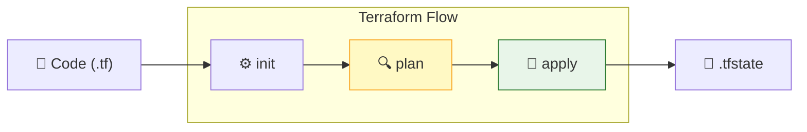

## Ngày 11 - Buổi 1: Terraform — "ORM" cho Hạ tầng (Infrastructure as Code)

Chào chị! Sau khi đã làm chủ được Hệ thống (Linux) và Quản lý tài nguyên (Kubernetes), hôm nay chúng ta sẽ bước sang một vũ khí cực kỳ lợi hại trong DevSecOps: **Terraform**. 

Nếu K8s giúp chị quản lý các Container, thì Terraform giúp chị quản lý **toàn bộ hệ thống** (Máy ảo VM, Network, Database trên Cloud...) chỉ bằng code.

---

### 1. Terraform là gì? — Góc nhìn từ Database

> 💡 **Góc nhìn từ DB:** 
> - **Cách truyền thống:** Chị lên giao diện (AWS/Azure/GCP Console) để click tạo máy ảo -> Giống như việc chị dùng chuột để tạo Table trong GUI (DBeaver). Dễ làm nhưng khó lặp lại, dễ nhầm lẫn.
> - **Terraform (IaC):** Chị viết code để định nghĩa hạ tầng -> Giống như việc chị viết **SQL Migration Scripts**. Chị có thể chạy script đó 10 lần để đẻ ra 10 cái Database y hệt nhau mà không sợ sai sót.

| Khái niệm | Trong Database | Trong Terraform |
| --- | --- | --- |
| **Provider** | Database Driver (JDBC, ODBC) | AWS, Google Cloud, Multipass... |
| **Resource** | Table (Bảng) | Virtual Machine, VPC, S3 Bucket... |
| **State File** | Current Schema (Sự thật hiện tại) | `terraform.tfstate` |
| **Apply** | `COMMIT` một Transaction | `terraform apply` |

---

### 2. Cài đặt Terraform trên Mac (Cho "Chị" dùng Mac)

Vì chị dùng máy Mac, cách nhanh và chuẩn nhất là dùng **Homebrew**. Chị mở Terminal lên và gõ 2 dòng lệnh sau:

```bash
# 1. Thêm "kho hàng" của HashiCorp (cha đẻ Terraform)
brew tap hashicorp/tap

# 2. Lấy Terraform về máy
brew install hashicorp/tap/terraform
```

Sau khi cài xong, chị gõ `terraform -v` để kiểm tra. Nếu nó hiện ra số phiên bản (ví dụ: `Terraform v1.7.0`) là "vũ khí" đã sẵn sàng!

---

### 3. Luồng làm việc (Workflow) của Terraform

Thay vì "Gõ là chạy luôn", Terraform đi qua các bước cực kỳ chặt chẽ để đảm bảo an toàn (y như cách chị check script SQL trước khi chạy lên Production vậy).



1. **`terraform init`**: Download "Driver" (Provider). Giống như `npm install` hay tải JAR driver cho DB.
2. **`terraform plan`**: **Đây là bước quan trọng nhất.** Terraform sẽ so sánh Code của chị với hệ thống thực tế và đưa ra bản dự thảo: *"Tôi sẽ thêm 2 VM mới, sửa 1 cái và xóa 0 cái"*. Giống như chị chạy `EXPLAIN` để xem Query sẽ chạy thế nào.
3. **`terraform apply`**: Xác nhận thực thi. Chỉ khi chị gõ `yes`, nó mới bắt đầu "đổ" hạ tầng ra thực tế.

---

### 4. Thực hành: Lab "Hạ tầng trên File" (Local Provider)

Để chị dễ hình dung mà chưa cần tài khoản Cloud (AWS/Azure) tốn tiền, chúng ta sẽ dùng Terraform để quản lý một... tệp văn bản (`local_file`).

**Bước 1: Tạo file cấu hình**
Chị hãy tạo một thư mục mới tên là `learn-terraform`, sau đó tạo file `main.tf` với nội dung sau:

```hcl
# 1. Khai báo "Driver" (Provider)
terraform {
  required_providers {
    local = {
      source  = "hashicorp/local"
      version = "2.5.1"
    }
  }
}

# 2. Định nghĩa "Thành phần" (Resource)
resource "local_file" "hello_sister" {
  filename = "chao_chi.txt"
  content  = "Chị ơi, Terraform đã tạo file này bằng code đó!"
}
```

**Bước 2: Chạy các lệnh cơ bản**

Mở Terminal tại thư mục đó và gõ:

```bash
# Khởi tạo (Tải provider local)
terraform init

# Xem kế hoạch (Check xem nó định làm gì)
terraform plan

# Thực thi (Gõ 'yes' khi được hỏi)
terraform apply
```

**Kết quả:** Chị sẽ thấy file `chao_chi.txt` xuất hiện ngay lập tức!

---

### 5. Quản lý trạng thái — terraform.tfstate

Sau khi chạy `apply`, chị sẽ thấy một file mới tên là `terraform.tfstate`. 

> 💡 **Sơ đồ quản lý trạng thái:**
>
> ```mermaid
> flowchart LR
>     Code["📄 File .tf<br/>(Mong muốn)"] -- So sánh --> State["📜 .tfstate<br/>(Bộ nhớ)"]
>     State -- Đồng bộ --> Reality["☁️ Thực tế<br/>(Hạ tầng)"]
> ```
>
> ⚠️ **Lưu ý quan trọng:** Đây là "bản ghi" tình trạng hiện tại của hệ thống. 
> - Nếu chị xóa file `chao_chi.txt` bằng tay, rồi chạy `terraform plan`, Terraform sẽ phát hiện ra: *"Ô, thực thực tế mất file rồi, để tôi tạo lại cho khớp với code nhé"*.
> - **Đừng bao giờ sửa file này bằng tay!** Nó là bộ não của Terraform.

---

### ✅ Checklist cuối buổi

| Kỹ năng | Giải thích | ✅ |
| --- | --- | --- |
| Hiểu IaC | Hạ tầng = Code (Dễ quản lý, dễ lặp lại) | ☐ |
| Tầm quan trọng của `plan` | Check script trước khi "đao xuống" | ☐ |
| Terraform Init | Tải Driver cần thiết | ☐ |
| .tfstate | File lưu giữ "sự thật" của hệ thống | ☐ |

---

**Câu hỏi "Hại não" cho chị:**
Nếu bây giờ chị vào file `main.tf`, sửa nội dung `content` thành *"Học Terraform nhàn tênh!"* rồi chạy `terraform apply`. 
1. Terraform sẽ **xóa sạch file cũ rồi tạo file mới** hay nó chỉ **update nội dung** bên trong file? 
2. Hãy thử chạy lệnh `terraform destroy` và xem chuyện gì xảy ra với file `chao_chi.txt`. Lệnh này tương đương với lệnh gì trong Database?

Chúc chị một ngày học tập hứng khởi! Lệnh bài Terraform trong tay, cả hệ thống Cloud sẽ nghe lời chị!
