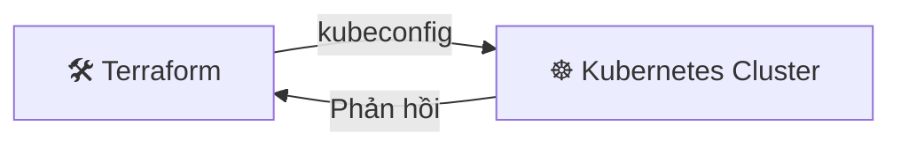

## Ngày 11 - Buổi 2: Terraform + Kubernetes — Hợp thể sức mạnh

Chào chị! Ở buổi trước, chị đã thấy Terraform tạo ra một file văn bản "từ hư vô". Hôm nay, chúng ta sẽ cho Terraform "bắt tay" với Kubernetes. 

---

### 1. Tại sao dùng Terraform cho K8s? — Góc nhìn từ DB

> 💡 **Góc nhìn từ DB:** 
> - **kubectl apply:** Giống như chị gõ lệnh `INSERT` hay `UPDATE` thủ công. Nếu chị xóa một dòng trong file YAML rồi `apply` lại, K8s **không tự xóa** tài nguyên cũ đó đi. Chị phải nhớ để `kubectl delete` bằng tay. Dễ để lại "rác" trong hệ thống.
> - **Terraform:** Giống như công cụ **Sync Schema**. Nếu chị xóa 1 đoạn code Deployment trong Terraform, khi `apply`, Terraform sẽ nói: *"À, chị vừa xóa lính trong code, để em xóa nó trên Cluster cho sạch nhé!"*. Nó đảm bảo "Code thế nào thì Cluster thế nấy" (Source of Truth).

---

### 2. Kubernetes Provider — "Cổng kết nối" Cluster

Để Terraform điều khiển được K8s, nó cần file "chìa khóa" `kubeconfig` (thường nằm ở `~/.kube/config` mà chị vẫn dùng để chạy `kubectl`).

**Sơ đồ kết nối:**



**Cấu hình Provider:**
Chị tạo file `k8s-deploy.tf` với nội dung khai báo "cổng kết nối" như sau:

```hcl
terraform {
  required_providers {
    kubernetes = {
      source  = "hashicorp/kubernetes"
      version = ">= 2.0.0"
    }
  }
}

provider "kubernetes" {
  config_path = "~/.kube/config" # Đường dẫn đến file chìa khóa Cluster của chị
}
```

---

### 3. Thực hành: Tự tay "đúc" tài nguyên K8s

Để chị không sót bước nào, chúng ta sẽ làm theo đúng trình tự từ tạo thư mục đến chạy lệnh kiểm tra.

**Bước 1: Chuẩn bị "phòng thí nghiệm"**
Chị copy và chạy các lệnh này để tạo thư mục mới:

```bash
mkdir -p ~/terraform-k8s-lab
cd ~/terraform-k8s-lab
```

**Bước 2: Viết code định nghĩa tài nguyên**
Chị chỉ cần copy nguyên khối lệnh dưới đây và dán vào Terminal. Nó sẽ tự động tạo ra file `k8s-deploy.tf` cho chị:

```bash
cat <<EOF > k8s-deploy.tf
terraform {
  required_providers {
    kubernetes = {
      source  = "hashicorp/kubernetes"
      version = ">= 2.0.0"
    }
  }
}

provider "kubernetes" {
  config_path = "~/.kube/config"
}

# 1. Tạo Namespace "lab-terraform-chi"
resource "kubernetes_namespace" "terraform_lab" {
  metadata {
    name = "lab-terraform-chi"
  }
}

# 2. Deploy Nginx vào Namespace vừa tạo
resource "kubernetes_deployment_v1" "nginx_app" {
  metadata {
    name      = "web-nghia-le"
    namespace = kubernetes_namespace.terraform_lab.metadata[0].name
    labels = {
      app = "nginx"
    }
  }

  spec {
    replicas = 2
    selector {
      match_labels = {
        app = "nginx"
      }
    }
    template {
      metadata {
        labels = {
          app = "nginx"
        }
      }
      spec {
        container {
          image = "nginx:1.21"
          name  = "nginx-server"
          port {
            container_port = 80
          }
        }
      }
    }
  }
}
EOF
```

**Bước 3: Triển khai và quản lý tài nguyên**
Chị gõ lần lượt 3 lệnh dưới đây:

```bash
# 1. Khởi tạo
terraform init

# 2. Lập kế hoạch (Xem Terraform định làm gì)
terraform plan

# 3. Thực thi (Gõ 'yes' khi được hỏi nhé)
terraform apply
```

**Bước 4: Kiểm chứng thành quả**
Sau khi lệnh `apply` báo xong, chị dùng `kubectl` để kiểm tra lính của mình:

```bash
# Xem Pod trong Namespace mới
kubectl get pods -n lab-terraform-chi

# Xem Namespace đã được tạo chưa
kubectl get ns lab-terraform-chi
```

---

### 4. Xóa sạch dấu vết

Khi học xong, chị gõ lệnh này để dọn dẹp Cluster cho sạch sẽ:

```bash
terraform destroy
```

Và gõ `yes` để xác nhận. Toàn bộ Namespace và Deployment sẽ "tan thành mây khói". Giống như lệnh `DROP SCHEMA ... CASCADE` vậy đó chị!

---

### ✅ Checklist cuối buổi

| Kỹ năng | Giải thích | ✅ |
| --- | --- | --- |
| K8s Provider | Cách Terraform kết nối với Cluster | ☐ |
| Quản lý vòng đời | Tạo, Sửa, Xóa tài nguyên K8s tập trung bằng code | ☐ |
| Biến số (Variables) | Chị có thể dùng biến để thay đổi số lượng replicas nhanh chóng | ☐ |

---

**Câu hỏi tư duy cho chị:**
Nếu chị dùng Terraform để tạo 100 cái Deployment, sau đó một bạn đồng nghiệp tò mò dùng lệnh `kubectl delete` xóa mất 1 cái. Khi chị chạy lại lệnh `terraform plan`, Terraform sẽ báo cáo điều gì? (Gợi ý: Terraform luôn so sánh State với thực tế).

Buổi tới chúng ta sẽ học cách: **Dùng Terraform để tạo ra chính cái máy ảo (VM) rồi tự cài K8s lên đó luôn!** (Full Automation).
